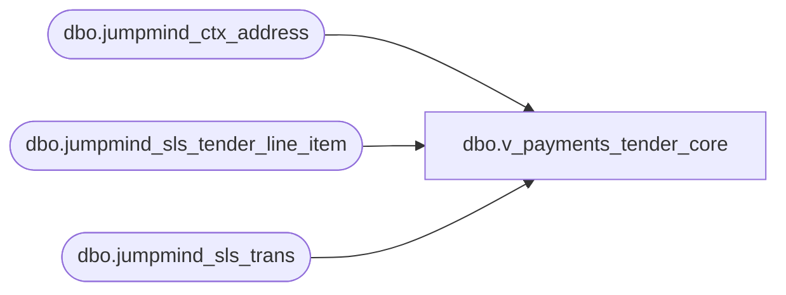

# dbo.v_payments_tender_core

**Database:** LH_Source  
**Server:** 4db76rlxaxcuvmuh5kw37wbnqq-ovsykae43znuhlmnflcdwm4ohu.datawarehouse.fabric.microsoft.com  

## Architecture Diagram



## Table Dependencies

| Referenced Table |
|---|
| dbo.jumpmind_ctx_address |
| dbo.jumpmind_sls_tender_line_item |
| dbo.jumpmind_sls_trans |

## View Code

```sql
-- POS tender payments (SALE, RETURN, REDEEM), pre-joined and pre-filtered CREATE   VIEW dbo.v_payments_tender_core AS SELECT     t.business_unit_id,     tli.business_date,     t.sequence_number,     tli.device_id,     tli.tender_code,     tli.tender_amount,     t.create_time,     cbu.country_id FROM dbo.jumpmind_sls_tender_line_item AS tli JOIN dbo.jumpmind_sls_trans AS t   ON t.device_id       = tli.device_id  AND t.business_date   = tli.business_date  AND t.sequence_number = tli.sequence_number JOIN dbo.jumpmind_ctx_address AS cbu   ON cbu.business_unit_id = t.business_unit_id WHERE     tli.voided = 0     AND t.trans_status = 'COMPLETED'     AND t.trans_type IN ('SALE','RETURN','REDEEM');
```

