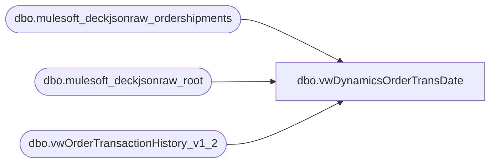

# dbo.vwDynamicsOrderTransDate

**Database:** LH_Source  
**Server:** 4db76rlxaxcuvmuh5kw37wbnqq-ovsykae43znuhlmnflcdwm4ohu.datawarehouse.fabric.microsoft.com  

## Architecture Diagram



## Table Dependencies

| Referenced Table |
|---|
| dbo.mulesoft_deckjsonraw_ordershipments |
| dbo.mulesoft_deckjsonraw_root |
| dbo.vwOrderTransactionHistory_v1_2 |

## View Code

```sql
CREATE view   [dbo].[vwDynamicsOrderTransDate]  as   SELECT ISNULL(os.[OrderID], th.OrderID) AS OrderID 	  ,r.OrderNumber       ,[OrderShipmentID]       ,CASE 		WHEN r.ShippingMethod = 'eGiftShipping' THEN 1 		WHEN r.ItemChangeId = 'IZGIFT' THEN 1 		ELSE [Shipped] 	   END AS [Shipped]       ,CASE 		WHEN r.ShippingMethod = 'eGiftShipping' THEN th.CaptureDateTime 		WHEN r.ItemChangeId = 'IZGIFT' THEN th.CaptureDateTime  		ELSE [DateShipped] 	  END AS DateShipped       ,ISNULL(os.[ShippingMethod], r.ShippingMethod) ShippingMethod       ,[OrderTransactionIdentifier]       ,[WarehouseCountNumber]       ,th.InventLocationId 	  ,th.SiteWarehouse 	  ,CASE 		WHEN th.AuthorizationDateTime IS NULL AND th.EarlyCaptureDateTime IS NOT NULL THEN EarlyCaptureDateTime 		WHEN r.ShippingMethod = 'eGiftShipping' THEN th.CaptureDateTime 		WHEN r.ItemChangeId = 'IZGIFT' THEN th.CaptureDateTime  		ELSE os.DateShipped 	   END AS TransactionDate 	  ,case when th.InventLocationId = th.SiteWarehouse and r.SiteCode = 'BAB' and th.SiteWarehouse = '1013' 			then 'Webstore' 		when th.InventLocationId = th.SiteWarehouse and r.SiteCode = 'BABUK' and th.SiteWarehouse = '2013' 			then 'UkWebStore' 		when os.ShippingMethod in ('InStore','Pickup','sameDay') 			then 'BOPIS' 		else 'BOSFS' 	end as ECommOrderType   FROM [LH_Source].[dbo].[mulesoft_deckjsonraw_ordershipments] os   RIGHT JOIN [LH_Source].[dbo].[mulesoft_deckjsonraw_root] r ON os.OrderID = r.OrderID   INNER JOIN [LH_Source].[dbo].[vwOrderTransactionHistory_v1_2] th ON r.OrderID = th.OrderID   WHERE r.OrderStatusCode IN ('PS', 'Z')   --AND r.OrderNumber = 'W9057950'
```

