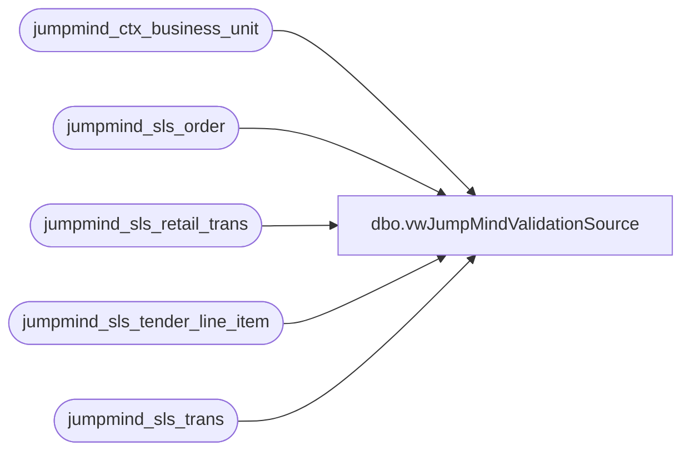

# dbo.vwJumpMindValidationSource

**Database:** LH_Source  
**Server:** 4db76rlxaxcuvmuh5kw37wbnqq-ovsykae43znuhlmnflcdwm4ohu.datawarehouse.fabric.microsoft.com  

## Architecture Diagram



## Table Dependencies

| Referenced Table |
|---|
| jumpmind_ctx_business_unit |
| jumpmind_sls_order |
| jumpmind_sls_retail_trans |
| jumpmind_sls_tender_line_item |
| jumpmind_sls_trans |

## View Code

```sql
CREATE view [dbo].[vwJumpMindValidationSource]   as select concat(s.device_id,'-',s.business_date,'-',s.sequence_number) as TransactionKey ,s.device_id  as DeviceId ,s.business_date as BusinessDate ,s.sequence_number  as SequenceNumber ,st.barcode  as Barcode ,concat (left(s.device_id,4),'-',s.business_date,'-',st.barcode, '_1') as RetailTransactionId , cast (s.create_time as date) as CreateDate ,case when so.order_id is not null  	then 1 else 0 end as ES_Flag , 0 as PIPO_Flag , s.discount_total as DiscountTotal , s.subtotal as SubTotal , s.tax_total_for_display as TaxTotal , s.total as Total --, s.extended_subtotal  from jumpmind_sls_retail_trans s  join jumpmind_sls_trans st on st.device_id  = s.device_id  and st.business_date = s.business_date  and st.sequence_number  = s.sequence_number  join jumpmind_ctx_business_unit cbu on cbu.business_unit_id = left(s.device_id,4) left join jumpmind_sls_order so on so.device_id  = s.device_id  and so.business_date = s.business_date  and so.order_id  = s.order_id where 1=1 and st.training_mode  = 0  and st.trans_status  in ('COMPLETED') -- case sensitive , any other statuses to consider? --and cast (st.create_time as date) >= getdate() -1 -- only Capture last x days --and DATEDIFF(dd, cast (st.create_time as date) , cast (getdate() as date)) <= 2 and st.barcode  is not null -- Added 6/26/2024 to exclude non sales transactions like cash man transations --and s.order_id is null -- In The Event We Need to EXCLUDE entire transactions that include Endless Aisle Orders\lines use this flag   and cbu.business_unit_id not in ('1013','2013') -- This will ensure no webstore transactions will push from JumpMind -- Mostly because we have to insert web sales so a Online order can be returned in store. --and cast (st.create_time as date) >= '2025-07-06' -- This field is only for go live cutover - sales created before this date most post via legacy sales audit group by  concat(s.device_id,'-',s.business_date,'-',s.sequence_number) , s.device_id  ,s.business_date ,s.sequence_number  ,st.barcode  , cast (s.create_time as date)  ,case when so.order_id is not null  	then 1 else 0 end , s.subtotal , s.tax_total_for_display , s.discount_total , s.total ,concat (left(s.device_id,4),'-',s.business_date,'-',st.barcode, '_1') UNION ALL select concat(st.device_id,'-',st.business_date,'-',st.sequence_number) as TransactionKey ,st.device_id  as DeviceId ,st.business_date as BusinessDate ,st.sequence_number  as SequenceNumber ,st.barcode  as Barcode ,concat (left(st.device_id,4),'-',st.business_date,'-',st.barcode, '_1') as RetailTransactionId , cast (st.create_time as date) as CreateDate , 0 as ES_Flag , 0 as PIPO_Flag , 0 as DiscountTotal , li.tender_amount as SubTotal , 0 as TaxTotal , li.tender_amount as Total --, s.extended_subtotal  from jumpmind_sls_trans st  join jumpmind_sls_tender_line_item as li on st.device_id  = li.device_id  and st.business_date = li.business_date  and st.sequence_number  = li.sequence_number  join jumpmind_ctx_business_unit cbu on cbu.business_unit_id = left(li.device_id,4) where 1=1 and st.training_mode  = 0  and st.trans_status  in ('COMPLETED') -- case sensitive , any other statuses to consider? and st.trans_type IN ('PAY_IN', 'PAY_OUT') and li.voided = 0 AND st.business_date <> '' --and cast (st.create_time as date) >= getdate() -1 -- only Capture last x days --and DATEDIFF(dd, cast (st.create_time as date) , cast (getdate() as date)) <= 2 and st.barcode  is not null -- Added 6/26/2024 to exclude non sales transactions like cash man transations --and s.order_id is null -- In The Event We Need to EXCLUDE entire transactions that include Endless Aisle Orders\lines use this flag   and cbu.business_unit_id not in ('1013','2013') -- This will ensure no webstore transactions will push from JumpMind -- Mostly because we have to insert web sales so a Online order can be returned in store. --and cast (st.create_time as date) >= '2025-07-06' -- This field is only for go live cutover - sales created before this date most post via legacy sales audit group by  concat(st.device_id,'-',st.business_date,'-',st.sequence_number) , st.device_id  ,st.business_date ,st.sequence_number  ,st.barcode  , cast (st.create_time as date)  , li.tender_amount ,concat (left(st.device_id,4),'-',st.business_date,'-',st.barcode, '_1')  --, s.extended_subtotal -- Added Union for Paid In\Paid Out transactions at they will need to be captured differently --union   --select  --t.device_id  --,t.business_date --,t.sequence_number  --,st.barcode --,0 as ES_Flag --,1 as PIPO_Flag --FROM jumpmind_sls_tender_control_trans t --join jumpmind_sls_trans st on t.device_id = st.device_id and t.sequence_number = st.sequence_number  and t.business_date = st.business_date   --join jumpmind_ctx_business_unit cbu on cbu.business_unit_id = left(st.device_id,4) --where 1=1 --and st.training_mode  = 0  --and st.trans_status  in ('COMPLETED')  --and cast (st.create_time as date) >= current_date -1 -- only Capture last x days --and st.barcode  is not null -- Added 6/26/2024 to exclude non sales transactions like cash man transations   --and cbu.business_unit_id not in ('1013','2013') -- This will ensure no webstore transactions will push from JumpMind -- Mostly because we have to insert web sales so a Online order can be returned in store. --and st.trans_type in ('PAY_IN','PAY_OUT') -- 'CASH_UP','CASH_DOWN' ----and cast (st.create_time as date) >= '2025-07-06' -- This field is only for go live cutover - sales created before this date most post via legacy sales audit --group by  --t.device_id  --,t.business_date --,t.sequence_number  --,st.barcode  --order by 1
```

