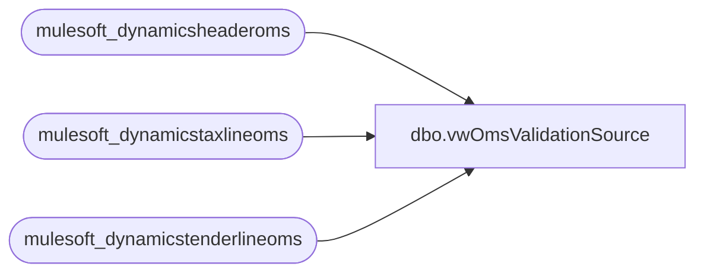

# dbo.vwOmsValidationSource

**Database:** LH_Source  
**Server:** 4db76rlxaxcuvmuh5kw37wbnqq-ovsykae43znuhlmnflcdwm4ohu.datawarehouse.fabric.microsoft.com  

## Architecture Diagram



## Table Dependencies

| Referenced Table |
|---|
| mulesoft_dynamicsheaderoms |
| mulesoft_dynamicstaxlineoms |
| mulesoft_dynamicstenderlineoms |

## View Code

```sql
CREATE     view [vwOmsValidationSource]   as   select o.TransactionKey , o.TransDate , o.RetailReceiptId as SequenceNumber , o.Barcode , o.RetailTransactionId , cast (o.CreateTime as date) as CreateDate , o.DiscAmount as DiscountTotal , sum (t.Amount) as TaxTotal , sum (ten.AmountCur) as Total from [mulesoft_dynamicsheaderoms] o join [mulesoft_dynamicstaxlineoms] t on t.RetailTransactionId = o.RetailTransactionId join [mulesoft_dynamicstenderlineoms] ten on ten.RetailTransactionId = o.RetailTransactionId group by o.TransactionKey , o.TransDate , o.RetailReceiptId , o.Barcode , o.RetailTransactionId , cast (o.CreateTime as date) , o.DiscAmount
```

