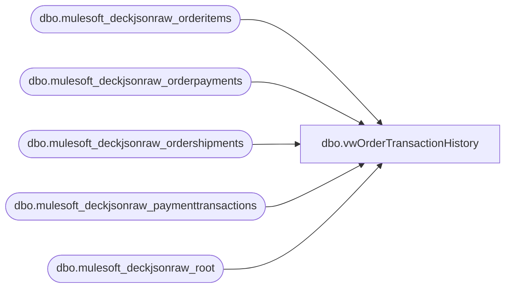

# dbo.vwOrderTransactionHistory

**Database:** LH_Source  
**Server:** 4db76rlxaxcuvmuh5kw37wbnqq-ovsykae43znuhlmnflcdwm4ohu.datawarehouse.fabric.microsoft.com  

## Architecture Diagram



## Table Dependencies

| Referenced Table |
|---|
| dbo.mulesoft_deckjsonraw_orderitems |
| dbo.mulesoft_deckjsonraw_orderpayments |
| dbo.mulesoft_deckjsonraw_ordershipments |
| dbo.mulesoft_deckjsonraw_paymenttransactions |
| dbo.mulesoft_deckjsonraw_root |

## View Code

```sql
CREATE view   [dbo].[vwOrderTransactionHistory]  as   WITH paymentTransactions AS ( SELECT DISTINCT pt.Generic1 AS GiftCardNumber     ,pt.Generic2 	,pt.Generic3 	,pt.Generic4 	,pt.Generic5     ,pt.Amount      ,r.OrderNumber     ,case when r.SiteCode = 'BAB'  	 	then cast( r.OrderDateUTC as date) 	    else cast( r.OrderStatusChangeDateUTC as date) -- BABUK we dont send to Dyn until shipped so OrderDate will not be in alignment with payment capture date but Status Date should be alignment with payment capture 	 end as TransDate 	,case when r.SiteCode = 'BAB'  	    then CONCAT('1', right(oi.WarehouseCode,3)) 	    else oi.WarehouseCode  	end as InventLocationId     ,case when r.SiteCode = 'BAB'  	    then '1013' 	    else '2013' 	end as SiteWarehouse    ,pt.PaymentTransactionTypeId    ,OrderStatusCode    ,CAST(pt.TransactionDateUTC AS DATE) TransactionDateUTC    ,pt.TransactionDateUTC TransactionDateTimeUTC    --,COUNT(pt.PaymentTransactionTypeId)    ,pt.PaymentTransactionID    ,r.OrderID   FROM [LH_Source].[dbo].[mulesoft_deckjsonraw_paymenttransactions] pt   INNER JOIN [LH_Source].[dbo].[mulesoft_deckjsonraw_orderpayments] op ON pt._ParentKeyField = op._ParentKeyField AND op.ID = pt.OrderPaymentId   INNER JOIN [LH_Source].[dbo].[mulesoft_deckjsonraw_orderitems] oi ON op._ParentKeyField  = oi._ParentKeyField --AND oi.ItemTypeLocalizeName NOT IN ('eGift')   INNER JOIN [LH_Source].[dbo].[mulesoft_deckjsonraw_root] r ON oi._ParentKeyField = r.OrderID   INNER join [LH_Source].[dbo].[mulesoft_deckjsonraw_ordershipments] os on r.OrderID = os._ParentKeyField   WHERE PaymentTransactionTypeId NOT IN (2) ) SELECT piv.OrderNumber       ,OrderID       ,CAST(SWITCHOFFSET(MIN([1]) AT TIME ZONE 'UTC', DATENAME(TzOffset, MIN([1]) AT TIME ZONE 'Central Standard Time'))AS DATETIME) AuthorizationDateTime 	  ,CAST(SWITCHOFFSET(MIN([10]) AT TIME ZONE 'UTC', DATENAME(TzOffset, MIN([10]) AT TIME ZONE 'Central Standard Time'))AS DATETIME) CaptureDateTime 	  ,CAST(SWITCHOFFSET(MIN([13]) AT TIME ZONE 'UTC', DATENAME(TzOffset, MIN([13]) AT TIME ZONE 'Central Standard Time'))AS DATETIME) EarlyCaptureDateTime 	  ,CAST(SWITCHOFFSET(MIN([14]) AT TIME ZONE 'UTC', DATENAME(TzOffset, MIN([14]) AT TIME ZONE 'Central Standard Time'))AS DATETIME) CaptureFromEarlyDatetime 	  ,CAST(SWITCHOFFSET(MIN([11]) AT TIME ZONE 'UTC', DATENAME(TzOffset, MIN([11]) AT TIME ZONE 'Central Standard Time'))AS DATETIME) RefundDateTime 	  ,PaymentTransactionID 	  ,InventLocationId 	  ,SiteWarehouse FROM (   SELECT OrderNumber, OrderID, PaymentTransactionTypeId, PaymentTransactionID, TransactionDateTimeUTC, InventLocationId, SiteWarehouse   FROM paymentTransactions   GROUP BY OrderNumber, OrderID, PaymentTransactionTypeId, PaymentTransactionID, TransactionDateTimeUTC, InventLocationId, SiteWarehouse ) src PIVOT ( 	MIN(TransactionDateTimeUTC) 	FOR PaymentTransactionTypeId IN ([1], [10], [13], [14], [11]) ) piv GROUP BY OrderNumber, OrderID, PaymentTransactionID, InventLocationId, SiteWarehouse
```

