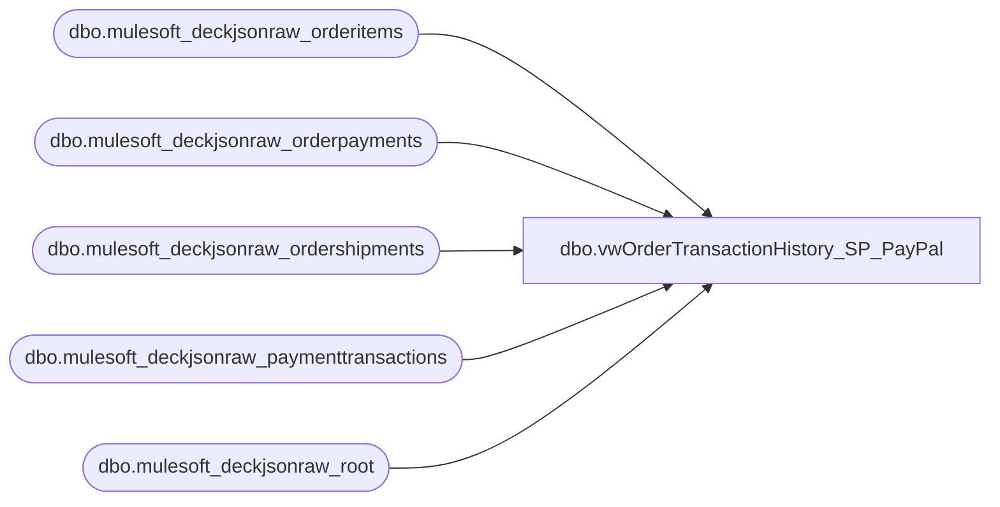

# dbo.vwOrderTransactionHistory_SP_PayPal

**Database:** LH_Source  
**Server:** 4db76rlxaxcuvmuh5kw37wbnqq-ovsykae43znuhlmnflcdwm4ohu.datawarehouse.fabric.microsoft.com  

## Architecture Diagram



## Table Dependencies

| Referenced Table |
|---|
| dbo.mulesoft_deckjsonraw_orderitems |
| dbo.mulesoft_deckjsonraw_orderpayments |
| dbo.mulesoft_deckjsonraw_ordershipments |
| dbo.mulesoft_deckjsonraw_paymenttransactions |
| dbo.mulesoft_deckjsonraw_root |

## View Code

```sql
CREATE view   [dbo].[vwOrderTransactionHistory_SP_PayPal]  as   WITH paymentTransactions AS ( SELECT DISTINCT pt.Generic1 AS GiftCardNumber     ,pt.Generic2 	,pt.Generic3 	,pt.Generic4 	,pt.Generic5     ,pt.Amount      ,r.OrderNumber     ,case when r.SiteCode = 'BAB'  	 	then cast( r.OrderDateUTC as date) 	    else cast( r.OrderStatusChangeDateUTC as date) -- BABUK we dont send to Dyn until shipped so OrderDate will not be in alignment with payment capture date but Status Date should be alignment with payment capture 	 end as TransDate 	,case when r.SiteCode = 'BAB'  	    then CONCAT('1', right(oi.WarehouseCode,3)) 	    else oi.WarehouseCode  	end as InventLocationId     ,case when r.SiteCode = 'BAB'  	    then '1013' 	    else '2013' 	end as SiteWarehouse    ,pt.PaymentTransactionTypeId    ,OrderStatusCode    ,CAST(pt.TransactionDateUTC AS DATE) TransactionDateUTC    ,pt.TransactionDateUTC TransactionDateTimeUTC    --,COUNT(pt.PaymentTransactionTypeId)    ,pt.PaymentTransactionID    ,r.OrderID   FROM [LH_Source].[dbo].[mulesoft_deckjsonraw_paymenttransactions] pt   INNER JOIN [LH_Source].[dbo].[mulesoft_deckjsonraw_orderpayments] op ON pt._ParentKeyField = op._ParentKeyField AND op.ID = pt.OrderPaymentId   INNER JOIN [LH_Source].[dbo].[mulesoft_deckjsonraw_orderitems] oi ON op._ParentKeyField  = oi._ParentKeyField --AND oi.ItemTypeLocalizeName NOT IN ('eGift')   INNER JOIN [LH_Source].[dbo].[mulesoft_deckjsonraw_root] r ON oi._ParentKeyField = r.OrderID   INNER join [LH_Source].[dbo].[mulesoft_deckjsonraw_ordershipments] os on r.OrderID = os._ParentKeyField AND os.WarehouseID = oi.RoutingID   WHERE (PaymentTransactionTypeId NOT IN (2) AND r.ShippingMethod NOT IN ('eGiftShipping'))   AND PaymentTransactionTypeId NOT IN (3)   UNION   SELECT DISTINCT pt.Generic1 AS GiftCardNumber     ,pt.Generic2 	,pt.Generic3 	,pt.Generic4 	,pt.Generic5     ,pt.Amount      ,r.OrderNumber     ,case when r.SiteCode = 'BAB'  	 	then cast( r.OrderDateUTC as date) 	    else cast( r.OrderStatusChangeDateUTC as date) -- BABUK we dont send to Dyn until shipped so OrderDate will not be in alignment with payment capture date but Status Date should be alignment with payment capture 	 end as TransDate 	,case when r.SiteCode = 'BAB'  	    then CONCAT('1', right(oi.WarehouseCode,3)) 	    else oi.WarehouseCode  	end as InventLocationId     ,case when r.SiteCode = 'BAB'  	    then '1013' 	    else '2013' 	end as SiteWarehouse    ,pt.PaymentTransactionTypeId    ,OrderStatusCode    ,CAST(pt.TransactionDateUTC AS DATE) TransactionDateUTC    ,pt.TransactionDateUTC TransactionDateTimeUTC    --,COUNT(pt.PaymentTransactionTypeId)    ,pt.PaymentTransactionID    ,r.OrderID   FROM [LH_Source].[dbo].[mulesoft_deckjsonraw_paymenttransactions] pt   INNER JOIN [LH_Source].[dbo].[mulesoft_deckjsonraw_orderpayments] op ON pt._ParentKeyField = op._ParentKeyField AND op.ID = pt.OrderPaymentId   INNER JOIN [LH_Source].[dbo].[mulesoft_deckjsonraw_orderitems] oi ON op._ParentKeyField  = oi._ParentKeyField --AND oi.ItemTypeLocalizeName NOT IN ('eGift')   INNER JOIN [LH_Source].[dbo].[mulesoft_deckjsonraw_root] r ON oi._ParentKeyField = r.OrderID   WHERE (PaymentTransactionTypeId NOT IN (2) AND r.ShippingMethod IN ('eGiftShipping'))   AND PaymentTransactionTypeId NOT IN (3) ), pivWorking AS ( SELECT piv.OrderNumber       ,OrderID       ,MIN([1]) AuthorizationDateTime 	  ,MIN([10]) CaptureDateTime 	  ,MIN([13]) EarlyCaptureDateTime 	  ,MIN([14]) CaptureFromEarlyDatetime 	  --,MIN([11]) RefundDateTime 	  --,[1]  AuthorizationDateTime 	  --,[10] CaptureDateTime 	  --,[13] EarlyCaptureDateTime 	  --,[14] CaptureFromEarlyDatetime 	  ,[11] RefundDateTime 	  ,InventLocationId 	  ,SiteWarehouse 	  --,TransactionDateUTC  	  ,MIN(PaymentTransactionID) PaymentTransactionID FROM (   SELECT OrderNumber, OrderID, PaymentTransactionTypeId, TransactionDateTimeUTC, InventLocationId, SiteWarehouse, CAST(TransactionDateTimeUTC AS DATE) AS TransactionDateUTC, PaymentTransactionID   FROM paymentTransactions   GROUP BY OrderNumber, OrderID, PaymentTransactionTypeId, TransactionDateTimeUTC, InventLocationId, SiteWarehouse, CAST(TransactionDateTimeUTC AS DATE), PaymentTransactionID ) src PIVOT ( 	MIN(TransactionDateTimeUTC) 	FOR PaymentTransactionTypeId IN ([1], [10], [13], [14], [11]) ) piv GROUP BY OrderNumber, OrderID, InventLocationId, SiteWarehouse, [11]--, PaymentTransactionID--, TransactionDateUTC ) SELECT * FROM pivWorking --WHERE OrderNumber = 'U2922637'  --, piv1 --AS --( --SELECT * FROM pivWorking WHERE RefundDateTime IS NULL --), piv2 --AS --( --SELECT * FROM pivWorking WHERE RefundDateTime IS NOT NULL --) --SELECT p1.OrderNumber --	  ,p1.OrderID --      ,MIN(p1.AuthorizationDateTime) AuthorizationDateTime --	  ,MIN(p1.CaptureDateTime) CaptureDateTime --	  ,MIN(p1.EarlyCaptureDateTime) EarlyCaptureDateTime --	  ,MIN(p1.CaptureFromEarlyDatetime) CaptureFromEarlyDatetime --	  ,p2.RefundDateTime --	  ,p1.InventLocationId --	  ,p1.SiteWarehouse --FROM piv1 p1 --LEFT JOIN piv2 p2 ON p1.OrderID = p2.OrderID --GROUP BY p1.OrderNumber, p1.OrderID, p2.RefundDateTime --	  ,p1.InventLocationId --	  ,p1.SiteWarehouse
```

