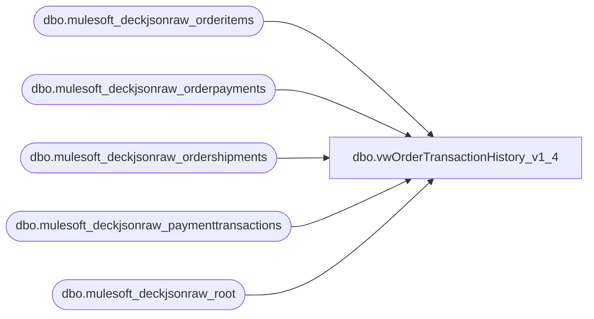

# dbo.vwOrderTransactionHistory_v1_4

**Database:** LH_Source  
**Server:** 4db76rlxaxcuvmuh5kw37wbnqq-ovsykae43znuhlmnflcdwm4ohu.datawarehouse.fabric.microsoft.com  

## Architecture Diagram



## Table Dependencies

| Referenced Table |
|---|
| dbo.mulesoft_deckjsonraw_orderitems |
| dbo.mulesoft_deckjsonraw_orderpayments |
| dbo.mulesoft_deckjsonraw_ordershipments |
| dbo.mulesoft_deckjsonraw_paymenttransactions |
| dbo.mulesoft_deckjsonraw_root |

## View Code

```sql
CREATE VIEW [dbo].[vwOrderTransactionHistory_v1_4] AS  WITH paymentTransactions AS (     SELECT DISTINCT           pt.Generic1 AS RefundReference         , pt.Generic2         , pt.Generic3         , pt.Generic4         , pt.Generic5         , pt.Amount         , r.OrderNumber         , CASE               WHEN r.SiteCode = 'BAB'                   THEN CAST(r.OrderDateUTC AS date)               ELSE CAST(r.OrderStatusChangeDateUTC AS date)           END AS TransDate         , CASE               WHEN r.SiteCode = 'BAB'                   THEN CONCAT('1', RIGHT(oi.WarehouseCode, 3))               ELSE oi.WarehouseCode           END AS InventLocationId         , CASE               WHEN r.SiteCode = 'BAB'                   THEN '1013'               ELSE '2013'           END AS SiteWarehouse         , pt.PaymentTransactionTypeId         , r.OrderStatusCode         , CAST(pt.TransactionDateUTC AS date) AS TransactionDateUTC         , pt.TransactionDateUTC AS TransactionDateTimeUTC         , r.OrderID     FROM [LH_Source].[dbo].[mulesoft_deckjsonraw_paymenttransactions] pt     INNER JOIN [LH_Source].[dbo].[mulesoft_deckjsonraw_orderpayments] op         ON pt._ParentKeyField = op._ParentKeyField        AND op.ID = pt.OrderPaymentId     INNER JOIN [LH_Source].[dbo].[mulesoft_deckjsonraw_orderitems] oi         ON op._ParentKeyField = oi._ParentKeyField     INNER JOIN [LH_Source].[dbo].[mulesoft_deckjsonraw_root] r         ON oi._ParentKeyField = r.OrderID     INNER JOIN [LH_Source].[dbo].[mulesoft_deckjsonraw_ordershipments] os         ON r.OrderID = os._ParentKeyField        AND os.WarehouseID = oi.RoutingID     WHERE pt.PaymentTransactionTypeId NOT IN (2)       AND r.ShippingMethod NOT IN ('eGiftShipping')      UNION      SELECT DISTINCT           pt.Generic1 AS RefundReference         , pt.Generic2         , pt.Generic3         , pt.Generic4         , pt.Generic5         , pt.Amount         , r.OrderNumber         , CASE               WHEN r.SiteCode = 'BAB'                   THEN CAST(r.OrderDateUTC AS date)               ELSE CAST(r.OrderStatusChangeDateUTC AS date)           END AS TransDate         , CASE               WHEN r.SiteCode = 'BAB'                   THEN CONCAT('1', RIGHT(oi.WarehouseCode, 3))               ELSE oi.WarehouseCode           END AS InventLocationId         , CASE               WHEN r.SiteCode = 'BAB'                   THEN '1013'               ELSE '2013'           END AS SiteWarehouse         , pt.PaymentTransactionTypeId         , r.OrderStatusCode         , CAST(pt.TransactionDateUTC AS date) AS TransactionDateUTC         , pt.TransactionDateUTC AS TransactionDateTimeUTC         , r.OrderID     FROM [LH_Source].[dbo].[mulesoft_deckjsonraw_paymenttransactions] pt     INNER JOIN [LH_Source].[dbo].[mulesoft_deckjsonraw_orderpayments] op         ON pt._ParentKeyField = op._ParentKeyField        AND op.ID = pt.OrderPaymentId     INNER JOIN [LH_Source].[dbo].[mulesoft_deckjsonraw_orderitems] oi         ON op._ParentKeyField = oi._ParentKeyField     INNER JOIN [LH_Source].[dbo].[mulesoft_deckjsonraw_root] r         ON oi._ParentKeyField = r.OrderID     WHERE pt.PaymentTransactionTypeId NOT IN (2)       AND r.ShippingMethod IN ('eGiftShipping') ),  orderLevelDates AS (     SELECT           pt.OrderNumber         , pt.OrderID         , pt.InventLocationId         , pt.SiteWarehouse         , MIN(CASE WHEN pt.PaymentTransactionTypeId = 1  THEN pt.TransactionDateTimeUTC END) AS AuthorizationDateTime         , MIN(CASE WHEN pt.PaymentTransactionTypeId = 10 THEN pt.TransactionDateTimeUTC END) AS CaptureDateTime         , MIN(CASE WHEN pt.PaymentTransactionTypeId = 13 THEN pt.TransactionDateTimeUTC END) AS EarlyCaptureDateTime         , MIN(CASE WHEN pt.PaymentTransactionTypeId = 14 THEN pt.TransactionDateTimeUTC END) AS CaptureFromEarlyDatetime     FROM paymentTransactions pt     GROUP BY           pt.OrderNumber         , pt.OrderID         , pt.InventLocationId         , pt.SiteWarehouse ),  refundRows AS (     SELECT DISTINCT           pt.OrderNumber         , pt.OrderID         , pt.InventLocationId         , pt.SiteWarehouse         , pt.RefundReference         , pt.TransactionDateTimeUTC AS RefundDateTime     FROM paymentTransactions pt     WHERE pt.PaymentTransactionTypeId = 11 )  SELECT       o.OrderNumber     , o.OrderID     , o.AuthorizationDateTime     , o.CaptureDateTime     , o.EarlyCaptureDateTime     , o.CaptureFromEarlyDatetime     , r.RefundDateTime     , r.RefundReference     , o.InventLocationId     , o.SiteWarehouse FROM orderLevelDates o LEFT JOIN refundRows r     ON  o.OrderNumber      = r.OrderNumber     AND o.OrderID          = r.OrderID     AND o.InventLocationId = r.InventLocationId     AND o.SiteWarehouse    = r.SiteWarehouse;
```

