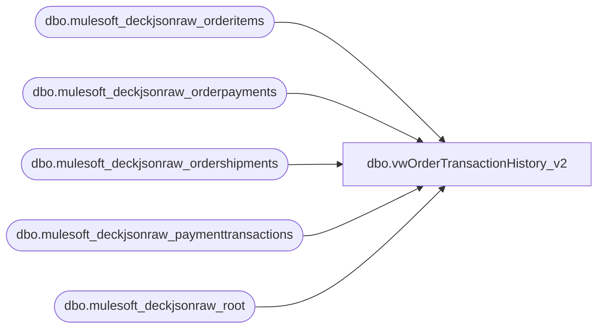

# dbo.vwOrderTransactionHistory_v2

**Database:** LH_Source  
**Server:** 4db76rlxaxcuvmuh5kw37wbnqq-ovsykae43znuhlmnflcdwm4ohu.datawarehouse.fabric.microsoft.com  

## Architecture Diagram



## Table Dependencies

| Referenced Table |
|---|
| dbo.mulesoft_deckjsonraw_orderitems |
| dbo.mulesoft_deckjsonraw_orderpayments |
| dbo.mulesoft_deckjsonraw_ordershipments |
| dbo.mulesoft_deckjsonraw_paymenttransactions |
| dbo.mulesoft_deckjsonraw_root |

## View Code

```sql
CREATE view   [dbo].[vwOrderTransactionHistory_v2]  as     WITH paymentTransactions AS ( SELECT DISTINCT pt.Generic1 AS GiftCardNumber     ,pt.Generic2 	,pt.Generic3 	,pt.Generic4 	,pt.Generic5     ,pt.Amount      ,r.OrderNumber     ,case when r.SiteCode = 'BAB'  	 	then cast( r.OrderDateUTC as date) 	    else cast( r.OrderStatusChangeDateUTC as date) -- BABUK we dont send to Dyn until shipped so OrderDate will not be in alignment with payment capture date but Status Date should be alignment with payment capture 	 end as TransDate 	,case when r.SiteCode = 'BAB'  	    then CONCAT('1', right(oi.WarehouseCode,3)) 	    else oi.WarehouseCode  	end as InventLocationId     ,case when r.SiteCode = 'BAB'  	    then '1013' 	    else '2013' 	end as SiteWarehouse    ,pt.PaymentTransactionTypeId    ,OrderStatusCode    ,CAST(pt.TransactionDateUTC AS DATE) TransactionDateUTC    ,FORMAT(pt.TransactionDateUTC, 'yyyy-MM-dd HH:mm:00') TransactionDateTimeUTC    --,COUNT(pt.PaymentTransactionTypeId)   FROM [dbo].[mulesoft_deckjsonraw_paymenttransactions] pt   INNER JOIN [dbo].[mulesoft_deckjsonraw_orderpayments] op ON pt._ParentKeyField = op._ParentKeyField AND op.ID = pt.OrderPaymentId   INNER JOIN [dbo].[mulesoft_deckjsonraw_orderitems] oi ON op._ParentKeyField  = oi._ParentKeyField --AND oi.ItemTypeLocalizeName NOT IN ('eGift')   INNER JOIN [dbo].[mulesoft_deckjsonraw_root] r ON oi._ParentKeyField = r.OrderID   INNER join [dbo].[mulesoft_deckjsonraw_ordershipments] os on r.OrderID = os._ParentKeyField   WHERE PaymentTransactionTypeId IN (1, 10, 13, 14, 11)   --AND OrderNumber = 'W9057950'    --WHERE (CAST(r.ExportCreatedUTC AS DATE) BETWEEN @startDate AND @endDate      --WHERE datediff(dd, CAST(r.ExportCreatedUTC AS DATE), getdate ()) <= 45     --AND pt.PaymentTransactionTypeId IN (13)     --AND op.PaymentSubType = 'Adyen_GiftCard')  ),    --AND SiteCode = CASE WHEN @siteWarehouse = '1013' THEN 'BAB' ELSE 'BABUK' END    --GROUP BY pt.Generic1, pt.Generic2, pt.Generic3, pt.Generic4, pt.Generic5, pt.Amount, r.OrderNumber, r.SiteCode, r.OrderDateUTC, r.OrderStatusChangeDateUTC, oi.WarehouseCode, pt.PaymentTransactionTypeId --) piv1 AS ( SELECT piv.OrderNumber, SUM([1]) isPaymentAuthorized, SUM([10]) isPaymentCaptured, SUM([13]) isEarlyCapture,  SUM([14]) isCaptureFromEarly, SUM([11]) isRefund, startTransactionDateTimeUTC,  endTransactionDateTimeUTC FROM (   SELECT OrderNumber,           PaymentTransactionTypeId,  		 TransactionDateTimeUTC startTransactionDateTimeUTC,  		 ISNULL(LEAD(TransactionDateTimeUTC) OVER (ORDER BY TransactionDateTimeUTC), '2399-12-31 23:59:00') AS endTransactionDateTimeUTC   FROM paymentTransactions   GROUP BY OrderNumber, PaymentTransactionTypeId, TransactionDateTimeUTC ) src PIVOT ( 	COUNT(PaymentTransactionTypeId) 	FOR PaymentTransactionTypeId IN ([1], [10], [13], [14], [11]) ) piv GROUP BY OrderNumber, startTransactionDateTimeUTC,  endTransactionDateTimeUTC ), earlyCapture_Credit AS ( SELECT OrderNumber, SUM(isPaymentAuthorized) isPaymentAuthorized, SUM(isPaymentCaptured) isPaymentCaptured, SUM(isEarlyCapture) isEarlyCapture, SUM(isCaptureFromEarly) isCaptureFromEarly, SUM(isRefund) isRefund, MIN(startTransactionDateTimeUTC) startTransactionDateTimeUTC, MAX(endTransactionDateTimeUTC) endTransactionDateTimeUTC FROM piv1 WHERE isEarlyCapture = 1 OR isPaymentCaptured = 1 GROUP BY OrderNumber ), everything_else AS ( SELECT * FROM piv1 WHERE isPaymentAuthorized = 1  OR isCaptureFromEarly = 1  OR isRefund = 1 --OR (isPaymentCaptured = 1 AND isEarlyCapture = 0) --OR (isPaymentCaptured = 0 AND isEarlyCapture = 1) ) SELECT * FROM earlyCapture_Credit UNION  SELECT * FROM everything_else
```

