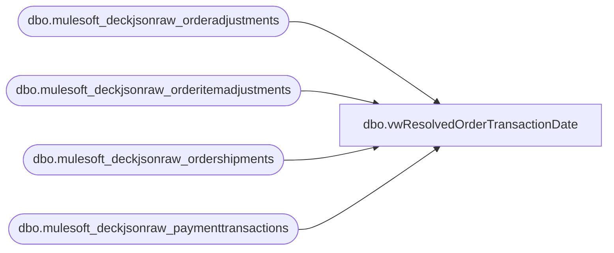

# dbo.vwResolvedOrderTransactionDate

**Database:** LH_Source  
**Server:** 4db76rlxaxcuvmuh5kw37wbnqq-ovsykae43znuhlmnflcdwm4ohu.datawarehouse.fabric.microsoft.com  

## Architecture Diagram



## Table Dependencies

| Referenced Table |
|---|
| dbo.mulesoft_deckjsonraw_orderadjustments |
| dbo.mulesoft_deckjsonraw_orderitemadjustments |
| dbo.mulesoft_deckjsonraw_ordershipments |
| dbo.mulesoft_deckjsonraw_paymenttransactions |

## View Code

```sql
CREATE   VIEW dbo.vwResolvedOrderTransactionDate AS WITH shipment_events AS (     SELECT         os._ParentKeyField                                               AS OrderID,         CAST(os.OrderShipmentID AS bigint)                               AS SourceRowID,         CAST(NULL AS bigint)                                             AS OrderItemID,         CAST(NULL AS bigint)                                             AS PaymentTransactionID,         CAST(os.OrderShipmentID AS bigint)                               AS OrderShipmentID,         CAST(os.OrderTransactionIdentifier AS int)                       AS SourceOrderTransactionIdentifier,         CAST(os.OrderTransactionIdentifier AS int)                       AS ResolvedOrderTransactionIdentifier,         TRY_CONVERT(datetime2(6), os.DateShipped)                        AS ShipmentDateUTC,         CAST(NULL AS datetime2(6))                                       AS AdjustmentDateUTC,         CAST(NULL AS datetime2(6))                                       AS PaymentTransactionDateUTC,         TRY_CONVERT(datetime2(6), os.DateShipped)                        AS ResolvedTransactionDateUTC,         CAST('SHIPMENT' AS varchar(50))                                  AS EventClass,         CAST('SHIPMENT_DATE' AS varchar(100))                            AS ResolutionRule,         CAST('mulesoft_deckjsonraw_ordershipments' AS varchar(128))      AS SourceTable     FROM dbo.mulesoft_deckjsonraw_ordershipments os     WHERE ISNULL(os.Shipped, 0) = 1       AND TRY_CONVERT(datetime2(6), os.DateShipped) IS NOT NULL       AND TRY_CONVERT(datetime2(6), os.DateShipped) >= '2000-01-01' ),  shipment_boundaries AS (     SELECT         os._ParentKeyField                                               AS OrderID,         CAST(os.OrderShipmentID AS bigint)                               AS OrderShipmentID,         CAST(os.OrderTransactionIdentifier AS int)                       AS ShipmentOrderTransactionIdentifier,         TRY_CONVERT(datetime2(6), os.DateShipped)                        AS ShipmentDateUTC     FROM dbo.mulesoft_deckjsonraw_ordershipments os     WHERE ISNULL(os.Shipped, 0) = 1       AND TRY_CONVERT(datetime2(6), os.DateShipped) IS NOT NULL       AND TRY_CONVERT(datetime2(6), os.DateShipped) >= '2000-01-01' ),  payment_events AS (     SELECT         pt._ParentKeyField                                               AS OrderID,         CAST(pt.PaymentTransactionID AS bigint)                          AS SourceRowID,         CAST(NULL AS bigint)                                             AS OrderItemID,         CAST(pt.PaymentTransactionID AS bigint)                          AS PaymentTransactionID,         CAST(NULL AS bigint)                                             AS OrderShipmentID,         CAST(NULL AS int)                                                AS SourceOrderTransactionIdentifier,         CAST(NULL AS int)                                                AS ResolvedOrderTransactionIdentifier,         CAST(NULL AS datetime2(6))                                       AS ShipmentDateUTC,         CAST(NULL AS datetime2(6))                                       AS AdjustmentDateUTC,         TRY_CONVERT(datetime2(6), pt.TransactionDateUTC)                 AS PaymentTransactionDateUTC,         TRY_CONVERT(datetime2(6), pt.TransactionDateUTC)                 AS ResolvedTransactionDateUTC,         CASE             WHEN pt.PaymentTransactionTypeId IN (3, 11) THEN 'REFUND_PAYMENT'             ELSE 'PAYMENT'         END                                                              AS EventClass,         CAST('PAYMENT_TRANSACTION_DATE' AS varchar(100))                 AS ResolutionRule,         CAST('mulesoft_deckjsonraw_paymenttransactions' AS varchar(128)) AS SourceTable     FROM dbo.mulesoft_deckjsonraw_paymenttransactions pt     WHERE TRY_CONVERT(datetime2(6), pt.TransactionDateUTC) IS NOT NULL       AND TRY_CONVERT(datetime2(6), pt.TransactionDateUTC) >= '2000-01-01' ),  item_adjustments_raw AS (     SELECT         oia._ParentKeyField                                              AS OrderID,         CAST(oia.ID AS bigint)                                           AS SourceRowID,         CAST(oia.OrderItemID AS bigint)                                  AS OrderItemID,         CAST(NULL AS bigint)                                             AS PaymentTransactionID,         CAST(NULL AS bigint)                                             AS OrderShipmentID,         CAST(oia.OrderTransactionIdentifier AS int)                      AS SourceOrderTransactionIdentifier,         TRY_CONVERT(datetime2(6), oia.AdjustmentDate)                    AS AdjustmentDateUTC,         CAST('ITEM_ADJUSTMENT' AS varchar(50))                           AS EventClass,         CAST('mulesoft_deckjsonraw_orderitemadjustments' AS varchar(128)) AS SourceTable     FROM dbo.mulesoft_deckjsonraw_orderitemadjustments oia     WHERE TRY_CONVERT(datetime2(6), oia.AdjustmentDate) IS NOT NULL       AND TRY_CONVERT(datetime2(6), oia.AdjustmentDate) >= '2000-01-01' ),  order_adjustments_raw AS (     SELECT         oa._ParentKeyField                                               AS OrderID,         CAST(oa.ID AS bigint)                                            AS SourceRowID,         CAST(NULL AS bigint)                                             AS OrderItemID,         CAST(NULL AS bigint)                                             AS PaymentTransactionID,         CAST(NULL AS bigint)                                             AS OrderShipmentID,         CAST(oa.OrderTransactionIdentifier AS int)                       AS SourceOrderTransactionIdentifier,         TRY_CONVERT(datetime2(6), oa.AdjustmentDate)                     AS AdjustmentDateUTC,         CAST('ORDER_ADJUSTMENT' AS varchar(50))                          AS EventClass,         CAST('mulesoft_deckjsonraw_orderadjustments' AS varchar(128))    AS SourceTable     FROM dbo.mulesoft_deckjsonraw_orderadjustments oa     WHERE TRY_CONVERT(datetime2(6), oa.AdjustmentDate) IS NOT NULL       AND TRY_CONVERT(datetime2(6), oa.AdjustmentDate) >= '2000-01-01' ),  all_adjustments AS (     SELECT * FROM item_adjustments_raw     UNION ALL     SELECT * FROM order_adjustments_raw ),  adjustments_with_next_shipment AS (     SELECT         a.OrderID,         a.SourceRowID,         a.OrderItemID,         a.PaymentTransactionID,         a.OrderShipmentID,         a.SourceOrderTransactionIdentifier,         a.AdjustmentDateUTC,         a.EventClass,         a.SourceTable,         ns.OrderShipmentID                                               AS NextShipmentID,         ns.ShipmentOrderTransactionIdentifier                            AS NextShipmentOrderTransactionIdentifier,         ns.ShipmentDateUTC                                               AS NextShipmentDateUTC     FROM all_adjustments a     OUTER APPLY (         SELECT TOP (1)             sb.OrderShipmentID,             sb.ShipmentOrderTransactionIdentifier,             sb.ShipmentDateUTC         FROM shipment_boundaries sb         WHERE sb.OrderID = a.OrderID           AND sb.ShipmentOrderTransactionIdentifier >= a.SourceOrderTransactionIdentifier         ORDER BY             sb.ShipmentOrderTransactionIdentifier ASC,             sb.ShipmentDateUTC ASC     ) ns ),  adjustments_classified AS (     SELECT         aws.OrderID,         aws.SourceRowID,         aws.OrderItemID,         aws.PaymentTransactionID,         aws.OrderShipmentID,         aws.SourceOrderTransactionIdentifier,         aws.AdjustmentDateUTC,         aws.EventClass,         aws.SourceTable,         aws.NextShipmentID,         aws.NextShipmentOrderTransactionIdentifier,         aws.NextShipmentDateUTC,         CASE             WHEN aws.NextShipmentOrderTransactionIdentifier IS NOT NULL              AND aws.SourceOrderTransactionIdentifier <= aws.NextShipmentOrderTransactionIdentifier                 THEN 1             ELSE 0         END AS IsPreShipmentOrAtShipment     FROM adjustments_with_next_shipment aws ),  adjustments_resolved AS (     SELECT         ac.OrderID,         ac.SourceRowID,         ac.OrderItemID,         CAST(ptmatch.PaymentTransactionID AS bigint)                     AS PaymentTransactionID,         CAST(ac.NextShipmentID AS bigint)                                AS OrderShipmentID,         ac.SourceOrderTransactionIdentifier,         CASE             WHEN ac.IsPreShipmentOrAtShipment = 1                 THEN ac.NextShipmentOrderTransactionIdentifier             ELSE NULL         END                                                              AS ResolvedOrderTransactionIdentifier,         CASE             WHEN ac.IsPreShipmentOrAtShipment = 1                 THEN ac.NextShipmentDateUTC             ELSE NULL         END                                                              AS ShipmentDateUTC,         ac.AdjustmentDateUTC,         TRY_CONVERT(datetime2(6), ptmatch.TransactionDateUTC)            AS PaymentTransactionDateUTC,         CASE             WHEN ac.IsPreShipmentOrAtShipment = 1                 THEN ac.NextShipmentDateUTC             WHEN ptmatch.PaymentTransactionID IS NOT NULL                 THEN TRY_CONVERT(datetime2(6), ptmatch.TransactionDateUTC)             ELSE ac.AdjustmentDateUTC         END                                                              AS ResolvedTransactionDateUTC,         CASE             WHEN ac.IsPreShipmentOrAtShipment = 1                 THEN ac.EventClass             WHEN ac.EventClass = 'ITEM_ADJUSTMENT'                 THEN 'POST_SHIPMENT_ITEM_ADJUSTMENT'             ELSE 'POST_SHIPMENT_ORDER_ADJUSTMENT'         END                                                              AS EventClass,         CASE             WHEN ac.IsPreShipmentOrAtShipment = 1                 THEN 'NEXT_SHIPMENT_DATE'             WHEN ptmatch.PaymentTransactionID IS NOT NULL                 THEN 'MATCHED_PAYMENT_TRANSACTION_DATE'             ELSE 'FALLBACK_ADJUSTMENT_DATE'         END                                                              AS ResolutionRule,         ac.SourceTable     FROM adjustments_classified ac     OUTER APPLY (         SELECT TOP (1)             pt.PaymentTransactionID,             pt.TransactionDateUTC         FROM dbo.mulesoft_deckjsonraw_paymenttransactions pt         WHERE pt._ParentKeyField = ac.OrderID           AND ac.IsPreShipmentOrAtShipment = 0           AND TRY_CONVERT(datetime2(6), pt.TransactionDateUTC) IS NOT NULL           AND TRY_CONVERT(datetime2(6), pt.TransactionDateUTC) >= '2000-01-01'           AND ac.AdjustmentDateUTC IS NOT NULL           AND ac.AdjustmentDateUTC >= '2000-01-01'         ORDER BY             CASE                 WHEN TRY_CONVERT(datetime2(6), pt.TransactionDateUTC) >= ac.AdjustmentDateUTC THEN 0                 ELSE 1             END,             ABS(DATEDIFF_BIG(MINUTE,                 TRY_CONVERT(datetime2(6), pt.TransactionDateUTC),                 ac.AdjustmentDateUTC             )),             pt.PaymentTransactionID     ) ptmatch ),  final_union AS (     SELECT         se.OrderID,         se.SourceTable,         se.EventClass,         se.ResolutionRule,         se.SourceRowID,         se.OrderItemID,         se.PaymentTransactionID,         se.OrderShipmentID,         se.SourceOrderTransactionIdentifier,         se.ResolvedOrderTransactionIdentifier,         se.ShipmentDateUTC,         se.AdjustmentDateUTC,         se.PaymentTransactionDateUTC,         se.ResolvedTransactionDateUTC     FROM shipment_events se      UNION ALL      SELECT         pe.OrderID,         pe.SourceTable,         pe.EventClass,         pe.ResolutionRule,         pe.SourceRowID,         pe.OrderItemID,         pe.PaymentTransactionID,         pe.OrderShipmentID,         pe.SourceOrderTransactionIdentifier,         pe.ResolvedOrderTransactionIdentifier,         pe.ShipmentDateUTC,         pe.AdjustmentDateUTC,         pe.PaymentTransactionDateUTC,         pe.ResolvedTransactionDateUTC     FROM payment_events pe      UNION ALL      SELECT         ar.OrderID,         ar.SourceTable,         ar.EventClass,         ar.ResolutionRule,         ar.SourceRowID,         ar.OrderItemID,         ar.PaymentTransactionID,         ar.OrderShipmentID,         ar.SourceOrderTransactionIdentifier,         ar.ResolvedOrderTransactionIdentifier,         ar.ShipmentDateUTC,         ar.AdjustmentDateUTC,         ar.PaymentTransactionDateUTC,         ar.ResolvedTransactionDateUTC     FROM adjustments_resolved ar )  SELECT     fu.OrderID,     fu.SourceTable,     fu.EventClass,     fu.ResolutionRule,     fu.SourceRowID,     fu.OrderItemID,     fu.PaymentTransactionID,     fu.OrderShipmentID,     fu.SourceOrderTransactionIdentifier,     fu.ResolvedOrderTransactionIdentifier,     fu.ShipmentDateUTC,     fu.AdjustmentDateUTC,     fu.PaymentTransactionDateUTC,     fu.ResolvedTransactionDateUTC,     CAST(CAST(fu.ResolvedTransactionDateUTC AS date) AS datetime2(6))    AS ResolvedTransactionDate,     CONVERT(date, fu.ResolvedTransactionDateUTC)                         AS ResolvedTransactionDateKey FROM final_union fu;
```

