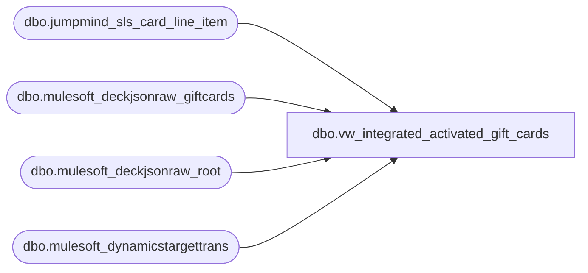

# dbo.vw_integrated_activated_gift_cards

**Database:** LH_Source  
**Server:** 4db76rlxaxcuvmuh5kw37wbnqq-ovsykae43znuhlmnflcdwm4ohu.datawarehouse.fabric.microsoft.com  

## Architecture Diagram



## Table Dependencies

| Referenced Table |
|---|
| dbo.jumpmind_sls_card_line_item |
| dbo.mulesoft_deckjsonraw_giftcards |
| dbo.mulesoft_deckjsonraw_root |
| dbo.mulesoft_dynamicstargettrans |

## View Code

```sql
CREATE VIEW vw_integrated_activated_gift_cards AS WITH pos_giftcards AS (     SELECT         CONVERT(varchar(32),  j.device_id)                                         AS device_id,         CONVERT(varchar(8),   j.business_date)                                     AS business_date,         CONVERT(varchar(50),  j.sequence_number)                                   AS sequence_number,         CONVERT(varchar(50),  j.line_sequence_number)                              AS line_sequence_number,         CONVERT(varchar(200), j.brand)                                             AS brand,         CONVERT(varchar(200), j.card_name)                                         AS card_name,         CONVERT(varchar(200), j.code)                                              AS code,         CONVERT(varchar(200), j.type_code)                                         AS type_code,         CONVERT(varchar(200), j.payment_provider_code)                             AS payment_provider_code,         CONVERT(varchar(64),  j.masked_card_number)                                AS masked_card_number,         CONVERT(varchar(64),  j.entry_mode)                                        AS entry_mode,         CONVERT(varchar(64),  j.service_code)                                      AS service_code,         CONVERT(varchar(16),  j.expiration_date)                                   AS expiration_date,         CONVERT(varchar(50),  j.ref_line_sequence_number)                           AS ref_line_sequence_number,         CONVERT(varchar(64),  j.card_number)                                       AS card_number,         CONVERT(varchar(64),  j.gift_card_action_code)                             AS gift_card_action_code,         CAST(j.last_update_time AS datetime2(6))                                   AS last_update_time     FROM dbo.jumpmind_sls_card_line_item AS j     WHERE j.type_code = 'GIFTCARD' ), hs AS (     SELECT         COALESCE(             NULLIF(CONVERT(varchar(64), dtt.SiteWarehouseCode), ''),             NULLIF(CONVERT(varchar(64), dtt.MaxWarehouseCode), ''),             NULLIF(CONVERT(varchar(64), r.SiteCode), '')         )                                                AS InventLocationId,         CAST(COALESCE(r.OrderDateUTC, r.DateCreatedUTC, r.OrderStatusChangeDateUTC, r.ExportCreatedUTC) AS date) AS TransDate,         CONVERT(varchar(64), r.OrderNumber)              AS OrderNumber,         r.OrderID,         r._RowIndex     FROM dbo.mulesoft_deckjsonraw_root r     LEFT JOIN dbo.mulesoft_dynamicstargettrans dtt       ON CONVERT(varchar(64), dtt.OrderId) = CONVERT(varchar(64), r.OrderID) ), oms_giftcards AS (     SELECT         CONCAT(COALESCE(hs.InventLocationId,'WEB'), '-052')                          AS device_id,         CONVERT(varchar(8), hs.TransDate, 112)                                       AS business_date,         CONVERT(varchar(50),             COALESCE(                 TRY_CONVERT(bigint, hs.OrderNumber),                 TRY_CONVERT(bigint, hs.OrderID),                 ABS(CHECKSUM(CAST(hs.OrderNumber AS nvarchar(4000))))             )         )                                                                             AS sequence_number,         CONVERT(varchar(50), 0)                                                      AS line_sequence_number,         CAST(NULL AS varchar(200))                                                   AS brand,         CAST(NULL AS varchar(200))                                                   AS card_name,         'GIFTCARD'                                                                   AS code,         'GIFTCARD'                                                                   AS type_code,         CAST(NULL AS varchar(200))                                                   AS payment_provider_code,         CASE           WHEN g.GiftCardNumber IS NOT NULL             THEN REPLICATE('*', 12) + RIGHT(CONVERT(varchar(32), g.GiftCardNumber), 4)           ELSE NULL         END                                                                          AS masked_card_number,         CAST(NULL AS varchar(64))                                                    AS entry_mode,         CAST(NULL AS varchar(64))                                                    AS service_code,         CAST(NULL AS varchar(16))                                                    AS expiration_date,         CAST(NULL AS varchar(50))                                                    AS ref_line_sequence_number,         CONVERT(varchar(64), g.GiftCardNumber)                                       AS card_number,         CASE WHEN TRY_CONVERT(int, g.Processed) = 1 THEN 'Issue' ELSE NULL END       AS gift_card_action_code,         CAST(COALESCE(TRY_CONVERT(datetime2(6), g.UpdateDate),                       TRY_CONVERT(datetime2(6), g.InsertDate)) AS datetime2(6))      AS last_update_time     FROM dbo.mulesoft_deckjsonraw_giftcards g     JOIN hs       ON CONVERT(varchar(64), g.OrderTransactionIdentifier) = CONVERT(varchar(64), hs._RowIndex) ) SELECT * FROM pos_giftcards UNION ALL SELECT * FROM oms_giftcards;
```

