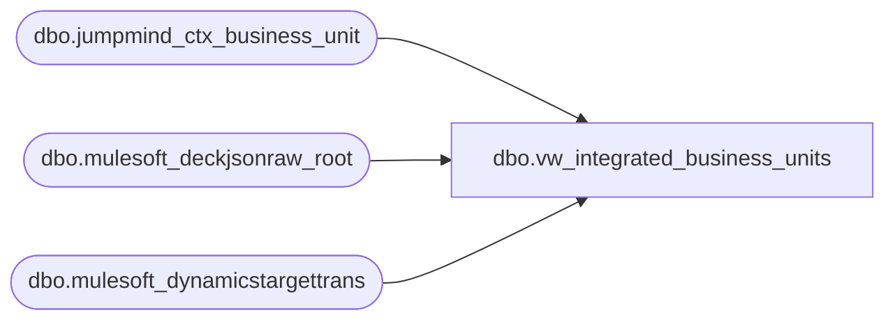

# dbo.vw_integrated_business_units

**Database:** LH_Source  
**Server:** 4db76rlxaxcuvmuh5kw37wbnqq-ovsykae43znuhlmnflcdwm4ohu.datawarehouse.fabric.microsoft.com  

## Architecture Diagram



## Table Dependencies

| Referenced Table |
|---|
| dbo.jumpmind_ctx_business_unit |
| dbo.mulesoft_deckjsonraw_root |
| dbo.mulesoft_dynamicstargettrans |

## View Code

```sql
---there are a few code from the oms side we don't know how to map. CREATE VIEW vw_integrated_business_units AS WITH oms_codes AS (     SELECT         NULLIF(CONVERT(varchar(64), dtt.MaxWarehouseCode), '') AS code,         MIN(COALESCE(r.DateCreatedUTC, r.OrderDateUTC, r.OrderStatusChangeDateUTC, r.ExportCreatedUTC)) AS create_time,         MAX(COALESCE(r.UpdateDate,     r.OrderStatusChangeDateUTC, r.OrderDateUTC,     r.ExportCreatedUTC)) AS last_update_time     FROM [dbo].[mulesoft_dynamicstargettrans] AS dtt     LEFT JOIN [dbo].[mulesoft_deckjsonraw_root] AS r            ON r.OrderID = dtt.OrderId     WHERE NULLIF(dtt.MaxWarehouseCode, '') IS NOT NULL     GROUP BY NULLIF(CONVERT(varchar(64), dtt.MaxWarehouseCode), '') ), oms_bu AS (     SELECT         TRY_CONVERT(int, code)                                    AS business_unit_id,         code                                                       AS geo_code,         code                                                       AS business_unit_name,         CAST(NULL AS varchar(64))                                  AS government_id,         create_time,         CAST('sp_bab_oms_merge_business_units' AS varchar(128))    AS create_by,         last_update_time,         CAST('sp_bab_oms_merge_business_units' AS varchar(128))    AS last_update_by     FROM oms_codes )  SELECT     bu.business_unit_id,     bu.geo_code,     bu.business_unit_name,     bu.government_id,     bu.create_time,     bu.create_by,     bu.last_update_time,     bu.last_update_by FROM [dbo].[jumpmind_ctx_business_unit] AS bu  UNION ALL  SELECT     o.business_unit_id,     o.geo_code,     o.business_unit_name,     o.government_id,     o.create_time,     o.create_by,     o.last_update_time,     o.last_update_by FROM oms_bu AS o LEFT JOIN [dbo].[jumpmind_ctx_business_unit] AS bu        ON bu.geo_code = o.geo_code   -- avoids duplicates where POS already defines this code WHERE bu.geo_code IS NULL;
```

