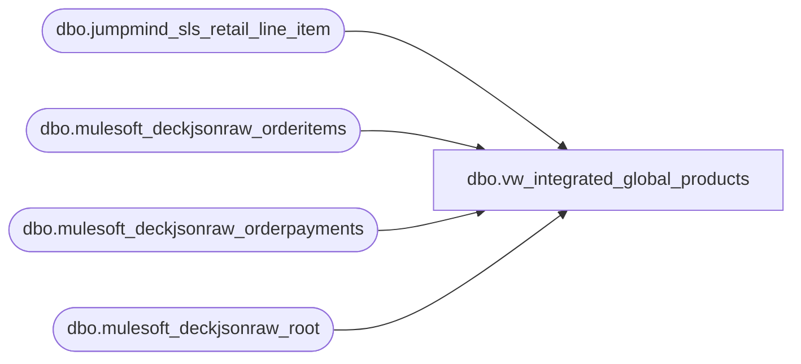

# dbo.vw_integrated_global_products

**Database:** LH_Source  
**Server:** 4db76rlxaxcuvmuh5kw37wbnqq-ovsykae43znuhlmnflcdwm4ohu.datawarehouse.fabric.microsoft.com  

## Architecture Diagram



## Table Dependencies

| Referenced Table |
|---|
| dbo.jumpmind_sls_retail_line_item |
| dbo.mulesoft_deckjsonraw_orderitems |
| dbo.mulesoft_deckjsonraw_orderpayments |
| dbo.mulesoft_deckjsonraw_root |

## View Code

```sql
CREATE VIEW vw_integrated_global_products AS WITH jumpmind_global_product_cte AS ( SELECT DISTINCT        [item_id]			AS [Item ID]       ,RIGHT([item_id],5)	AS [Core SKU]       ,[item_description]	AS [Item Description]       ,[iso_currency_code]	AS [Currency]       ,[item_type]			AS [Item Type] 	  ,CASE 			WHEN	[iso_currency_code] =	'USD' 			THEN	[item_description] 			END AS	'Item Name (US)' 	  ,CASE 			WHEN	[iso_currency_code] =	'CAD' 			THEN	[item_description] 			END AS	'Item Name (CA)' 	  ,CASE 			WHEN	[iso_currency_code] =	'GBP' 			THEN	[item_description] 			END AS	'Item Name (UK)' 	  ,CASE 			WHEN	[iso_currency_code] =	'EUR' 			THEN	[item_description] 			END AS	'Item Name (IE)'   FROM		[dbo].[jumpmind_sls_retail_line_item]   WHERE LEN(item_id)		=	6 ), deck_global_products_cte AS ( SELECT DISTINCT StyleNumber as [Item ID] , DeckSKU as [Core SKU] , oi.Custom1 as [Item Description] , case when r.SiteCode = 'BAB'  		then 'USD' 	else 'GBP' 	end as [Currency] , CASE WHEN UPPER(oi.ItemTypeLocalizeName) = 'REGULAR ITEM'  	THEN 'STOCK' ELSE UPPER(oi.ItemTypeLocalizeName) END as [Item Type] FROM LH_Source.dbo.mulesoft_deckjsonraw_orderitems oi LEFT JOIN LH_Source.dbo.mulesoft_deckjsonraw_root r ON oi.OrderID = r.OrderID LEFT JOIN LH_Source.dbo.mulesoft_deckjsonraw_orderpayments op on oi.PaymentID = op.ID ), deck_global_products_ext AS ( 	SELECT * 	,CASE 		WHEN	[Currency] =	'USD' 		THEN	[Item Description] 		END AS	'Item Name (US)' 	,CASE 		WHEN	[Currency] =	'CAD' 		THEN	[Item Description] 		END AS	'Item Name (CA)' 	,CASE 		WHEN	[Currency] =	'GBP' 		THEN	[Item Description] 		END AS	'Item Name (UK)' 	,CASE 		WHEN	[Currency] =	'EUR' 		THEN	[Item Description] 		END AS	'Item Name (IE)' 	FROM deck_global_products_cte ) SELECT * FROM jumpmind_global_product_cte UNION SELECT * FROM deck_global_products_ext
```

