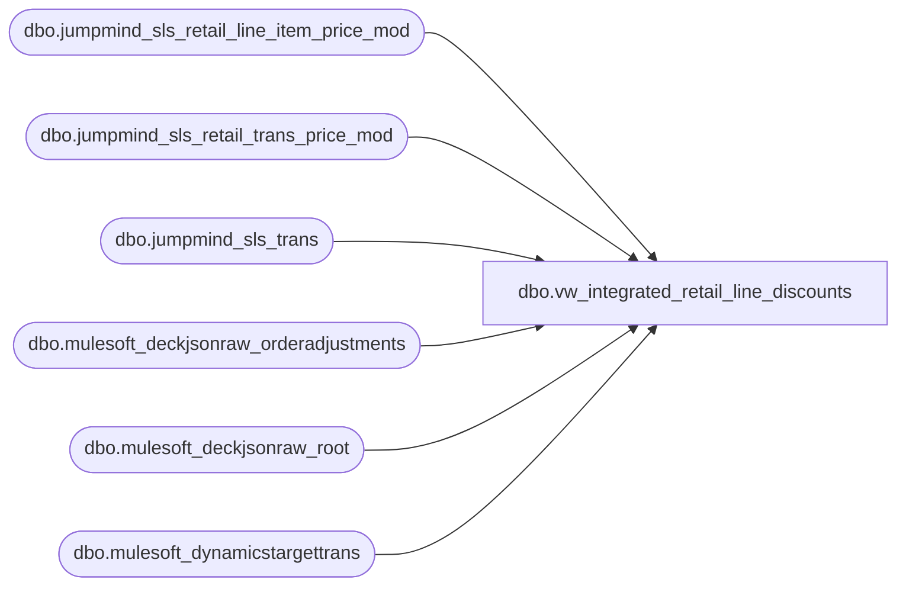

# dbo.vw_integrated_retail_line_discounts

**Database:** LH_Source  
**Server:** 4db76rlxaxcuvmuh5kw37wbnqq-ovsykae43znuhlmnflcdwm4ohu.datawarehouse.fabric.microsoft.com  

## Architecture Diagram



## Table Dependencies

| Referenced Table |
|---|
| dbo.jumpmind_sls_retail_line_item_price_mod |
| dbo.jumpmind_sls_retail_trans_price_mod |
| dbo.jumpmind_sls_trans |
| dbo.mulesoft_deckjsonraw_orderadjustments |
| dbo.mulesoft_deckjsonraw_root |
| dbo.mulesoft_dynamicstargettrans |

## View Code

```sql
CREATE VIEW vw_integrated_retail_line_discounts AS WITH pos_tx_header AS (     SELECT         st.device_id,         st.business_date,         st.sequence_number     FROM dbo.jumpmind_sls_trans st ), pos_trans_mod AS (     SELECT         business_date,         calc_method,         device_id,         entry_method_code,         iso_currency_code,         last_update_time,         line_sequence_number,         mod_line_sequence_number,         override_user_id,         price_mod_source_type_code,         price_mod_type_code,         reason_code,         rounding_amount,         mod_by_amount,         mod_by_percentage,         create_time,         create_by,         last_update_by,         sequence_number,         username,         voided     FROM dbo.jumpmind_sls_retail_trans_price_mod ), pos_lineitem_coupon_agg AS (     SELECT         x.device_id,         x.business_date,         x.sequence_number,         STRING_AGG(x.applied_coupon_item_ids, ',') AS applied_coupon_item_ids     FROM (         SELECT DISTINCT             lipm.device_id,             lipm.business_date,             lipm.sequence_number,             CONVERT(varchar(256), lipm.applied_coupon_item_ids) AS applied_coupon_item_ids         FROM dbo.jumpmind_sls_retail_line_item_price_mod AS lipm         WHERE lipm.applied_coupon_item_ids IS NOT NULL           AND LTRIM(RTRIM(CONVERT(varchar(256), lipm.applied_coupon_item_ids))) <> ''     ) AS x     GROUP BY         x.device_id,         x.business_date,         x.sequence_number ), hs AS (     SELECT         COALESCE(             NULLIF(CONVERT(varchar(64), dtt.SiteWarehouseCode), ''),             NULLIF(CONVERT(varchar(64), dtt.MaxWarehouseCode), ''),             NULLIF(CONVERT(varchar(64), r.SiteCode), '')         )                                         AS InventLocationId,         CAST(COALESCE(r.OrderDateUTC, r.DateCreatedUTC, r.OrderStatusChangeDateUTC, r.ExportCreatedUTC) AS date)                                                   AS TransDate,         CONVERT(varchar(64), r.OrderNumber)       AS Barcode,         r.OrderID,         r._RowIndex     FROM dbo.mulesoft_deckjsonraw_root r     LEFT JOIN dbo.mulesoft_dynamicstargettrans dtt         ON CONVERT(varchar(64), dtt.OrderId) = CONVERT(varchar(64), r.OrderID) ), deck_adjustments AS (     SELECT         a._ParentKeyField             AS OrderID_key,         a.OrderTransactionIdentifier  AS RootRowIndex,         a.AdjustmentDate,         a.AdjustmentTypeValue     FROM dbo.mulesoft_deckjsonraw_orderadjustments a ) SELECT     CONCAT(         CAST(h.device_id AS varchar(64)), '-',          CONVERT(varchar(10), h.business_date, 120), '-',          CONVERT(varchar(50), h.sequence_number)     )                                           AS TransactionKey,     COALESCE(a.applied_coupon_item_ids, '')     AS applied_coupon_item_ids,     d.business_date                             AS business_date,     d.calc_method                               AS calc_method,     COALESCE(CONVERT(varchar(128), d.create_by), '')        AS create_by,     d.create_time                               AS create_time,     COALESCE(NULLIF(CONVERT(varchar(256), d.reason_code), ''),              NULLIF(CONVERT(varchar(256), d.price_mod_type_code), ''),              '')                                 AS description,     d.device_id                                 AS device_id,     COALESCE(CONVERT(varchar(64), d.entry_method_code), '') AS entry_method_code,     COALESCE(CONVERT(varchar(10), d.iso_currency_code), '') AS iso_currency_code,     COALESCE(CONVERT(varchar(128), d.last_update_by), '')   AS last_update_by,     d.last_update_time                          AS last_update_time,     d.line_sequence_number                      AS line_sequence_number,     ''                                          AS loyalty_promotion_id,     d.mod_by_amount                             AS mod_by_amount,     d.mod_by_percentage                         AS mod_by_percentage,     d.mod_by_amount                             AS modification_total,     COALESCE(CONVERT(varchar(64), d.override_user_id), '')  AS override_user_id,     ''                                          AS price_mod_source_sub_type_code,     COALESCE(CONVERT(varchar(64), d.price_mod_source_type_code), '') AS price_mod_source_type_code,     COALESCE(CONVERT(varchar(64), d.price_mod_type_code), '')        AS price_mod_type_code,     ''                                          AS promotion_id,     CAST(NULL AS numeric(18,6))                 AS promotion_reward_quantity,     CASE          WHEN UPPER(COALESCE(d.price_mod_source_type_code,'')) LIKE '%EMPLOYEE%' THEN 'Employee Discount'         ELSE ''     END                                         AS promotion_type,     COALESCE(CONVERT(varchar(64), d.reason_code), '')        AS reason_code,     CAST(NULL AS int)                           AS ref_line_sequence_number,     d.sequence_number                           AS sequence_number,     COALESCE(CONVERT(varchar(128), d.username), '')          AS username,     d.voided                                    AS voided,     ''                                          AS promo_code_id,     ''                                          AS reward_base_price_type_code,     CAST(NULL AS bit)                           AS vendor_funded_flag,     CAST(NULL AS int)                           AS quantity_index,     ''                                          AS rtn_device_id,     CAST(NULL AS date)                          AS rtn_business_date,     CAST(NULL AS bigint)                        AS rtn_sequence_number,     CAST(0 AS bit)                              AS returned_flag,     ''                                          AS external_id,     'POS'                                       AS SourceSystem FROM pos_trans_mod d JOIN pos_tx_header h   ON h.device_id = d.device_id  AND h.business_date = d.business_date  AND h.sequence_number = d.sequence_number LEFT JOIN pos_lineitem_coupon_agg a   ON a.device_id = d.device_id  AND a.business_date = d.business_date  AND a.sequence_number = d.sequence_number UNION ALL SELECT     CONCAT(         hs.InventLocationId, '-', '052', '-', CONVERT(varchar, hs.TransDate, 112), '-', hs.Barcode     )                                           AS TransactionKey,     ''                                          AS applied_coupon_item_ids,     CONVERT(varchar(8), hs.TransDate, 112)      AS business_date,     'AMOUNT'                                    AS calc_method,     ''                                          AS create_by,     da.AdjustmentDate                           AS create_time,     COALESCE(CONVERT(varchar(256), da.AdjustmentTypeValue), '') AS description,     'WEB'                                       AS device_id,     ''                                          AS entry_method_code,     CASE          WHEN hs.InventLocationId LIKE 'BAB%' THEN 'USD' ELSE 'GBP'     END                                         AS iso_currency_code,     ''                                          AS last_update_by,     da.AdjustmentDate                           AS last_update_time,     CAST(0 AS int)                              AS line_sequence_number,     ''                                          AS loyalty_promotion_id,     CAST(NULL AS numeric(18,6))                 AS mod_by_amount,     CAST(NULL AS numeric(18,6))                 AS mod_by_percentage,     CAST(NULL AS numeric(18,6))                 AS modification_total,     ''                                          AS override_user_id,     ''                                          AS price_mod_source_sub_type_code,     CASE          WHEN da.AdjustmentTypeValue LIKE '%Manual%' THEN 'MANUAL' ELSE 'SYSTEM'     END                                         AS price_mod_source_type_code,     'TRANS'                                     AS price_mod_type_code,     ''                                          AS promotion_id,     CAST(NULL AS numeric(18,6))                 AS promotion_reward_quantity,     ''                                          AS promotion_type,     ''                                          AS reason_code,     CAST(NULL AS int)                           AS ref_line_sequence_number,     TRY_CONVERT(bigint, da.OrderID_key)         AS sequence_number,     ''                                          AS username,     CAST(0 AS bit)                              AS voided,     ''                                          AS promo_code_id,     ''                                          AS reward_base_price_type_code,     CAST(NULL AS bit)                           AS vendor_funded_flag,     CAST(NULL AS int)                           AS quantity_index,     ''                                          AS rtn_device_id,     CAST(NULL AS date)                          AS rtn_business_date,     CAST(NULL AS bigint)                        AS rtn_sequence_number,     CAST(NULL AS bit)                           AS returned_flag,     ''                                          AS external_id,     'OMS'                                       AS SourceSystem FROM deck_adjustments da JOIN hs   ON CONVERT(varchar(64), hs.OrderID) = CONVERT(varchar(64), da.OrderID_key)  AND hs._RowIndex = da.RootRowIndex;
```

