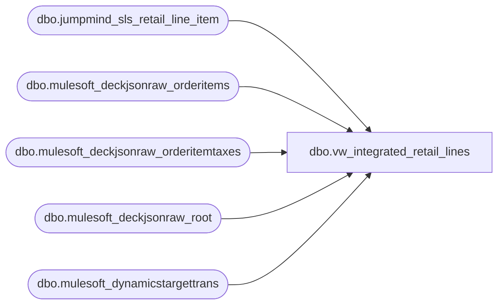

# dbo.vw_integrated_retail_lines

**Database:** LH_Source  
**Server:** 4db76rlxaxcuvmuh5kw37wbnqq-ovsykae43znuhlmnflcdwm4ohu.datawarehouse.fabric.microsoft.com  

## Architecture Diagram



## Table Dependencies

| Referenced Table |
|---|
| dbo.jumpmind_sls_retail_line_item |
| dbo.mulesoft_deckjsonraw_orderitems |
| dbo.mulesoft_deckjsonraw_orderitemtaxes |
| dbo.mulesoft_deckjsonraw_root |
| dbo.mulesoft_dynamicstargettrans |

## View Code

```sql
CREATE VIEW vw_integrated_retail_lines AS WITH pos_lines AS (     SELECT         CAST(j.device_id AS varchar(64)) AS device_id,         CONVERT(varchar(8), TRY_CONVERT(date, j.business_date, 112), 112) AS business_date,         CAST(j.sequence_number AS bigint) AS sequence_number,         CAST(j.line_sequence_number AS int) AS line_sequence_number,         CAST(j.pos_item_id AS varchar(8000)) AS pos_item_id,         CAST(j.item_id AS varchar(8000)) AS item_id,         CAST(j.item_description AS varchar(8000)) AS item_description,         CAST(j.item_type AS varchar(8000)) AS item_type,         CAST(j.regular_unit_price AS decimal(18,2)) AS regular_unit_price,         CAST(j.actual_unit_price  AS decimal(18,2)) AS actual_unit_price,         CAST(j.loyalty_unit_price AS decimal(18,2)) AS loyalty_unit_price,         CAST(j.quantity AS decimal(18,2)) AS quantity,         CAST(j.extended_amount AS decimal(18,2)) AS extended_amount,         CAST(j.discount_amount AS decimal(18,2)) AS discount_amount,         CAST(j.extended_discounted_amount AS decimal(18,2)) AS extended_discounted_amount,         CAST(j.rtn_extended_discounted_amount AS decimal(18,2)) AS rtn_extended_discounted_amount,         CAST(j.tax_amount AS decimal(18,2)) AS tax_amount,         CAST(j.reason_code_group_id AS varchar(8000)) AS reason_code_group_id,         CAST(j.reason_code AS varchar(8000)) AS reason_code,         CAST(j.disposition_code AS varchar(8000)) AS disposition_code,         CAST(j.gift_receipt AS int) AS gift_receipt,         CAST(j.item_returnable AS int) AS item_returnable,         CAST(j.item_taxable AS int) AS item_taxable,         CAST(j.quantity_avail_for_return AS decimal(18,2)) AS quantity_avail_for_return,         CAST(j.item_discountable AS int) AS item_discountable,         CAST(j.employee_discount_allowed AS int) AS employee_discount_allowed,         CAST(j.item_price_overridable AS int) AS item_price_overridable,         CAST(j.discount_applied AS int) AS discount_applied,         CAST(j.damage_discount_applied AS int) AS damage_discount_applied,         CAST(j.tax_included_in_price AS int) AS tax_included_in_price,         CAST(j.tax_group_id AS varchar(8000)) AS tax_group_id,         CAST(j.orig_line_sequence_number AS int) AS orig_line_sequence_number,         CAST(j.orig_sequence_number AS bigint) AS orig_sequence_number,         CAST(j.orig_business_date AS varchar(8000)) AS orig_business_date,         CAST(j.orig_device_id AS varchar(8000)) AS orig_device_id,         CAST(j.orig_order_id AS varchar(8000)) AS orig_order_id,         CAST(j.orig_username AS varchar(8000)) AS orig_username,         CAST(j.orig_business_unit_id AS varchar(8000)) AS orig_business_unit_id,         CAST(j.return_policy_id AS varchar(8000)) AS return_policy_id,         CAST(j.item_returned AS int) AS item_returned,         CAST(j.iso_currency_code AS varchar(8)) AS iso_currency_code,         CAST(j.tare_weight AS decimal(18,2)) AS tare_weight,         CAST(j.item_weight AS decimal(18,2)) AS item_weight,         CAST(j.item_weight_plus_tare AS decimal(18,2)) AS item_weight_plus_tare,         CAST(j.weight_unit_of_measure AS varchar(8000)) AS weight_unit_of_measure,         CAST(j.weight_entry_method_code AS varchar(8000)) AS weight_entry_method_code,         CAST(j.family_code AS varchar(8000)) AS family_code,         CAST(j.item_length AS decimal(18,2)) AS item_length,         CAST(j.length_unit_of_measure AS varchar(8000)) AS length_unit_of_measure,         CAST(j.quantity_modifiable AS int) AS quantity_modifiable,         CAST(j.save_value AS decimal(18,2)) AS save_value,         CAST(j.save_value_type AS varchar(8000)) AS save_value_type,         CAST(j.coupon_allowed AS int) AS coupon_allowed,         CAST(j.eletronic_coupon_allowed AS int) AS eletronic_coupon_allowed,         CAST(j.coupon_multiply_allowed AS int) AS coupon_multiply_allowed,         CAST(j.username AS varchar(8000)) AS username,         CAST(j.external_system_id AS varchar(8000)) AS external_system_id,         CAST(j.product_id AS varchar(8000)) AS product_id,         CAST(j.item_name AS varchar(8000)) AS item_name,         CAST(j.item_long_description AS varchar(8000)) AS item_long_description,         CAST(j.additional_classifiers AS varchar(8000)) AS additional_classifiers,         CAST(j.order_line_number AS int) AS order_line_number,         CAST(j.order_id AS varchar(8000)) AS order_id,         CAST(j.line_item_type AS varchar(8000)) AS line_item_type,         CAST(j.inquiry_method_code AS varchar(8000)) AS inquiry_method_code,         CAST(j.voided AS int) AS voided,         CAST(j.override_user_id AS varchar(8000)) AS override_user_id,         CAST(j.entry_method_code AS varchar(8000)) AS entry_method_code,         CAST(j.create_time AS datetime2) AS create_time,         CAST(j.create_by AS varchar(8000)) AS create_by,         CAST(j.last_update_time AS datetime2) AS last_update_time,         CAST(j.last_update_by AS varchar(8000)) AS last_update_by,         CAST(j.stuff_info AS varchar(8000)) AS stuff_info,         CAST(j.find_a_bear_id AS varchar(8000)) AS find_a_bear_id,         CAST(j.serialized_coupon_barcode AS varchar(8000)) AS serialized_coupon_barcode,         CAST(j.classifier_class AS varchar(8000)) AS classifier_class,         CAST(j.classifier_style AS varchar(8000)) AS classifier_style,         CAST(j.classifier_brand AS varchar(8000)) AS classifier_brand,         CAST(j.classifier_department AS varchar(8000)) AS classifier_department,         CAST(j.price_type AS varchar(8000)) AS price_type,         CAST(j.list_unit_price AS decimal(18,2)) AS list_unit_price,         CAST(j.retail_unit_price AS decimal(18,2)) AS retail_unit_price,         CAST(j.item_tax_group_id AS varchar(8000)) AS item_tax_group_id,         CAST(j.tax_group_type AS varchar(8000)) AS tax_group_type,         CAST(j.tax_exempted AS int) AS tax_exempted,         CAST(j.tender_group AS varchar(8000)) AS tender_group,         CAST(j.tender_auth_method_code AS varchar(8000)) AS tender_auth_method_code,         CAST(j.serial_number AS varchar(8000)) AS serial_number,         CAST(j.cart_line_item_uuid AS varchar(8000)) AS cart_line_item_uuid,         CAST(j.related_line_sequence_number AS int) AS related_line_sequence_number,         CAST(j.epc AS varchar(8000)) AS epc,         CAST(j.tax_group_id_modification_type AS varchar(8000)) AS tax_group_id_modification_type,         CAST(j.additional_attributes AS varchar(8000)) AS additional_attributes,         CONCAT(             CAST(j.device_id AS varchar(64)),             '-',             CONVERT(varchar(10), TRY_CONVERT(date, j.business_date, 112), 120),             '-',             CAST(j.sequence_number AS varchar(50))         ) AS transaction_key,         'POS' AS source     FROM dbo.jumpmind_sls_retail_line_item j     WHERE TRY_CONVERT(date, j.business_date, 112) >= DATEADD(year, -1, CAST(GETDATE() AS date)) ), root AS (     SELECT         r.OrderID,         r.OrderNumber,         r.SiteCode,         CAST(COALESCE(r.OrderDateUTC, r.DateCreatedUTC) AS date) AS TransDate,         r.OrderDateUTC,         r.DateCreatedUTC,         r.OrderStatusChangeDateUTC     FROM dbo.mulesoft_deckjsonraw_root r     WHERE CAST(COALESCE(r.OrderDateUTC, r.DateCreatedUTC) AS date) >= DATEADD(year, -1, CAST(GETDATE() AS date)) ), site_wh AS (     SELECT         rt.OrderID,         COALESCE(NULLIF(CONVERT(varchar(64), dtt.SiteWarehouseCode), ''),                  NULLIF(CONVERT(varchar(64), rt.SiteCode), '')) AS InventLocationId,         rt.TransDate,         rt.OrderNumber     FROM root rt     OUTER APPLY (         SELECT TOP (1) dtt.SiteWarehouseCode         FROM dbo.mulesoft_dynamicstargettrans dtt         WHERE dtt.OrderId = rt.OrderID         ORDER BY TRY_CONVERT(datetime2(7), dtt.ExportCreatedUTC) DESC     ) dtt ), oms_base AS (     SELECT         oi.ID AS OI_ID,         TRY_CONVERT(bigint, oi.OrderID) AS OI_OrderID,         oi.ExternalItemID AS OI_ExternalItemID,         oi.Custom1 AS OI_Custom1,         oi.ItemTypeID AS OI_ItemTypeID,         oi.GrossPrice AS OI_GrossPrice,         oi.NetPrice AS OI_NetPrice,         oi.Returnable AS OI_Returnable,         oi.InsertDate AS OI_InsertDate,         oi.UpdateDate AS OI_UpdateDate     FROM dbo.mulesoft_deckjsonraw_orderitems oi ), oms_with_seq AS (     SELECT         ob.*,         ROW_NUMBER() OVER (             PARTITION BY ob.OI_OrderID             ORDER BY COALESCE(ob.OI_UpdateDate, ob.OI_InsertDate) ASC, ob.OI_ID         ) AS rn_line     FROM oms_base ob ), oms_lines AS (     SELECT         CAST(COALESCE(sw.InventLocationId, 'WEB') + '-052' AS varchar(8000)) AS device_id,         CONVERT(varchar(8), rt.TransDate, 112) AS business_date,         COALESCE(             TRY_CONVERT(bigint, rt.OrderNumber),             TRY_CONVERT(bigint, rt.OrderID),             CAST(ABS(CHECKSUM(CAST(rt.OrderNumber AS nvarchar(4000)))) AS bigint)         ) AS sequence_number,         CAST(ow.rn_line AS int) AS line_sequence_number,         CAST(ow.OI_ExternalItemID AS varchar(8000)) AS pos_item_id,         CAST(ow.OI_ID AS varchar(8000)) AS item_id,         CAST(ow.OI_Custom1 AS varchar(8000)) AS item_description,         CAST(ow.OI_ItemTypeID AS varchar(8000)) AS item_type,         CAST(ow.OI_GrossPrice AS decimal(18,2)) AS regular_unit_price,         CAST(ow.OI_NetPrice AS decimal(18,2)) AS actual_unit_price,         CAST(NULL AS decimal(18,2)) AS loyalty_unit_price,         CAST(1 AS decimal(18,2)) AS quantity,         CAST(ow.OI_GrossPrice AS decimal(18,2)) AS extended_amount,         CAST(NULLIF(ow.OI_GrossPrice - ow.OI_NetPrice, 0.0) AS decimal(18,2)) AS discount_amount,         CAST(ow.OI_NetPrice AS decimal(18,2)) AS extended_discounted_amount,         CAST(NULL AS decimal(18,2)) AS rtn_extended_discounted_amount,         CAST(oit.Amount AS decimal(18,2)) AS tax_amount,         CAST(NULL AS varchar(8000)) AS reason_code_group_id,         CAST(NULL AS varchar(8000)) AS reason_code,         CAST(NULL AS varchar(8000)) AS disposition_code,         CAST(0 AS int) AS gift_receipt,         CAST(ow.OI_Returnable AS int) AS item_returnable,         CAST(1 AS int) AS item_taxable,         CAST(NULL AS decimal(18,2)) AS quantity_avail_for_return,         CAST(1 AS int) AS item_discountable,         CAST(NULL AS int) AS employee_discount_allowed,         CAST(NULL AS int) AS item_price_overridable,         CASE WHEN NULLIF(ow.OI_GrossPrice - ow.OI_NetPrice, 0.0) IS NOT NULL THEN 1 ELSE 0 END AS discount_applied,         CAST(0 AS int) AS damage_discount_applied,         CAST(oit.IsVAT AS int) AS tax_included_in_price,         CAST(NULL AS varchar(8000)) AS tax_group_id,         CAST(NULL AS int) AS orig_line_sequence_number,         CAST(NULL AS bigint) AS orig_sequence_number,         CAST(NULL AS varchar(8000)) AS orig_business_date,         CAST(NULL AS varchar(8000)) AS orig_device_id,         CAST(NULL AS varchar(8000)) AS orig_order_id,         CAST(NULL AS varchar(8000)) AS orig_username,         CAST(NULL AS varchar(8000)) AS orig_business_unit_id,         CAST(NULL AS varchar(8000)) AS return_policy_id,         CAST(0 AS int) AS item_returned,         CASE WHEN rt.SiteCode = 'BAB' THEN 'USD' ELSE 'GBP' END AS iso_currency_code,         CAST(NULL AS decimal(18,2)) AS tare_weight,         CAST(NULL AS decimal(18,2)) AS item_weight,         CAST(NULL AS decimal(18,2)) AS item_weight_plus_tare,         CAST(NULL AS varchar(8000)) AS weight_unit_of_measure,         CAST(NULL AS varchar(8000)) AS weight_entry_method_code,         CAST(NULL AS varchar(8000)) AS family_code,         CAST(NULL AS decimal(18,2)) AS item_length,         CAST(NULL AS varchar(8000)) AS length_unit_of_measure,         CAST(NULL AS int) AS quantity_modifiable,         CAST(NULL AS decimal(18,2)) AS save_value,         CAST(NULL AS varchar(8000)) AS save_value_type,         CAST(1 AS int) AS coupon_allowed,         CAST(NULL AS int) AS eletronic_coupon_allowed,         CAST(NULL AS int) AS coupon_multiply_allowed,         CAST(NULL AS varchar(8000)) AS username,         CAST(NULL AS varchar(8000)) AS external_system_id,         CAST(ow.OI_ExternalItemID AS varchar(8000)) AS product_id,         CAST(NULL AS varchar(8000)) AS item_name,         CAST(NULL AS varchar(8000)) AS item_long_description,         CAST(NULL AS varchar(8000)) AS additional_classifiers,         CAST(ow.rn_line AS int) AS order_line_number,         CAST(ow.OI_OrderID AS varchar(8000)) AS order_id,         CAST('WEB_SALE' AS varchar(8000)) AS line_item_type,         CAST(NULL AS varchar(8000)) AS inquiry_method_code,         CAST(0 AS int) AS voided,         CAST(NULL AS varchar(8000)) AS override_user_id,         CAST('WEB' AS varchar(8000)) AS entry_method_code,         CAST(rt.DateCreatedUTC AS datetime2) AS create_time,         CAST('deckjsonraw' AS varchar(8000)) AS create_by,         CAST(rt.OrderStatusChangeDateUTC AS datetime2) AS last_update_time,         CAST('deckjsonraw' AS varchar(8000)) AS last_update_by,         CAST(NULL AS varchar(8000)) AS stuff_info,         CAST(NULL AS varchar(8000)) AS find_a_bear_id,         CAST(NULL AS varchar(8000)) AS serialized_coupon_barcode,         CAST(NULL AS varchar(8000)) AS classifier_class,         CAST(NULL AS varchar(8000)) AS classifier_style,         CAST(NULL AS varchar(8000)) AS classifier_brand,         CAST(NULL AS varchar(8000)) AS classifier_department,         CAST('P' AS varchar(8000)) AS price_type,         CAST(NULL AS decimal(18,2)) AS list_unit_price,         CAST(NULL AS decimal(18,2)) AS retail_unit_price,         CAST(NULL AS varchar(8000)) AS item_tax_group_id,         CAST(NULL AS varchar(8000)) AS tax_group_type,         CAST(0 AS int) AS tax_exempted,         CAST('WEB' AS varchar(8000)) AS tender_group,         CAST(NULL AS varchar(8000)) AS tender_auth_method_code,         CAST(NULL AS varchar(8000)) AS serial_number,         CAST(NULL AS varchar(8000)) AS cart_line_item_uuid,         CAST(NULL AS int) AS related_line_sequence_number,         CAST(NULL AS varchar(8000)) AS epc,         CAST(NULL AS varchar(8000)) AS tax_group_id_modification_type,         CAST(NULL AS varchar(8000)) AS additional_attributes,         CONCAT(             COALESCE(sw.InventLocationId, 'WEB'),             '-052-',             CONVERT(varchar(8), rt.TransDate, 112),             '-',             CONVERT(varchar(64), rt.OrderNumber)         ) AS transaction_key,         'OMS' AS source     FROM oms_with_seq ow     JOIN root rt       ON ow.OI_OrderID = TRY_CONVERT(bigint, rt.OrderID)     JOIN site_wh sw       ON sw.OrderID = rt.OrderID     LEFT JOIN dbo.mulesoft_deckjsonraw_orderitemtaxes oit       ON TRY_CONVERT(bigint, ow.OI_ID) = TRY_CONVERT(bigint, oit._ParentKeyField) ) SELECT * FROM pos_lines UNION ALL SELECT * FROM oms_lines;
```

