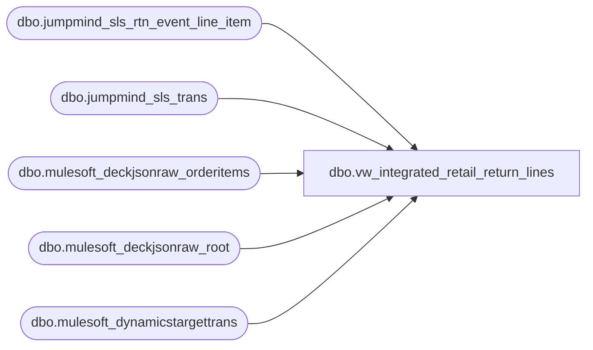

# dbo.vw_integrated_retail_return_lines

**Database:** LH_Source  
**Server:** 4db76rlxaxcuvmuh5kw37wbnqq-ovsykae43znuhlmnflcdwm4ohu.datawarehouse.fabric.microsoft.com  

## Architecture Diagram



## Table Dependencies

| Referenced Table |
|---|
| dbo.jumpmind_sls_rtn_event_line_item |
| dbo.jumpmind_sls_trans |
| dbo.mulesoft_deckjsonraw_orderitems |
| dbo.mulesoft_deckjsonraw_root |
| dbo.mulesoft_dynamicstargettrans |

## View Code

```sql
CREATE VIEW vw_integrated_retail_return_lines AS WITH pos_ret AS (   SELECT       CAST(j.device_id AS varchar(64))                                                       AS device_id,       CONVERT(varchar(8), j.business_date, 112)                                              AS business_date,       CAST(j.sequence_number AS bigint)                                                      AS sequence_number,       CAST(j.line_sequence_number AS int)                                                    AS line_sequence_number,       CAST(j.rtn_event_type_code AS varchar(64))                                             AS rtn_event_type_code,       CAST(j.rtn_rejection_code AS varchar(256))                                             AS rtn_rejection_code,       CAST(j.pos_item_id AS varchar(64))                                                     AS pos_item_id,       CAST(j.item_id AS varchar(64))                                                         AS item_id,       CAST(j.entry_mode_code AS varchar(32))                                                 AS entry_mode_code,       CAST(j.orig_line_sequence_number AS int)                                               AS orig_line_sequence_number,       CAST(j.orig_sequence_number AS bigint)                                                 AS orig_sequence_number,       CASE         WHEN j.orig_business_date IS NULL THEN NULL         ELSE CONVERT(varchar(8), TRY_CONVERT(date, j.orig_business_date, 112), 112)       END                                                                                    AS orig_business_date,       CAST(j.orig_device_id AS varchar(64))                                                  AS orig_device_id,       CAST(j.orig_order_id AS varchar(64))                                                   AS orig_order_id,       CAST(j.rtn_policy_id AS varchar(64))                                                   AS rtn_policy_id,       CAST(j.voided AS bit)                                                                  AS voided,       CAST(j.override_user_id AS varchar(64))                                                AS override_user_id,       CAST(j.entry_method_code AS varchar(32))                                               AS entry_method_code,       CAST(j.create_time AS datetime2)                                                       AS create_time,       CAST('openpos-sls' AS varchar(64))                                                     AS create_by,       CAST(NULL AS datetime2)                                                                AS last_update_time,       CAST(NULL AS varchar(64))                                                              AS last_update_by,       CAST('POS' AS varchar(8))                                                              AS source   FROM dbo.jumpmind_sls_rtn_event_line_item j   JOIN dbo.jumpmind_sls_trans st     ON st.device_id = j.device_id    AND st.business_date = j.business_date    AND st.sequence_number = j.sequence_number   WHERE st.training_mode = 0     AND st.trans_status = 'COMPLETED' ), oms_items AS (   SELECT       TRY_CONVERT(int, oi._ParentKeyField)                                                   AS ParentOrderID,       CAST(oi.ID AS varchar(64))                                                             AS OI_ID,       CAST(oi._RowIndex AS int)                                                              AS RowIndex,       oi.ReturnTypeID                                                                        AS ReturnTypeID,       oi.ReturnReasonID                                                                      AS ReturnReasonID,       CAST(oi.ReturnReasonText AS varchar(256))                                              AS ReturnReasonText,       CAST(oi.ItemStatusName AS varchar(128))                                                AS ItemStatusName,       CAST(oi.ItemStatusCode AS varchar(64))                                                 AS ItemStatusCode,       TRY_CONVERT(bigint, oi.ExternalItemID)                                                 AS ExternalItemID_bigint,       TRY_CONVERT(bigint, oi.OrderID)                                                        AS OrderID_bigint,       CAST(oi.DeckSKU AS varchar(64))                                                        AS DeckSKU,       CAST(oi.GTIN AS varchar(64))                                                           AS GTIN,       CAST(oi.WarehouseCode AS varchar(64))                                                  AS WarehouseCode,       oi.InsertDate                                                                          AS InsertDate,       oi.UpdateDate                                                                          AS UpdateDate   FROM dbo.mulesoft_deckjsonraw_orderitems oi   WHERE TRY_CONVERT(int, oi._ParentKeyField) IS NOT NULL ), oms_join AS (   SELECT       r.OrderID,       r.OrderNumber,       r.SiteCode,       CAST(COALESCE(r.OrderDateUTC, r.DateCreatedUTC) AS date)                                AS TransDate,       COALESCE(i.UpdateDate, r.UpdateDate, r.OrderDateUTC, r.DateCreatedUTC, i.InsertDate)   AS LastUpd,       i.RowIndex,       i.ReturnTypeID,       i.ReturnReasonID,       i.ReturnReasonText,       i.ItemStatusName,       i.ItemStatusCode,       i.ExternalItemID_bigint,       i.OrderID_bigint,       i.DeckSKU,       i.GTIN,       i.WarehouseCode   FROM oms_items i   JOIN dbo.mulesoft_deckjsonraw_root r     ON r.OrderID = i.ParentOrderID ), oms_ret AS (   SELECT       CAST(COALESCE(CAST(swh.SiteWarehouseCode AS varchar(64)), CAST(j.SiteCode AS varchar(64)), CAST(j.WarehouseCode AS varchar(64)), 'WEB') AS varchar(64)) AS device_id,       CONVERT(varchar(8), j.TransDate, 112)                                                   AS business_date,       CAST(j.OrderID AS bigint)                                                               AS sequence_number,       CAST(COALESCE(j.RowIndex, 1) AS int)                                                    AS line_sequence_number,       CAST(CASE             WHEN j.ReturnTypeID IS NOT NULL THEN 'RETURN'             WHEN j.ItemStatusName IN ('Returned','Refund','Return Authorized') THEN 'RETURN'             WHEN j.ItemStatusCode IN ('RET','RFND','RAUTH') THEN 'RETURN'             ELSE 'ORDER_ITEM'           END AS varchar(64))                                                                 AS rtn_event_type_code,       CAST(j.ReturnReasonText AS varchar(256))                                                AS rtn_rejection_code,       CAST(NULL AS varchar(64))                                                               AS pos_item_id,       CONVERT(varchar(64), j.ExternalItemID_bigint)                                           AS item_id,       CAST(NULL AS varchar(32))                                                               AS entry_mode_code,       CAST(NULL AS int)                                                                       AS orig_line_sequence_number,       CAST(NULL AS bigint)                                                                    AS orig_sequence_number,       CAST(NULL AS varchar(8))                                                                AS orig_business_date,       CAST(NULL AS varchar(64))                                                               AS orig_device_id,       CAST(NULL AS varchar(64))                                                               AS orig_order_id,       CAST(NULL AS varchar(64))                                                               AS rtn_policy_id,       CAST(0 AS bit)                                                                          AS voided,       CAST(NULL AS varchar(64))                                                               AS override_user_id,       CAST(NULL AS varchar(32))                                                               AS entry_method_code,       CAST(j.LastUpd AS datetime2)                                                            AS create_time,       CAST('openpos-sls' AS varchar(64))                                                      AS create_by,       CAST(NULL AS datetime2)                                                                 AS last_update_time,       CAST(NULL AS varchar(64))                                                               AS last_update_by,       CAST('OMS' AS varchar(8))                                                               AS source   FROM oms_join j   OUTER APPLY (     SELECT TOP (1) dtt.SiteWarehouseCode     FROM dbo.mulesoft_dynamicstargettrans dtt     WHERE dtt.OrderId = j.OrderID   ) swh ) SELECT * FROM pos_ret UNION ALL SELECT * FROM oms_ret;
```

