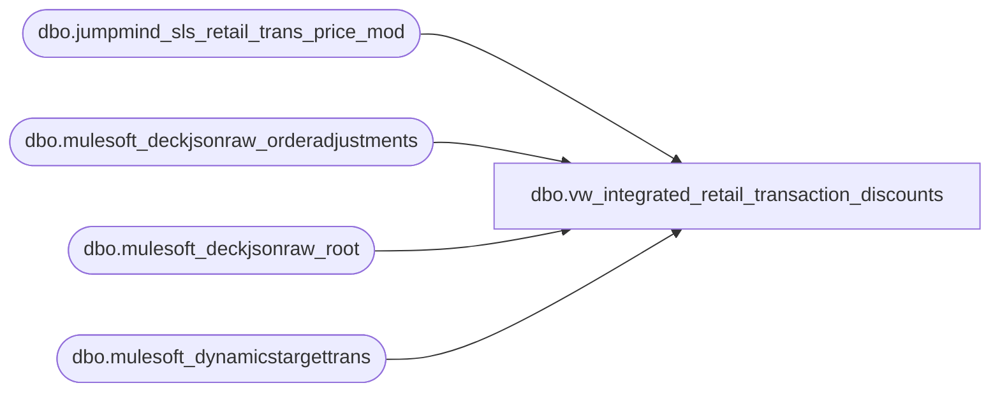

# dbo.vw_integrated_retail_transaction_discounts

**Database:** LH_Source  
**Server:** 4db76rlxaxcuvmuh5kw37wbnqq-ovsykae43znuhlmnflcdwm4ohu.datawarehouse.fabric.microsoft.com  

## Architecture Diagram



## Table Dependencies

| Referenced Table |
|---|
| dbo.jumpmind_sls_retail_trans_price_mod |
| dbo.mulesoft_deckjsonraw_orderadjustments |
| dbo.mulesoft_deckjsonraw_root |
| dbo.mulesoft_dynamicstargettrans |

## View Code

```sql
CREATE VIEW vw_integrated_retail_transaction_discounts AS WITH jumpmind_retail_transaction_discounts AS (     SELECT         CAST(j.device_id AS varchar(64))                                         AS device_id,         CONVERT(varchar(8), j.business_date, 112)                                AS business_date,         CAST(j.sequence_number AS bigint)                                        AS sequence_number,         CAST(j.line_sequence_number AS int)                                      AS line_sequence_number,         CAST(j.mod_line_sequence_number AS int)                                  AS mod_line_sequence_number,         CAST(j.username AS varchar(128))                                         AS username,         CAST(j.reason_code AS varchar(64))                                       AS reason_code,         CAST(NULL AS numeric(18,2))                                              AS mod_by_percentage,         CAST(NULL AS numeric(18,2))                                              AS mod_by_amount,         CAST(j.rounding_amount AS numeric(18,2))                                 AS rounding_amount,         CAST(j.calc_method AS varchar(32))                                       AS calc_method,         CAST(j.iso_currency_code AS varchar(8))                                  AS iso_currency_code,         CAST(j.price_mod_type_code AS varchar(16))                               AS price_mod_type_code,         CAST(j.price_mod_source_type_code AS varchar(16))                        AS price_mod_source_type_code,         CAST(j.voided AS bit)                                                    AS voided,         CAST(j.override_user_id AS varchar(64))                                  AS override_user_id,         CAST(j.entry_method_code AS varchar(64))                                  AS entry_method_code,         CAST(j.last_update_time AS datetime2)                                    AS create_time,         CAST('openpos-sls' AS varchar(64))                                       AS create_by,         CAST(j.last_update_time AS datetime2)                                    AS last_update_time,         CAST('openpos-sls' AS varchar(64))                                       AS last_update_by     FROM dbo.jumpmind_sls_retail_trans_price_mod j ), hs AS (     SELECT         COALESCE(           NULLIF(CONVERT(varchar(64), dtt.MaxWarehouseCode), ''),           NULLIF(CONVERT(varchar(64), dtt.SiteWarehouseCode), ''),           NULLIF(CONVERT(varchar(64), r.SiteCode), '')         )                                    AS InventLocationId,         CAST(COALESCE(r.OrderDateUTC, r.DateCreatedUTC, r.OrderStatusChangeDateUTC, r.ExportCreatedUTC) AS date)                                               AS TransDate,         CONVERT(varchar(64), r.OrderNumber)  AS Barcode,         r.OrderID,         r._RowIndex     FROM dbo.mulesoft_deckjsonraw_root r     LEFT JOIN dbo.mulesoft_dynamicstargettrans dtt       ON CONVERT(varchar(64), dtt.OrderId) = CONVERT(varchar(64), r.OrderID) ), deck_adjustments AS (     SELECT         a._ParentKeyField                              AS OrderID_key,         a.OrderTransactionIdentifier                   AS RootRowIndex,         a.AdjustmentDate,         a.AdjustmentTypeValue     FROM dbo.mulesoft_deckjsonraw_orderadjustments a ) SELECT     device_id,     business_date,     sequence_number,     line_sequence_number,     mod_line_sequence_number,     username,     reason_code,     mod_by_percentage,     mod_by_amount,     rounding_amount,     calc_method,     iso_currency_code,     price_mod_type_code,     price_mod_source_type_code,     voided,     override_user_id,     entry_method_code,     create_time,     create_by,     last_update_time,     last_update_by FROM jumpmind_retail_transaction_discounts  UNION ALL  SELECT     CAST('WEB' AS varchar(64))                                                                AS device_id,     CONVERT(varchar(8), hs.TransDate, 112)                                                    AS business_date,     TRY_CONVERT(bigint, da.OrderID_key)                                                       AS sequence_number,     CAST(0 AS int)                                                                            AS line_sequence_number,     CAST(1 AS int)                                                                            AS mod_line_sequence_number,     CAST(NULL AS varchar(128))                                                                AS username,     CAST(NULL AS varchar(64))                                                                 AS reason_code,     CAST(NULL AS numeric(18,2))                                                               AS mod_by_percentage,     CAST(NULL AS numeric(18,2))                                                               AS mod_by_amount,     CAST(NULL AS numeric(18,2))                                                               AS rounding_amount,     CAST('AMOUNT' AS varchar(32))                                                             AS calc_method,     CASE         WHEN hs.InventLocationId LIKE 'BAB%' THEN 'USD'         WHEN hs.InventLocationId LIKE 'UK%'  THEN 'GBP'         ELSE NULL     END                                                                                       AS iso_currency_code,     CAST('TRANS' AS varchar(16))                                                              AS price_mod_type_code,     CAST(CASE WHEN da.AdjustmentTypeValue LIKE '%Manual%' THEN 'MANUAL' END AS varchar(16))  AS price_mod_source_type_code,     CAST(0 AS bit)                                                                            AS voided,     CAST(NULL AS varchar(64))                                                                 AS override_user_id,     CAST(NULL AS varchar(64))                                                                 AS entry_method_code,     CAST(da.AdjustmentDate AS datetime2)                                                      AS create_time,     CAST('deckjsonraw' AS varchar(64))                                                        AS create_by,     CAST(da.AdjustmentDate AS datetime2)                                                      AS last_update_time,     CAST('deckjsonraw' AS varchar(64))                                                        AS last_update_by FROM deck_adjustments da JOIN hs   ON CONVERT(varchar(64), hs.OrderID) = CONVERT(varchar(64), da.OrderID_key)  AND hs._RowIndex = da.RootRowIndex;
```

