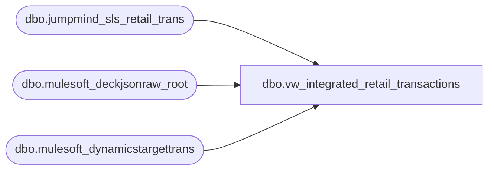

# dbo.vw_integrated_retail_transactions

**Database:** LH_Source  
**Server:** 4db76rlxaxcuvmuh5kw37wbnqq-ovsykae43znuhlmnflcdwm4ohu.datawarehouse.fabric.microsoft.com  

## Architecture Diagram



## Table Dependencies

| Referenced Table |
|---|
| dbo.jumpmind_sls_retail_trans |
| dbo.mulesoft_deckjsonraw_root |
| dbo.mulesoft_dynamicstargettrans |

## View Code

```sql
CREATE VIEW vw_integrated_retail_transactions AS WITH pos_tx AS (   SELECT       CONVERT(varchar(128),         CONCAT(           st.device_id, '-',           CASE WHEN TRY_CONVERT(date, st.business_date) IS NOT NULL                THEN CONVERT(varchar(10), TRY_CONVERT(date, st.business_date), 120)                ELSE st.business_date END,           '-',           CONVERT(varchar(50), st.sequence_number)         )       ) AS TransactionKey,       st.device_id,       st.business_date,       st.sequence_number,       st.total,       st.pre_tender_balance_due,       st.subtotal,       st.tax_total,       st.tax_total_for_display,       st.discount_total,       st.customer_id,       st.selling_channel_code,       st.loyalty_card_number,       st.tax_exempt_customer_id,       st.tax_exempt_certificate,       st.tax_exempt_code,       st.employee_id_for_discount,       st.iso_currency_code,       st.line_item_count,       st.age_restricted_date_of_birth,       st.item_count,       st.customer_name,       st.tender_type_codes,       st.voidable_flag,       st.tax_geo_code_origin,       st.rcpt_rtn_total,       st.non_rcpt_rtn_total,       st.customer_entry_method_code,       st.cust_other_id,       st.rcpt_rtn_count,       st.non_rcpt_rtn_count,       st.ring_elapsed_time_in_secs,       st.tender_elapsed_time_in_secs,       st.idle_elapsed_time_in_secs,       st.lock_elapsed_time_in_secs,       st.entry_mode_code,       st.suspended_reason_code,       st.suspended_note,       st.order_id,       st.loyalty_points_earned,       st.customer_callout,       st.fiscal_control_number,       st.gift_receipt_print_type,       st.fiscal_processor_code,       st.create_time,       st.create_by,       st.last_update_time,       st.last_update_by,       st.party_id,       st.employee_name_for_discount,       st.event_id,       st.event_invoice,       st.extended_subtotal,       st.parent_order_id,       st.additional_attributes,       'POS' as Source   FROM dbo.jumpmind_sls_retail_trans AS st ), hs AS (   SELECT       COALESCE(         NULLIF(CONVERT(varchar(64), dtt.MaxWarehouseCode), ''),         NULLIF(CONVERT(varchar(64), dtt.SiteWarehouseCode), ''),         NULLIF(CONVERT(varchar(64), r.SiteCode), '')       ) AS InventLocationId,       COALESCE(r.OrderDateUTC, r.DateCreatedUTC, r.OrderStatusChangeDateUTC, r.ExportCreatedUTC) AS TransDateDT,       CONVERT(varchar(64), r.OrderNumber) AS OrderNumber,       CONVERT(varchar(64), r.OrderID)     AS OrderID,       TRY_CONVERT(decimal(17,2), r.SubTotal) AS SubTotal_Dec,       TRY_CONVERT(decimal(17,2), r.Tax)      AS Tax_Dec,       TRY_CONVERT(decimal(17,2), r.Total)    AS Total_Dec,       CONVERT(varchar(8000), r.OrderSource)  AS OrderSource,       COALESCE(r.UpdateDate, r.OrderDateUTC, r.DateCreatedUTC) AS LastUpdateTime,       r.ExportCreatedUTC AS ExportCreatedUTC   FROM dbo.mulesoft_deckjsonraw_root r   LEFT JOIN dbo.mulesoft_dynamicstargettrans dtt     ON CONVERT(varchar(64), dtt.OrderId) = CONVERT(varchar(64), r.OrderID) ), oms_tx AS (   SELECT       CONVERT(varchar(128),         CONCAT(           hs.InventLocationId, '-','052','-',           CONVERT(varchar(8), CAST(hs.TransDateDT AS date), 112),           '-',           hs.OrderNumber         )       ) AS TransactionKey,       CONVERT(varchar(8000), CONCAT(hs.InventLocationId, '-', '052')) AS device_id,       CONVERT(varchar(10), CAST(hs.TransDateDT AS date), 120)         AS business_date,       TRY_CONVERT(bigint, hs.OrderID)                                 AS sequence_number,       hs.Total_Dec                                                     AS total,       CAST(NULL AS decimal(17,2))                                      AS pre_tender_balance_due,       hs.SubTotal_Dec                                                  AS subtotal,       hs.Tax_Dec                                                       AS tax_total,       hs.Tax_Dec                                                       AS tax_total_for_display,       CAST(NULL AS decimal(17,2))                                      AS discount_total,       CAST(NULL AS varchar(8000))                                      AS customer_id,       hs.OrderSource                                                   AS selling_channel_code,       CAST(NULL AS varchar(8000))                                      AS loyalty_card_number,       CAST(NULL AS varchar(8000))                                      AS tax_exempt_customer_id,       CAST(NULL AS varchar(8000))                                      AS tax_exempt_certificate,       CAST(NULL AS varchar(8000))                                      AS tax_exempt_code,       CAST(NULL AS varchar(8000))                                      AS employee_id_for_discount,       CAST(NULL AS varchar(8000))                                      AS iso_currency_code,       CAST(NULL AS int)                                                AS line_item_count,       CAST(NULL AS datetime2(6))                                       AS age_restricted_date_of_birth,       CAST(NULL AS int)                                                AS item_count,       CAST(NULL AS varchar(8000))                                      AS customer_name,       CAST(NULL AS varchar(8000))                                      AS tender_type_codes,       CAST(0 AS int)                                                   AS voidable_flag,       CAST(NULL AS varchar(8000))                                      AS tax_geo_code_origin,       CAST(NULL AS decimal(17,2))                                      AS rcpt_rtn_total,       CAST(NULL AS decimal(17,2))                                      AS non_rcpt_rtn_total,       CAST(NULL AS varchar(8000))                                      AS customer_entry_method_code,       CAST(NULL AS varchar(8000))                                      AS cust_other_id,       CAST(NULL AS int)                                                AS rcpt_rtn_count,       CAST(NULL AS int)                                                AS non_rcpt_rtn_count,       CAST(NULL AS int)                                                AS ring_elapsed_time_in_secs,       CAST(NULL AS int)                                                AS tender_elapsed_time_in_secs,       CAST(NULL AS int)                                                AS idle_elapsed_time_in_secs,       CAST(NULL AS int)                                                AS lock_elapsed_time_in_secs,       CAST(NULL AS varchar(8000))                                      AS entry_mode_code,       CAST(NULL AS varchar(8000))                                      AS suspended_reason_code,       CAST(NULL AS varchar(8000))                                      AS suspended_note,       CONVERT(varchar(8000), hs.OrderID)                               AS order_id,       CAST(NULL AS decimal(17,2))                                      AS loyalty_points_earned,       CAST(NULL AS varchar(8000))                                      AS customer_callout,       CAST(NULL AS varchar(8000))                                      AS fiscal_control_number,       CAST(NULL AS varchar(8000))                                      AS gift_receipt_print_type,       CAST(NULL AS varchar(8000))                                      AS fiscal_processor_code,       CAST(hs.ExportCreatedUTC AS datetime2(6))                        AS create_time,       CAST('WEB' AS varchar(8000))                                     AS create_by,       CAST(hs.LastUpdateTime AS datetime2(6))                          AS last_update_time,       CAST(NULL AS varchar(8000))                                      AS last_update_by,       CAST(NULL AS varchar(8000))                                      AS party_id,       CAST(NULL AS varchar(8000))                                      AS employee_name_for_discount,       CAST(NULL AS varchar(8000))                                      AS event_id,       CAST(NULL AS varchar(8000))                                      AS event_invoice,       CAST(NULL AS decimal(17,2))                                      AS extended_subtotal,       CAST(NULL AS varchar(8000))                                      AS parent_order_id,       CAST(NULL AS varchar(8000))                                      AS additional_attributes,       'OMS'                                                            AS Source   FROM hs ) SELECT * FROM pos_tx UNION ALL SELECT * FROM oms_tx;
```

