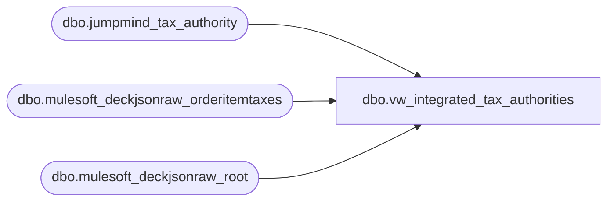

# dbo.vw_integrated_tax_authorities

**Database:** LH_Source  
**Server:** 4db76rlxaxcuvmuh5kw37wbnqq-ovsykae43znuhlmnflcdwm4ohu.datawarehouse.fabric.microsoft.com  

## Architecture Diagram



## Table Dependencies

| Referenced Table |
|---|
| dbo.jumpmind_tax_authority |
| dbo.mulesoft_deckjsonraw_orderitemtaxes |
| dbo.mulesoft_deckjsonraw_root |

## View Code

```sql
CREATE VIEW vw_integrated_tax_authorities AS WITH pos_auth AS (   SELECT DISTINCT       CAST(ja.id AS varchar(64))                 AS id,       CAST(ja.auth_name AS varchar(256))         AS auth_name,       CAST(ja.rounding_code AS int)              AS rounding_code,       CAST(ja.rounding_digits_quantity AS int)   AS rounding_digits_quantity,       CAST(ja.auth_type_name AS varchar(256))    AS auth_type_name,       CAST('POS' AS varchar(8))                  AS source   FROM dbo.jumpmind_tax_authority ja ), root_site AS (   SELECT _RowIndex, SiteCode   FROM dbo.mulesoft_deckjsonraw_root ), oms_src AS (   SELECT DISTINCT       it._ParentKeyField AS RootRowKey,       UPPER(COALESCE(         NULLIF(LTRIM(RTRIM(CAST(it.Description AS varchar(256)))), ''),         CASE WHEN TRY_CONVERT(int, it.IsVAT) = 1 THEN 'VAT'              ELSE CONCAT('TAXTYPE_', CONVERT(varchar(32), it.TaxType))         END       ))                                    AS auth_name,       TRY_CONVERT(decimal(18,6), it.Rate)   AS rate_val,       TRY_CONVERT(int, it.IsVAT)            AS is_vat   FROM dbo.mulesoft_deckjsonraw_orderitemtaxes it   WHERE COALESCE(TRY_CONVERT(decimal(18,6), it.Amount), 0) <> 0 ), oms_norm AS (   SELECT DISTINCT       CONVERT(varchar(64),               -ABS(CHECKSUM(CONCAT(rs.SiteCode, ':', os.auth_name, ':',                                    COALESCE(CONVERT(varchar(64), os.rate_val), '0'), ':',                                    COALESCE(CONVERT(varchar(8),  os.is_vat),   '0'))))       )                                       AS id,       os.auth_name                             AS auth_name,       CAST(4  AS int)                          AS rounding_code,       CAST(10 AS int)                          AS rounding_digits_quantity,       CAST(NULL AS varchar(256))               AS auth_type_name,       CAST('OMS' AS varchar(8))                AS source   FROM oms_src os   LEFT JOIN root_site rs     ON rs._RowIndex = os.RootRowKey ), unioned AS (   SELECT id, auth_name, rounding_code, rounding_digits_quantity, auth_type_name, source FROM pos_auth   UNION ALL   SELECT id, auth_name, rounding_code, rounding_digits_quantity, auth_type_name, source FROM oms_norm ) SELECT   id,   auth_name,   rounding_code,   rounding_digits_quantity,   auth_type_name,   source FROM unioned ;
```

