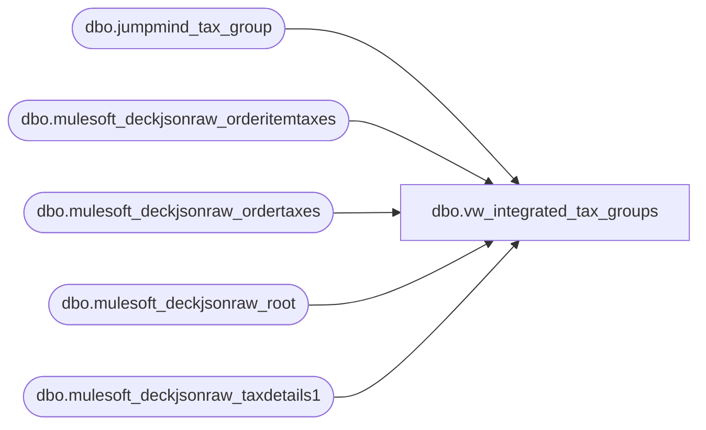

# dbo.vw_integrated_tax_groups

**Database:** LH_Source  
**Server:** 4db76rlxaxcuvmuh5kw37wbnqq-ovsykae43znuhlmnflcdwm4ohu.datawarehouse.fabric.microsoft.com  

## Architecture Diagram



## Table Dependencies

| Referenced Table |
|---|
| dbo.jumpmind_tax_group |
| dbo.mulesoft_deckjsonraw_orderitemtaxes |
| dbo.mulesoft_deckjsonraw_ordertaxes |
| dbo.mulesoft_deckjsonraw_root |
| dbo.mulesoft_deckjsonraw_taxdetails1 |

## View Code

```sql
CREATE VIEW vw_integrated_tax_groups AS WITH pos_groups AS (   SELECT DISTINCT     CAST(id            AS varchar(64))   AS [Id],     CAST(group_name    AS varchar(256))  AS [Group Name],     CAST([description] AS varchar(256))  AS [Description],     CAST('POS'         AS varchar(8))    AS [source]   FROM dbo.jumpmind_tax_group ), root_site AS (   SELECT _RowIndex, SiteCode   FROM dbo.mulesoft_deckjsonraw_root ), oms_item AS (   SELECT DISTINCT       it._ParentKeyField                         AS RootRowKey,       TRY_CONVERT(int, it.IsVAT)                 AS IsVAT,       TRY_CONVERT(decimal(18,6), it.Rate)        AS Rate   FROM dbo.mulesoft_deckjsonraw_orderitemtaxes it   WHERE COALESCE(TRY_CONVERT(decimal(18,6), it.Amount), 0) <> 0 ), oms_ship AS (   SELECT DISTINCT       ot._ParentKeyField                         AS RootRowKey,       UPPER(NULLIF(LTRIM(RTRIM(CAST(ot.Description AS varchar(256)))), '')) AS DescText   FROM dbo.mulesoft_deckjsonraw_ordertaxes ot   WHERE COALESCE(TRY_CONVERT(decimal(18,6), ot.Amount), 0) <> 0 ), oms_sales_tax AS (   SELECT DISTINCT       td1._ParentKeyField                        AS RootRowKey   FROM dbo.mulesoft_deckjsonraw_taxdetails1 td1   WHERE UPPER(NULLIF(LTRIM(RTRIM(CAST(td1.TaxType AS varchar(64)))), '')) = 'TAX' ), oms_item_site AS (   SELECT i.RootRowKey, i.IsVAT, i.Rate, rs.SiteCode   FROM oms_item i   LEFT JOIN root_site rs ON rs._RowIndex = i.RootRowKey ), oms_ship_site AS (   SELECT s.RootRowKey, s.DescText, rs.SiteCode   FROM oms_ship s   LEFT JOIN root_site rs ON rs._RowIndex = s.RootRowKey ), oms_sales_tax_site AS (   SELECT t.RootRowKey, rs.SiteCode   FROM oms_sales_tax t   LEFT JOIN root_site rs ON rs._RowIndex = t.RootRowKey ), oms_groups AS (   SELECT DISTINCT       CONCAT('OMS-', COALESCE(SiteCode,'WEB'), '-S') AS [Id],       'S'                                            AS [Group Name],       'Taxable'                                      AS [Description],       'OMS'                                          AS [source]   FROM oms_item_site   WHERE IsVAT = 1 AND COALESCE(Rate,0) > 0   UNION ALL   SELECT DISTINCT       CONCAT('OMS-', COALESCE(SiteCode,'WEB'), '-Z') AS [Id],       'Z'                                            AS [Group Name],       'Zero Rated'                                   AS [Description],       'OMS'                                          AS [source]   FROM oms_item_site   WHERE IsVAT = 1 AND COALESCE(Rate,0) = 0   UNION ALL   SELECT DISTINCT       CONCAT('OMS-', COALESCE(SiteCode,'WEB'), '-S_SHIP') AS [Id],       'S_SHIP'                                           AS [Group Name],       'VAT Shipping'                                     AS [Description],       'OMS'                                              AS [source]   FROM oms_ship_site   WHERE DescText LIKE '%VAT%' AND DescText LIKE '%SHIP%'   UNION ALL   SELECT DISTINCT       CONCAT('OMS-', COALESCE(SiteCode,'WEB'), '-TAX') AS [Id],       'TAX'                                            AS [Group Name],       'Sales Tax'                                      AS [Description],       'OMS'                                            AS [source]   FROM oms_sales_tax_site ) SELECT [Id], [Group Name], [Description], [source] FROM pos_groups UNION ALL SELECT [Id], [Group Name], [Description], [source] FROM oms_groups ;
```

