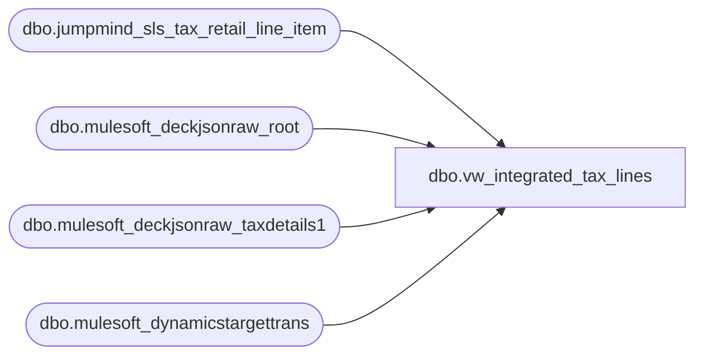

# dbo.vw_integrated_tax_lines

**Database:** LH_Source  
**Server:** 4db76rlxaxcuvmuh5kw37wbnqq-ovsykae43znuhlmnflcdwm4ohu.datawarehouse.fabric.microsoft.com  

## Architecture Diagram



## Table Dependencies

| Referenced Table |
|---|
| dbo.jumpmind_sls_tax_retail_line_item |
| dbo.mulesoft_deckjsonraw_root |
| dbo.mulesoft_deckjsonraw_taxdetails1 |
| dbo.mulesoft_dynamicstargettrans |

## View Code

```sql
CREATE VIEW vw_integrated_tax_lines AS WITH jm_base AS (   SELECT       device_id,       business_date,       sequence_number,       line_sequence_number,       tax_line_sequence_number,       authority_id,       authority_type,       group_id,       rule_name,       tax_type,       tax_holiday_indicator,       rate_rule_sequence_number,       override_applied,       tax_exempt_id,       tax_exempt,       tax_exempt_amount,       override_percent,       override_amount,       override_reason_code,       tax_percentage,       tax_amount,       money_tax_amount,       taxable_amount,       iso_currency_code,       calculation_source,       tax_included_in_price,       voided,       override_user_id,       entry_method_code,       create_time,       create_by,       last_update_time,       last_update_by,       rule_description,       CAST(NULL AS varchar(100)) AS calculation_method   FROM dbo.jumpmind_sls_tax_retail_line_item   WHERE create_by = 'openpos-sls'     AND voided = 0 ), jm_cur AS (   SELECT       device_id,       CAST(business_date AS date) AS business_date,       sequence_number,       line_sequence_number,       tax_line_sequence_number,       CAST(authority_id AS varchar(100)) AS authority_id,       CAST(authority_type AS varchar(100)) AS authority_type,       CAST(group_id AS varchar(100)) AS group_id,       CAST(rule_name AS varchar(256)) AS rule_name,       CAST(tax_type AS varchar(100)) AS tax_type,       CAST(tax_holiday_indicator AS bit) AS tax_holiday_indicator,       rate_rule_sequence_number,       CAST(override_applied AS bit) AS override_applied,       CAST(tax_exempt_id AS varchar(100)) AS tax_exempt_id,       CAST(tax_exempt AS bit) AS tax_exempt,       CAST(tax_exempt_amount AS decimal(18,6)) AS tax_exempt_amount,       CASE WHEN override_percent IS NULL THEN NULL            ELSE TRY_CONVERT(decimal(18,6), override_percent) / 100.0 END AS override_percent,       CAST(override_amount AS decimal(18,6)) AS override_amount,       CAST(override_reason_code AS varchar(100)) AS override_reason_code,       CASE WHEN tax_percentage IS NULL THEN NULL            ELSE TRY_CONVERT(decimal(18,6), tax_percentage) / 100.0 END AS tax_percentage,       CAST(tax_amount AS decimal(18,6)) AS tax_amount,       CAST(money_tax_amount AS decimal(18,6)) AS money_tax_amount,       CAST(taxable_amount AS decimal(18,6)) AS taxable_amount,       CAST(iso_currency_code AS varchar(8)) AS iso_currency_code,       CAST(calculation_source AS varchar(64)) AS calculation_source,       CAST(tax_included_in_price AS bit) AS tax_included_in_price,       CAST(voided AS bit) AS voided,       CAST(override_user_id AS varchar(100)) AS override_user_id,       CAST(entry_method_code AS varchar(64)) AS entry_method_code,       create_time,       create_by,       last_update_time,       last_update_by,       CAST(rule_description AS varchar(512)) AS rule_description,       CAST(calculation_method AS varchar(100)) AS calculation_method,       CAST('POS' AS varchar(8)) AS source   FROM jm_base ), oms_td1 AS (   SELECT       TRY_CONVERT(int, td1._ParentKeyField)       AS ParentOrderID,       CAST(td1._RowIndex AS int)                  AS RowIndex,       CAST(td1.TaxType AS varchar(100))           AS TaxType,       TRY_CONVERT(decimal(18,6), td1.TotalAmount) AS TotalAmount,       td1.InsertDate,       td1.UpdateDate   FROM dbo.mulesoft_deckjsonraw_taxdetails1 td1   WHERE TRY_CONVERT(int, td1._ParentKeyField) IS NOT NULL ), oms_base AS (   SELECT       r.OrderID,       r.OrderNumber,       r.SiteCode,       COALESCE(t.UpdateDate, t.InsertDate) AS TransDate,       COALESCE(t.UpdateDate, t.InsertDate) AS LastUpd,       t.RowIndex,       t.TaxType,       t.TotalAmount,       dtt.SiteWarehouseCode   FROM oms_td1 t   JOIN dbo.mulesoft_deckjsonraw_root r     ON r.OrderID = t.ParentOrderID   OUTER APPLY (     SELECT TOP (1) d.SiteWarehouseCode     FROM dbo.mulesoft_dynamicstargettrans d     WHERE d.OrderId = r.OrderID   ) dtt ), ms_cur AS (   SELECT       CAST(         COALESCE(           NULLIF(LTRIM(RTRIM(SiteWarehouseCode)), ''),           NULLIF(LTRIM(RTRIM(SiteCode)), ''),           'WEB'         ) + '-052'       AS varchar(64)) AS device_id,       CAST(CAST(TransDate AS date) AS date) AS business_date,       CAST(r.OrderID AS bigint) AS sequence_number,       CAST(RowIndex AS int) AS line_sequence_number,       CAST(ROW_NUMBER() OVER (PARTITION BY OrderID, RowIndex ORDER BY TaxType, LastUpd) AS bigint) AS tax_line_sequence_number,       CAST(NULL AS varchar(100)) AS authority_id,       CAST(NULL AS varchar(100)) AS authority_type,       CAST(NULL AS varchar(100)) AS group_id,       CAST(TaxType AS varchar(256)) AS rule_name,       CAST(TaxType AS varchar(100)) AS tax_type,       CAST(0 AS bit) AS tax_holiday_indicator,       CAST(NULL AS int) AS rate_rule_sequence_number,       CAST(0 AS bit) AS override_applied,       CAST(NULL AS varchar(100)) AS tax_exempt_id,       CAST(0 AS bit) AS tax_exempt,       CAST(NULL AS decimal(18,6)) AS tax_exempt_amount,       CAST(NULL AS decimal(18,6)) AS override_percent,       CAST(NULL AS decimal(18,6)) AS override_amount,       CAST(NULL AS varchar(100)) AS override_reason_code,       CAST(NULL AS decimal(18,6)) AS tax_percentage,       CAST(TotalAmount AS decimal(18,6)) AS tax_amount,       CAST(TotalAmount AS decimal(18,6)) AS money_tax_amount,       CAST(NULL AS decimal(18,6)) AS taxable_amount,       CASE WHEN SiteCode = 'BABUK' THEN 'GBP'            WHEN SiteCode = 'BAB'   THEN 'USD'            ELSE NULL END AS iso_currency_code,       CAST('Ecommerce' AS varchar(64)) AS calculation_source,       CAST(0 AS bit) AS tax_included_in_price,       CAST(0 AS bit) AS voided,       CAST(NULL AS varchar(100)) AS override_user_id,       CAST(NULL AS varchar(64)) AS entry_method_code,       CAST(TransDate AS datetime2) AS create_time,       CAST('sp_bab_pos_merge_webreturns' AS varchar(128)) AS create_by,       CAST(LastUpd AS datetime2) AS last_update_time,       CAST('sp_bab_pos_merge_webreturns' AS varchar(128)) AS last_update_by,       CAST(TaxType AS varchar(512)) AS rule_description,       CAST(NULL AS varchar(100)) AS calculation_method,       CAST('OMS' AS varchar(8)) AS source   FROM oms_base r ) SELECT   device_id,   business_date,   sequence_number,   line_sequence_number,   tax_line_sequence_number,   authority_id,   authority_type,   group_id,   rule_name,   tax_type,   tax_holiday_indicator,   rate_rule_sequence_number,   override_applied,   tax_exempt_id,   tax_exempt,   tax_exempt_amount,   override_percent,   override_amount,   override_reason_code,   tax_percentage,   tax_amount,   money_tax_amount,   taxable_amount,   iso_currency_code,   calculation_source,   tax_included_in_price,   voided,   override_user_id,   entry_method_code,   create_time,   create_by,   last_update_time,   last_update_by,   rule_description,   calculation_method,   source FROM jm_cur UNION ALL SELECT   device_id,   business_date,   sequence_number,   line_sequence_number,   tax_line_sequence_number,   authority_id,   authority_type,   group_id,   rule_name,   tax_type,   tax_holiday_indicator,   rate_rule_sequence_number,   override_applied,   tax_exempt_id,   tax_exempt,   tax_exempt_amount,   override_percent,   override_amount,   override_reason_code,   tax_percentage,   tax_amount,   money_tax_amount,   taxable_amount,   iso_currency_code,   calculation_source,   tax_included_in_price,   voided,   override_user_id,   entry_method_code,   create_time,   create_by,   last_update_time,   last_update_by,   rule_description,   calculation_method,   source FROM ms_cur;
```

