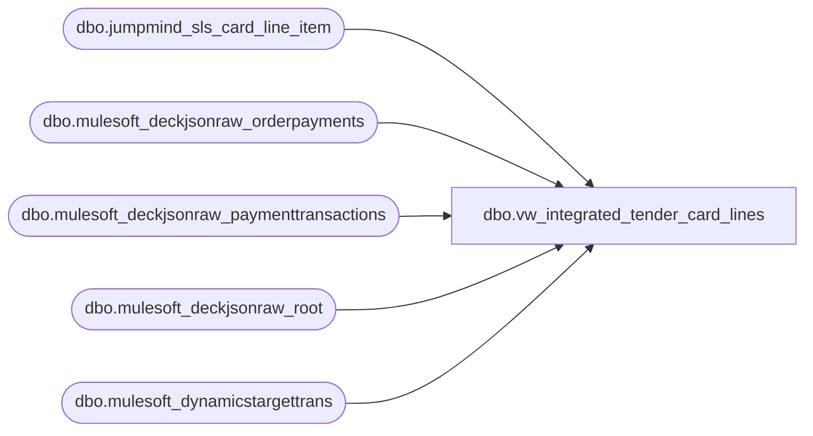

# dbo.vw_integrated_tender_card_lines

**Database:** LH_Source  
**Server:** 4db76rlxaxcuvmuh5kw37wbnqq-ovsykae43znuhlmnflcdwm4ohu.datawarehouse.fabric.microsoft.com  

## Architecture Diagram



## Table Dependencies

| Referenced Table |
|---|
| dbo.jumpmind_sls_card_line_item |
| dbo.mulesoft_deckjsonraw_orderpayments |
| dbo.mulesoft_deckjsonraw_paymenttransactions |
| dbo.mulesoft_deckjsonraw_root |
| dbo.mulesoft_dynamicstargettrans |

## View Code

```sql
CREATE VIEW vw_integrated_tender_card_lines AS WITH pos_raw AS (   SELECT *   FROM dbo.jumpmind_sls_card_line_item   WHERE TRY_CONVERT(date, business_date, 112) >= DATEADD(year, -1, CAST(GETDATE() AS date)) ), pos_shaped AS (   SELECT       device_id AS device_id,       CONVERT(varchar(8), TRY_CONVERT(date, business_date, 112), 112) AS business_date,       sequence_number AS sequence_number,       line_sequence_number AS line_sequence_number,       CAST(brand AS varchar(200)) AS brand,       CAST(card_name AS varchar(200)) AS card_name,       CAST(code AS varchar(200)) AS code,       CAST(type_code AS varchar(200)) AS type_code,       CAST(payment_provider_code AS varchar(200)) AS payment_provider_code,       CAST(masked_card_number AS varchar(64)) AS masked_card_number,       CAST(entry_mode AS varchar(64)) AS entry_mode,       CAST(service_code AS varchar(64)) AS service_code,       CAST(expiration_date AS varchar(10)) AS expiration_date,       ref_line_sequence_number AS ref_line_sequence_number,       CAST(card_number AS varchar(64)) AS card_number,       create_time AS create_time,       create_by AS create_by,       last_update_time AS last_update_time,       last_update_by AS last_update_by,       CAST(gift_card_action_code AS varchar(64)) AS gift_card_action_code,       'POS' AS source   FROM pos_raw ), op AS (   SELECT       TRY_CONVERT(int, op._ParentKeyField) AS ParentOrderID,       CAST(op.ID AS bigint) AS OP_ID,       op.InsertDate AS OP_InsertDate,       op.UpdateDate AS OP_UpdateDate,       CAST(op.PaymentProcessor AS varchar(200)) AS OP_PaymentProcessor,       CAST(op.PaymentSubType  AS varchar(200)) AS OP_PaymentSubType,       CAST(op.CardType        AS varchar(200)) AS OP_CardType,       CAST(op.CardNumber      AS varchar(32))  AS OP_Last4,       TRY_CONVERT(int, op.ExpirationMonth)     AS OP_ExpMonth,       TRY_CONVERT(int, op.ExpirationYear)      AS OP_ExpYear   FROM dbo.mulesoft_deckjsonraw_orderpayments op   WHERE TRY_CONVERT(int, op._ParentKeyField) IS NOT NULL ), pt AS (   SELECT       CAST(pt.OrderPaymentId AS bigint)        AS PT_OrderPaymentId,       CAST(pt.PaymentTransactionTypeId AS int) AS PT_TypeId,       CAST(pt.Amount AS decimal(18,6))         AS PT_Amount,       CAST(pt.IsDecline AS bit)                AS PT_IsDecline,       pt.TransactionDateUTC                    AS PT_TransUTC,       pt.InsertDate                            AS PT_InsertDate,       pt.UpdateDate                            AS PT_UpdateDate   FROM dbo.mulesoft_deckjsonraw_paymenttransactions pt ), pt_best AS (   SELECT *   FROM (     SELECT         p.*,         ROW_NUMBER() OVER (           PARTITION BY p.PT_OrderPaymentId           ORDER BY             CASE WHEN p.PT_IsDecline = 0 AND p.PT_TypeId IN (14) THEN 1                  WHEN p.PT_IsDecline = 0 THEN 2                  ELSE 3 END,             COALESCE(p.PT_UpdateDate, p.PT_InsertDate, p.PT_TransUTC) DESC         ) AS rn     FROM pt p   ) x   WHERE x.rn = 1 ), root AS (   SELECT       r.OrderID,       r.OrderNumber,       r.SiteCode   FROM dbo.mulesoft_deckjsonraw_root r ), op_ranked AS (   SELECT       o.*,       ROW_NUMBER() OVER (         PARTITION BY o.ParentOrderID         ORDER BY COALESCE(pb.PT_UpdateDate, pb.PT_InsertDate, o.OP_UpdateDate, o.OP_InsertDate) ASC, o.OP_ID       ) AS rn   FROM op o   LEFT JOIN pt_best pb     ON pb.PT_OrderPaymentId = o.OP_ID ), oms_enriched AS (   SELECT       CAST(COALESCE(CONVERT(varchar(64), dtt.SiteWarehouseCode), CONVERT(varchar(64), rt.SiteCode), 'WEB') + '-052' AS varchar(64)) AS device_id,       CONVERT(varchar(8),               CAST(COALESCE(pb.PT_UpdateDate, pb.PT_InsertDate, o.OP_UpdateDate, o.OP_InsertDate) AS date), 112) AS business_date,       CAST(rt.OrderID AS bigint) AS sequence_number,       CAST(orx.rn AS int) AS line_sequence_number,       COALESCE(NULLIF(o.OP_CardType, ''), NULLIF(o.OP_PaymentSubType, ''), NULLIF(o.OP_PaymentProcessor, '')) AS brand,       CAST(NULL AS varchar(200)) AS card_name,       COALESCE(NULLIF(o.OP_PaymentProcessor, ''), NULLIF(o.OP_PaymentSubType, ''), NULLIF(o.OP_CardType, '')) AS code,       COALESCE(NULLIF(o.OP_PaymentSubType, ''),  NULLIF(o.OP_PaymentProcessor, ''), NULLIF(o.OP_CardType, '')) AS type_code,       CAST(NULL AS varchar(200)) AS payment_provider_code,       CASE WHEN NULLIF(o.OP_Last4, '') IS NOT NULL THEN CONCAT(REPLICATE('*', 12), o.OP_Last4) END AS masked_card_number,       CAST(NULL AS varchar(64)) AS entry_mode,       CAST(NULL AS varchar(64)) AS service_code,       CASE         WHEN ISNULL(o.OP_ExpMonth,0) BETWEEN 1 AND 12 AND ISNULL(o.OP_ExpYear,0) > 0           THEN RIGHT('00'+CAST(o.OP_ExpMonth AS varchar(2)),2) + RIGHT(RIGHT('0000'+CAST(o.OP_ExpYear AS varchar(4)),4),2)       END AS expiration_date,       CAST(orx.rn AS int) AS ref_line_sequence_number,       CAST(NULL AS varchar(64)) AS card_number,       COALESCE(pb.PT_InsertDate, o.OP_InsertDate) AS create_time,       'sp_bab_pos_merge_webreturns' AS create_by,       COALESCE(pb.PT_UpdateDate, pb.PT_InsertDate, o.OP_UpdateDate, o.OP_InsertDate) AS last_update_time,       'sp_bab_pos_merge_webreturns' AS last_update_by,       CAST(NULL AS varchar(64)) AS gift_card_action_code,       'OMS' AS source   FROM op_ranked orx   JOIN op o     ON o.OP_ID = orx.OP_ID   LEFT JOIN pt_best pb     ON pb.PT_OrderPaymentId = o.OP_ID   JOIN root rt     ON rt.OrderID = orx.ParentOrderID   OUTER APPLY (     SELECT TOP (1) dtt.SiteWarehouseCode     FROM dbo.mulesoft_dynamicstargettrans dtt     WHERE dtt.OrderId = rt.OrderID     ORDER BY TRY_CONVERT(datetime2(7), dtt.ExportCreatedUTC) DESC   ) dtt ) SELECT * FROM pos_shaped UNION ALL SELECT * FROM oms_enriched;
```

