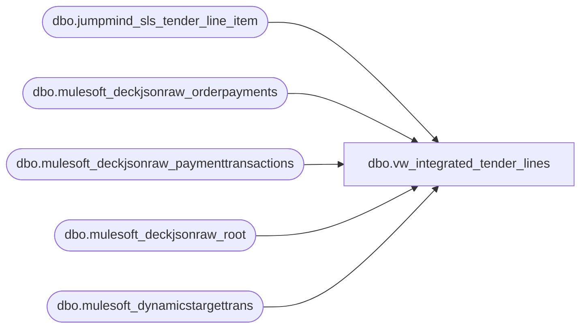

# dbo.vw_integrated_tender_lines

**Database:** LH_Source  
**Server:** 4db76rlxaxcuvmuh5kw37wbnqq-ovsykae43znuhlmnflcdwm4ohu.datawarehouse.fabric.microsoft.com  

## Architecture Diagram



## Table Dependencies

| Referenced Table |
|---|
| dbo.jumpmind_sls_tender_line_item |
| dbo.mulesoft_deckjsonraw_orderpayments |
| dbo.mulesoft_deckjsonraw_paymenttransactions |
| dbo.mulesoft_deckjsonraw_root |
| dbo.mulesoft_dynamicstargettrans |

## View Code

```sql
CREATE VIEW vw_integrated_tender_lines AS WITH pos_raw AS (   SELECT *   FROM dbo.jumpmind_sls_tender_line_item   WHERE create_by = 'openpos-sls'     AND ISNULL(voided,0) = 0     AND TRY_CONVERT(date, business_date, 112) >= DATEADD(year, -1, CAST(GETDATE() AS date)) ), pos_base AS (   SELECT       CAST(device_id AS varchar(64))                                   AS device_id,       CONVERT(varchar(8), TRY_CONVERT(date, business_date, 112), 112)  AS business_date,       CAST(sequence_number AS bigint)                                   AS sequence_number,       CAST(line_sequence_number AS int)                                 AS line_sequence_number,       CAST(tender_code AS varchar(200))                                 AS tender_code,       CAST(tender_type_code AS varchar(200))                            AS tender_type_code,       CAST(change_flag AS bit)                                          AS change_flag,       CAST(customer_account_number AS varchar(128))                     AS customer_account_number,       CAST(tender_account_number AS varchar(64))                        AS tender_account_number,       CAST(iso_currency_code AS varchar(10))                            AS iso_currency_code,       CAST(tender_amount AS decimal(18,6))                              AS tender_amount,       CAST(cash_back_amount AS decimal(18,6))                           AS cash_back_amount,       CAST(iso_foreign_currency_code AS varchar(10))                    AS iso_foreign_currency_code,       CAST(foreign_currency_amount AS decimal(18,6))                    AS foreign_currency_amount,       CAST(exchange_rate AS decimal(18,6))                              AS exchange_rate,       CAST(overtendered AS bit)                                         AS overtendered,       CAST(partially_approved AS bit)                                   AS partially_approved,       CAST(tender_finance_id AS varchar(64))                            AS tender_finance_id,       CAST(certificate_number AS varchar(128))                          AS certificate_number,       CAST(post_void AS bit)                                            AS post_void,       CAST(voided AS bit)                                               AS voided,       CAST(override_user_id AS varchar(64))                             AS override_user_id,       CAST(entry_method_code AS varchar(64))                            AS entry_method_code,       CAST(create_time AS datetime2)                                    AS create_time,       CAST(create_by AS varchar(128))                                   AS create_by,       CAST(last_update_time AS datetime2)                               AS last_update_time,       CAST(last_update_by AS varchar(128))                              AS last_update_by,       CAST(tender_auth_method_code AS varchar(64))                      AS tender_auth_method_code,       CAST(tender_group AS varchar(64))                                 AS tender_group,       CAST(tender_id AS varchar(64))                                    AS tender_id,       CAST(voucher_id AS varchar(64))                                   AS voucher_id,       CAST('POS' AS varchar(8))                                         AS source   FROM pos_raw ), root AS (   SELECT       r.OrderID,       r.OrderNumber,       r.SiteCode,       CAST(COALESCE(r.OrderDateUTC, r.DateCreatedUTC) AS date) AS TransDate,       r.OrderDateUTC,       r.DateCreatedUTC,       r.OrderStatusChangeDateUTC   FROM dbo.mulesoft_deckjsonraw_root r   WHERE CAST(COALESCE(r.OrderDateUTC, r.DateCreatedUTC) AS date) >= DATEADD(year, -1, CAST(GETDATE() AS date)) ), hs AS (   SELECT       COALESCE(         NULLIF(CONVERT(varchar(64), dtt.MaxWarehouseCode), ''),         NULLIF(CONVERT(varchar(64), dtt.SiteWarehouseCode), ''),         NULLIF(CONVERT(varchar(64), r.SiteCode), '')       ) AS InventLocationId,       r.OrderID,       r.OrderNumber,       r.SiteCode,       CAST(COALESCE(r.OrderDateUTC, r.DateCreatedUTC) AS date) AS TransDate,       r.OrderDateUTC,       r.DateCreatedUTC,       r.OrderStatusChangeDateUTC   FROM root r   LEFT JOIN dbo.mulesoft_dynamicstargettrans dtt     ON CONVERT(varchar(64), dtt.OrderId) = CONVERT(varchar(64), r.OrderID) ), op AS (   SELECT       TRY_CONVERT(int, op._ParentKeyField)           AS ParentOrderID,       CONVERT(varchar(64), op.ID)                    AS OrderPaymentId,       CAST(op._RowIndex AS int)                      AS OP_RowIndex,       CAST(op.PaymentProcessor AS varchar(200))      AS PaymentProcessor,       CAST(op.PaymentSubType  AS varchar(200))       AS PaymentSubType,       CAST(op.CardType        AS varchar(200))       AS CardType,       CAST(op.AuthorizedAmount AS decimal(18,6))     AS AuthorizedAmount,       CAST(op.CapturedAmount   AS decimal(18,6))     AS CapturedAmount,       CAST(op.CreditedAmount   AS decimal(18,6))     AS CreditedAmount,       op.InsertDate                                    AS OP_InsertDate,       op.UpdateDate                                    AS OP_UpdateDate   FROM dbo.mulesoft_deckjsonraw_orderpayments op   WHERE TRY_CONVERT(int, op._ParentKeyField) IS NOT NULL ), pt AS (   SELECT       CONVERT(varchar(64), pt.OrderPaymentId)        AS OrderPaymentId,       CAST(pt.PaymentTransactionTypeId AS int)       AS PaymentTransactionTypeId,       CAST(pt.Amount AS decimal(18,6))               AS Amount,       pt.TransactionDateUTC                          AS TransactionDateUTC,       pt.InsertDate                                  AS PT_InsertDate,       pt.UpdateDate                                  AS PT_UpdateDate   FROM dbo.mulesoft_deckjsonraw_paymenttransactions pt ), pt_best AS (   SELECT *   FROM (     SELECT       p.*,       ROW_NUMBER() OVER (         PARTITION BY p.OrderPaymentId         ORDER BY           CASE WHEN p.PaymentTransactionTypeId IN (14,1,2) THEN 1 ELSE 2 END,           COALESCE(p.PT_UpdateDate, p.PT_InsertDate, p.TransactionDateUTC) DESC       ) AS rn     FROM pt p   ) x   WHERE x.rn = 1 ), oms_base AS (   SELECT       CAST(COALESCE(h.InventLocationId, h.SiteCode, 'WEB') + '-052' AS varchar(64)) AS device_id,       CONVERT(varchar(8), h.TransDate, 112)                  AS business_date,       CAST(h.OrderID AS bigint)                              AS sequence_number,       ROW_NUMBER() OVER (         PARTITION BY h.OrderID         ORDER BY COALESCE(pb.TransactionDateUTC, o.OP_UpdateDate, o.OP_InsertDate)       )                                                      AS line_sequence_number,       COALESCE(o.CardType, o.PaymentSubType, o.PaymentProcessor) AS tender_code,       COALESCE(o.PaymentSubType, o.PaymentProcessor, o.CardType) AS tender_type_code,       CAST(0 AS bit)                                         AS change_flag,       CAST(NULL AS varchar(128))                              AS customer_account_number,       CAST(NULL AS varchar(64))                               AS tender_account_number,       CASE WHEN h.SiteCode LIKE 'BAB%' THEN 'USD'            WHEN h.SiteCode LIKE 'UK%'  THEN 'GBP'            WHEN h.InventLocationId LIKE 'BAB%' THEN 'USD'            WHEN h.InventLocationId LIKE 'UK%'  THEN 'GBP'            ELSE NULL END                                      AS iso_currency_code,       COALESCE(         CASE           WHEN pb.PaymentTransactionTypeId IN (3,4) THEN -ABS(pb.Amount)           WHEN pb.PaymentTransactionTypeId IN (1,2,14) THEN  ABS(pb.Amount)           ELSE pb.Amount         END,         NULLIF(o.CapturedAmount, 0),         NULLIF(o.AuthorizedAmount, 0),         -1 * NULLIF(o.CreditedAmount, 0),         0       )                                                       AS tender_amount,       CAST(NULL AS decimal(18,6))                             AS cash_back_amount,       CAST(NULL AS varchar(10))                               AS iso_foreign_currency_code,       CAST(NULL AS decimal(18,6))                             AS foreign_currency_amount,       CAST(NULL AS decimal(18,6))                             AS exchange_rate,       CAST(0 AS bit)                                          AS overtendered,       CAST(0 AS bit)                                          AS partially_approved,       CAST(NULL AS varchar(64))                               AS tender_finance_id,       CAST(NULL AS varchar(128))                              AS certificate_number,       CAST(0 AS bit)                                          AS post_void,       CAST(0 AS bit)                                          AS voided,       CAST(NULL AS varchar(64))                               AS override_user_id,       CAST(NULL AS varchar(64))                               AS entry_method_code,       COALESCE(h.OrderDateUTC, h.DateCreatedUTC)              AS create_time,       'sp_bab_pos_merge_webreturns'                           AS create_by,       COALESCE(pb.PT_UpdateDate, pb.PT_InsertDate, h.OrderStatusChangeDateUTC, h.OrderDateUTC, h.DateCreatedUTC) AS last_update_time,       'sp_bab_pos_merge_webreturns'                           AS last_update_by,       CAST(NULL AS varchar(64))                               AS tender_auth_method_code,       'WEB'                                                   AS tender_group,       CAST(NULL AS varchar(64))                               AS tender_id,       CAST(NULL AS varchar(64))                               AS voucher_id,       'OMS'                                                   AS source   FROM op o   JOIN hs h     ON h.OrderID = o.ParentOrderID   LEFT JOIN pt_best pb     ON pb.OrderPaymentId = o.OrderPaymentId ) SELECT * FROM pos_base UNION ALL SELECT * FROM oms_base;
```

