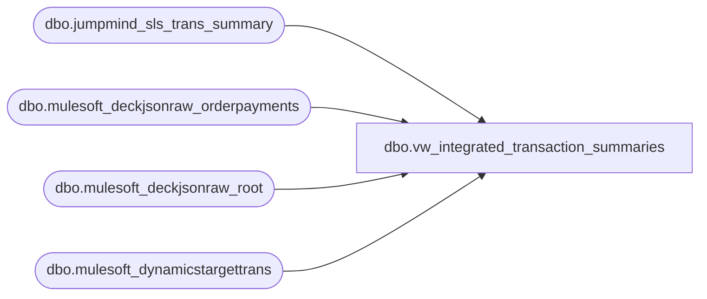

# dbo.vw_integrated_transaction_summaries

**Database:** LH_Source  
**Server:** 4db76rlxaxcuvmuh5kw37wbnqq-ovsykae43znuhlmnflcdwm4ohu.datawarehouse.fabric.microsoft.com  

## Architecture Diagram



## Table Dependencies

| Referenced Table |
|---|
| dbo.jumpmind_sls_trans_summary |
| dbo.mulesoft_deckjsonraw_orderpayments |
| dbo.mulesoft_deckjsonraw_root |
| dbo.mulesoft_dynamicstargettrans |

## View Code

```sql
CREATE VIEW vw_integrated_transaction_summaries AS WITH cutoff AS (   SELECT CONVERT(int, CONVERT(varchar(8), CAST(DATEADD(year,-1,GETDATE()) AS date), 112)) AS cutoff_yyyymmdd ), pos_base AS (   SELECT       device_id,       business_date,       sequence_number,       barcode,       begin_time,       business_unit_id,       client_offset,       create_by,       create_time,       customer_id,       customer_name,       device_type,       discount_total,       employee_id_for_discount,       end_time,       iso_currency_code,       item_count,       last_update_by,       last_update_time,       local_offset,       loyalty_card_number,       loyalty_rewards_count,       loyalty_rewards_total,       mfr_coupons_count,       mfr_coupons_non_taxable_count,       mfr_coupons_non_taxable_total,       mfr_coupons_taxable_count,       mfr_coupons_taxable_total,       mfr_coupons_total,       non_rcpt_rtn_count,       paid_to,       pre_tender_balance_due,       rcpt_rtn_count,       resumed_device_id,       resumed_sequence_number,       session_id,       store_bank_id,       store_electronic_promos_count,       store_electronic_promos_total,       store_physical_coupons_count,       store_physical_coupons_total,       store_promos_count,       store_promos_non_taxable_count,       store_promos_non_taxable_total,       store_promos_taxable_count,       store_promos_taxable_total,       store_promos_total,       suspended_device_id,       suspended_sequence_number,       tax_total,       tender_type_codes,       tender1_amount,       tender1_auth_code,       tender1_card_type_code,       tender1_masked_card_number,       tender1_type_code,       tender2_amount,       tender2_auth_code,       tender2_card_type_code,       tender2_masked_card_number,       tender2_type_code,       tender3_amount,       tender3_auth_code,       tender3_card_type_code,       tender3_masked_card_number,       tender3_type_code,       tender4_amount,       tender4_auth_code,       tender4_card_type_code,       tender4_masked_card_number,       tender4_type_code,       tender5_amount,       tender5_auth_code,       tender5_card_type_code,       tender5_masked_card_number,       tender5_type_code,       till_id,       total,       total_physical_coupons_count,       training_mode,       trans_status_code,       transaction_duration_in_sec,       username,       voidable_flag,       voided_sequence_number,       trans_type_code,       reason_code,       CAST('POS' AS varchar(8)) AS source   FROM dbo.jumpmind_sls_trans_summary s   CROSS JOIN cutoff k   WHERE COALESCE(TRY_CONVERT(int, CONVERT(varchar(8), TRY_CONVERT(datetime2, s.business_date), 112)),                  TRY_CONVERT(int, s.business_date)) >= k.cutoff_yyyymmdd ), oms_root AS (   SELECT       r.OrderID,       r.OrderNumber,       r.SiteCode,       COALESCE(TRY_CONVERT(datetime2(7), r.OrderDateUTC),                TRY_CONVERT(datetime2(7), r.DateCreatedUTC),                TRY_CONVERT(datetime2(7), r.UpdateDate)) AS biz_dt_raw,       COALESCE(TRY_CONVERT(datetime2(7), r.UpdateDate),                TRY_CONVERT(datetime2(7), r.LastUpdateUTC),                TRY_CONVERT(datetime2(7), r.OrderDateUTC),                TRY_CONVERT(datetime2(7), r.DateCreatedUTC)) AS last_upd_raw   FROM dbo.mulesoft_deckjsonraw_root r ), oms_root_filt AS (   SELECT r.*   FROM oms_root r   CROSS JOIN cutoff k   WHERE TRY_CONVERT(int, CONVERT(varchar(8), r.biz_dt_raw, 112)) >= k.cutoff_yyyymmdd ), oms_header AS (   SELECT       rf.OrderID,       rf.OrderNumber,       rf.SiteCode,       CAST(CAST(rf.biz_dt_raw AS date) AS date) AS business_date,       COALESCE(NULLIF(CAST(dtt.SiteWarehouseCode AS varchar(64)), ''),                NULLIF(CAST(rf.SiteCode AS varchar(64)), '')) + '-052' AS device_id,       CASE WHEN rf.SiteCode = 'BABUK' THEN 'GBP'            WHEN rf.SiteCode = 'BAB'   THEN 'USD'            ELSE '*' END AS iso_currency_code,       rf.last_upd_raw AS last_update_time   FROM oms_root_filt rf   OUTER APPLY (     SELECT TOP (1) dtt.SiteWarehouseCode     FROM dbo.mulesoft_dynamicstargettrans dtt     WHERE dtt.OrderId = rf.OrderID     ORDER BY TRY_CONVERT(datetime2(7), dtt.ExportCreatedUTC) DESC   ) dtt ), oms_payments AS (   SELECT       TRY_CONVERT(int, op._ParentKeyField) AS OrderID,       COALESCE(NULLIF(op.CapturedAmount, 0), NULLIF(op.AuthorizedAmount, 0), 0)         - COALESCE(NULLIF(op.CreditedAmount, 0), 0) AS net_amount,       COALESCE(NULLIF(op.CardType, ''), NULLIF(op.PaymentSubType, ''), NULLIF(op.PaymentProcessor, '')) AS type_code,       CASE WHEN NULLIF(op.CardNumber, '') IS NOT NULL            THEN '****' + RIGHT(op.CardNumber, 4) END AS masked_num,       NULLIF(op.Generic1, '') AS auth_code   FROM dbo.mulesoft_deckjsonraw_orderpayments op   WHERE TRY_CONVERT(int, op._ParentKeyField) IS NOT NULL ), oms_tenders AS (   SELECT OrderID,          MAX(CASE WHEN rn = 1 THEN net_amount END)   AS t1_amount,          MAX(CASE WHEN rn = 1 THEN type_code  END)   AS t1_type_code,          MAX(CASE WHEN rn = 1 THEN masked_num END)   AS t1_masked,          MAX(CASE WHEN rn = 1 THEN auth_code  END)   AS t1_auth,          MAX(CASE WHEN rn = 2 THEN net_amount END)   AS t2_amount,          MAX(CASE WHEN rn = 2 THEN type_code  END)   AS t2_type_code,          MAX(CASE WHEN rn = 2 THEN masked_num END)   AS t2_masked,          MAX(CASE WHEN rn = 2 THEN auth_code  END)   AS t2_auth   FROM (     SELECT       p.*,       ROW_NUMBER() OVER (PARTITION BY p.OrderID ORDER BY ABS(TRY_CONVERT(decimal(18,6), p.net_amount)) DESC, type_code) AS rn     FROM oms_payments p   ) x   WHERE rn <= 2   GROUP BY OrderID ), oms_base AS (   SELECT       oh.device_id,       CAST(oh.business_date AS date) AS business_date,       TRY_CONVERT(bigint, oh.OrderNumber) AS sequence_number,       CAST(NULL AS varchar(100)) AS barcode,       CAST(NULL AS datetime2(7)) AS begin_time,       CAST(NULL AS int) AS business_unit_id,       CAST(NULL AS int) AS client_offset,       CAST(NULL AS varchar(128)) AS create_by,       CAST(NULL AS datetime2(7)) AS create_time,       CAST(NULL AS varchar(64)) AS customer_id,       CAST(NULL AS varchar(256)) AS customer_name,       CAST(NULL AS varchar(64)) AS device_type,       CAST(NULL AS decimal(18,6)) AS discount_total,       CAST(NULL AS varchar(64)) AS employee_id_for_discount,       CAST(NULL AS datetime2(7)) AS end_time,       oh.iso_currency_code,       CAST(NULL AS int) AS item_count,       CAST(NULL AS varchar(128)) AS last_update_by,       oh.last_update_time AS last_update_time,       CAST(NULL AS int) AS local_offset,       CAST(NULL AS varchar(64)) AS loyalty_card_number,       CAST(NULL AS int) AS loyalty_rewards_count,       CAST(NULL AS decimal(18,6)) AS loyalty_rewards_total,       CAST(NULL AS int) AS mfr_coupons_count,       CAST(NULL AS int) AS mfr_coupons_non_taxable_count,       CAST(NULL AS decimal(18,6)) AS mfr_coupons_non_taxable_total,       CAST(NULL AS int) AS mfr_coupons_taxable_count,       CAST(NULL AS decimal(18,6)) AS mfr_coupons_taxable_total,       CAST(NULL AS decimal(18,6)) AS mfr_coupons_total,       CAST(NULL AS int) AS non_rcpt_rtn_count,       CAST(NULL AS varchar(64)) AS paid_to,       CAST(NULL AS decimal(18,6)) AS pre_tender_balance_due,       CAST(NULL AS int) AS rcpt_rtn_count,       CAST(NULL AS varchar(64)) AS resumed_device_id,       CAST(NULL AS bigint) AS resumed_sequence_number,       CAST(NULL AS varchar(64)) AS session_id,       CAST(NULL AS varchar(64)) AS store_bank_id,       CAST(NULL AS int) AS store_electronic_promos_count,       CAST(NULL AS decimal(18,6)) AS store_electronic_promos_total,       CAST(NULL AS int) AS store_physical_coupons_count,       CAST(NULL AS decimal(18,6)) AS store_physical_coupons_total,       CAST(NULL AS int) AS store_promos_count,       CAST(NULL AS int) AS store_promos_non_taxable_count,       CAST(NULL AS decimal(18,6)) AS store_promos_non_taxable_total,       CAST(NULL AS int) AS store_promos_taxable_count,       CAST(NULL AS decimal(18,6)) AS store_promos_taxable_total,       CAST(NULL AS decimal(18,6)) AS store_promos_total,       CAST(NULL AS varchar(64)) AS suspended_device_id,       CAST(NULL AS bigint) AS suspended_sequence_number,       CAST(NULL AS decimal(18,6)) AS tax_total,       LTRIM(RTRIM(COALESCE(ot.t1_type_code,'') + CASE WHEN ot.t1_type_code IS NOT NULL AND ot.t2_type_code IS NOT NULL THEN ' ' ELSE '' END + COALESCE(ot.t2_type_code,''))) AS tender_type_codes,       TRY_CONVERT(decimal(18,6), ot.t1_amount) AS tender1_amount,       ot.t1_auth AS tender1_auth_code,       ot.t1_type_code AS tender1_card_type_code,       ot.t1_masked AS tender1_masked_card_number,       ot.t1_type_code AS tender1_type_code,       TRY_CONVERT(decimal(18,6), ot.t2_amount) AS tender2_amount,       ot.t2_auth AS tender2_auth_code,       ot.t2_type_code AS tender2_card_type_code,       ot.t2_masked AS tender2_masked_card_number,       ot.t2_type_code AS tender2_type_code,       CAST(NULL AS decimal(18,6)) AS tender3_amount,       CAST(NULL AS varchar(64)) AS tender3_auth_code,       CAST(NULL AS varchar(64)) AS tender3_card_type_code,       CAST(NULL AS varchar(64)) AS tender3_masked_card_number,       CAST(NULL AS varchar(64)) AS tender3_type_code,       CAST(NULL AS decimal(18,6)) AS tender4_amount,       CAST(NULL AS varchar(64)) AS tender4_auth_code,       CAST(NULL AS varchar(64)) AS tender4_card_type_code,       CAST(NULL AS varchar(64)) AS tender4_masked_card_number,       CAST(NULL AS varchar(64)) AS tender4_type_code,       CAST(NULL AS decimal(18,6)) AS tender5_amount,       CAST(NULL AS varchar(64)) AS tender5_auth_code,       CAST(NULL AS varchar(64)) AS tender5_card_type_code,       CAST(NULL AS varchar(64)) AS tender5_masked_card_number,       CAST(NULL AS varchar(64)) AS tender5_type_code,       CAST(NULL AS varchar(64)) AS till_id,       CAST(NULL AS decimal(18,6)) AS total,       CAST(NULL AS int) AS total_physical_coupons_count,       CAST(NULL AS bit) AS training_mode,       CAST(NULL AS varchar(64)) AS trans_status_code,       CAST(NULL AS int) AS transaction_duration_in_sec,       CAST(NULL AS varchar(64)) AS username,       CAST(NULL AS bit) AS voidable_flag,       CAST(NULL AS bigint) AS voided_sequence_number,       CAST(NULL AS varchar(64)) AS trans_type_code,       CAST(NULL AS varchar(64)) AS reason_code,       CAST('OMS' AS varchar(8)) AS source   FROM oms_header oh   LEFT JOIN oms_tenders ot     ON ot.OrderID = oh.OrderID ) SELECT * FROM pos_base UNION ALL SELECT * FROM oms_base;
```

