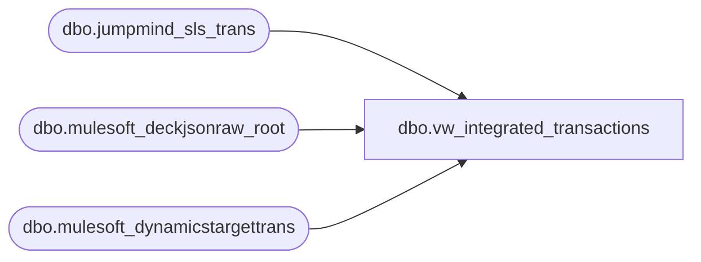

# dbo.vw_integrated_transactions

**Database:** LH_Source  
**Server:** 4db76rlxaxcuvmuh5kw37wbnqq-ovsykae43znuhlmnflcdwm4ohu.datawarehouse.fabric.microsoft.com  

## Architecture Diagram



## Table Dependencies

| Referenced Table |
|---|
| dbo.jumpmind_sls_trans |
| dbo.mulesoft_deckjsonraw_root |
| dbo.mulesoft_dynamicstargettrans |

## View Code

```sql
CREATE VIEW vw_integrated_transactions AS WITH pos AS (   SELECT       CAST(device_id AS varchar(64))                                        AS device_id,       CAST(business_date AS varchar(8))                                     AS business_date,       CAST(sequence_number AS varchar(50))                                  AS sequence_number,       CAST(trans_type AS varchar(64))                                       AS trans_type,       CAST(trans_status AS varchar(64))                                     AS trans_status,       TRY_CONVERT(int, business_unit_id)                                    AS business_unit_id,       CAST(username AS varchar(64))                                         AS username,       TRY_CONVERT(datetime2(6), begin_time)                                 AS begin_time,       TRY_CONVERT(datetime2(6), end_time)                                   AS end_time,       TRY_CONVERT(int, local_offset)                                        AS local_offset,       TRY_CONVERT(int, client_offset)                                       AS client_offset,       TRY_CONVERT(bit, keyed_offline)                                       AS keyed_offline,       CAST(override_user_id AS varchar(64))                                 AS override_user_id,       CAST(barcode AS varchar(64))                                          AS barcode,       TRY_CONVERT(bit, training_mode)                                       AS training_mode,       CAST(session_id AS varchar(64))                                       AS session_id,       CAST(trans_pin AS varchar(64))                                        AS trans_pin,       CAST(till_id AS varchar(64))                                          AS till_id,       CAST(app_id AS varchar(64))                                           AS app_id,       CAST(app_version AS varchar(64))                                      AS app_version,       TRY_CONVERT(datetime2(6), create_time)                                AS create_time,       CAST(create_by AS varchar(128))                                       AS create_by,       TRY_CONVERT(datetime2(6), last_update_time)                           AS last_update_time,       CAST(last_update_by AS varchar(128))                                  AS last_update_by,       CAST(suspended_trans_data AS varchar(max))                            AS suspended_trans_data,       CAST(bank_bag_number AS varchar(64))                                  AS bank_bag_number   FROM dbo.jumpmind_sls_trans   WHERE create_by = 'openpos-sls' ), oms_root AS (   SELECT       r.OrderID,       r.OrderNumber,       r.SiteCode,       r.OrderDateUTC,       r.DateCreatedUTC,       r.DeliveryDate,       r.InsertDate,       r.UpdateDate,       dtt.SiteWarehouseCode   FROM dbo.mulesoft_deckjsonraw_root r   OUTER APPLY (     SELECT TOP (1) dtt.SiteWarehouseCode     FROM dbo.mulesoft_dynamicstargettrans dtt     WHERE dtt.OrderId = r.OrderID   ) dtt ), oms AS (   SELECT       CONCAT(         COALESCE(NULLIF(CAST(orm.SiteWarehouseCode AS varchar(64)),''), NULLIF(CAST(orm.SiteCode AS varchar(64)),''), 'WEB'),         '-',         '052'       )                                                                      AS device_id,       CONVERT(varchar(8), TRY_CONVERT(date, COALESCE(orm.OrderDateUTC, orm.DateCreatedUTC, orm.InsertDate)), 112)                                                                               AS business_date,       CAST(orm.OrderNumber AS varchar(50))                                   AS sequence_number,       CAST(NULL AS varchar(64))                                              AS trans_type,       CAST(NULL AS varchar(64))                                              AS trans_status,       CAST(NULL AS int)                                                      AS business_unit_id,       CAST(NULL AS varchar(64))                                              AS username,       TRY_CONVERT(datetime2(6), COALESCE(orm.OrderDateUTC, orm.DateCreatedUTC, orm.InsertDate))                                                                               AS begin_time,       TRY_CONVERT(datetime2(6), COALESCE(orm.DeliveryDate, orm.UpdateDate, orm.OrderDateUTC, orm.DateCreatedUTC))                                                                               AS end_time,       CAST(0 AS int)                                                         AS local_offset,       CAST(0 AS int)                                                         AS client_offset,       CAST(0 AS bit)                                                         AS keyed_offline,       CAST(NULL AS varchar(64))                                              AS override_user_id,       CAST(NULL AS varchar(64))                                              AS barcode,       CAST(0 AS bit)                                                         AS training_mode,       CAST(NULL AS varchar(64))                                              AS session_id,       CAST(NULL AS varchar(64))                                              AS trans_pin,       CAST('052' AS varchar(64))                                             AS till_id,       CAST(NULL AS varchar(64))                                              AS app_id,       CAST(NULL AS varchar(64))                                              AS app_version,       TRY_CONVERT(datetime2(6), COALESCE(orm.DateCreatedUTC, orm.InsertDate)) AS create_time,       CAST(orm.SiteCode AS varchar(128))                                     AS create_by,       TRY_CONVERT(datetime2(6), COALESCE(orm.UpdateDate, orm.DateCreatedUTC, orm.OrderDateUTC, orm.InsertDate))                                                                               AS last_update_time,       CAST(NULL AS varchar(128))                                             AS last_update_by,       CAST(NULL AS varchar(max))                                             AS suspended_trans_data,       CAST(NULL AS varchar(64))                                              AS bank_bag_number   FROM oms_root orm ) SELECT * FROM pos UNION ALL SELECT * FROM oms;
```

