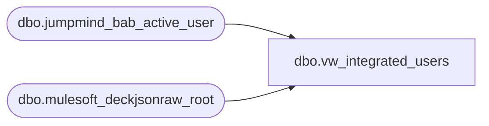

# dbo.vw_integrated_users

**Database:** LH_Source  
**Server:** 4db76rlxaxcuvmuh5kw37wbnqq-ovsykae43znuhlmnflcdwm4ohu.datawarehouse.fabric.microsoft.com  

## Architecture Diagram



## Table Dependencies

| Referenced Table |
|---|
| dbo.jumpmind_bab_active_user |
| dbo.mulesoft_deckjsonraw_root |

## View Code

```sql
CREATE VIEW vw_integrated_users AS WITH deck_agents AS (   SELECT       LOWER(LTRIM(RTRIM(         COALESCE(           NULLIF(CONVERT(varchar(256), r.LockedByName), ''),           NULLIF(CONVERT(varchar(256), r.SourceAgent), '')         )       )))                                    AS username,       MAX(NULLIF(CONVERT(varchar(128), r.MembershipID), '')) AS alternate_id,       MAX(COALESCE(r.OrderDateUTC, r.DateCreatedUTC, r.LastUpdateUTC)) AS last_login   FROM dbo.mulesoft_deckjsonraw_root AS r   WHERE       NULLIF(CONVERT(varchar(256), r.LockedByName), '') IS NOT NULL       OR NULLIF(CONVERT(varchar(256), r.SourceAgent), '') IS NOT NULL   GROUP BY       LOWER(LTRIM(RTRIM(         COALESCE(           NULLIF(CONVERT(varchar(256), r.LockedByName), ''),           NULLIF(CONVERT(varchar(256), r.SourceAgent), '')         )       ))) )  SELECT     business_unit_id,     username,     last_name,     first_name,     last_login,     locked_out_flag,     alternate_id,     workgroup_id,     user_active_flag,     'POS' AS source FROM dbo.jumpmind_bab_active_user  UNION ALL  SELECT     CAST(NULL AS int)          AS business_unit_id,     da.username                AS username,     CAST(NULL AS varchar(200)) AS last_name,     CAST(NULL AS varchar(200)) AS first_name,     da.last_login              AS last_login,     CAST(NULL AS bit)          AS locked_out_flag,     da.alternate_id            AS alternate_id,     CAST(NULL AS varchar(64))  AS workgroup_id,     CAST(1 AS bit)             AS user_active_flag,     'OMS'                      AS source FROM deck_agents AS da;
```

