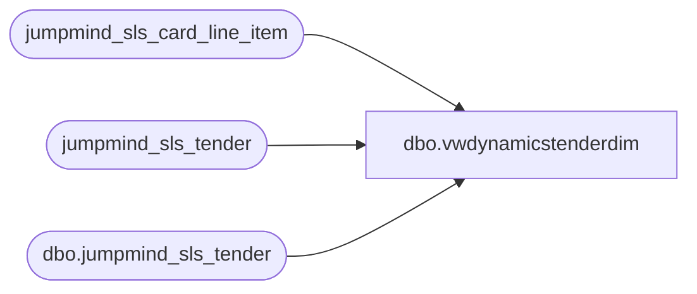

# dbo.vwdynamicstenderdim

**Database:** LH_Source  
**Server:** 4db76rlxaxcuvmuh5kw37wbnqq-ovsykae43znuhlmnflcdwm4ohu.datawarehouse.fabric.microsoft.com  

## Architecture Diagram



## Table Dependencies

| Referenced Table |
|---|
| jumpmind_sls_card_line_item |
| jumpmind_sls_tender |
| dbo.jumpmind_sls_tender |

## View Code

```sql
CREATE   VIEW [dbo].[vwdynamicstenderdim] AS WITH summary AS (     SELECT         st.tender_type_code,         st.tender_code,         st.[description],         CASE             WHEN st.tender_code IN ('CASH_CAD','CASH_EUR','CASH_GBP','CASH_HKD','CASH_MXN','CASH_USD') THEN '600'             WHEN st.tender_code IN ('BANK_CHECK','CHECK_USD') THEN '601'             WHEN st.tender_code IN (                 'AMEX','CREDIT_CARD','DISCOVER_CREDIT','MASTERCARD_CREDIT','VISA_CREDIT',                 'AMEX_DEBIT','DEBIT_CARD','DISCOVER_DEBIT','INTERAC','MASTERCARD_DEBIT','VISA_DEBIT',                 'AMAZON','APPLEPAY','GLOBALE','KLARNA','PAYPAL','VENMO','CO_BRAND',                 'MANUFACTURER_COUPON','PRIVATE_LABEL'             ) THEN '999'             WHEN st.tender_code = 'EVENT_INVOICE' THEN '630'             WHEN st.tender_type_code = 'GIFT_CARD' THEN '633 '   -- keeping trailing space as in source             WHEN st.tender_code = 'LOCAL_TENDER' THEN '626'             WHEN st.tender_type_code = 'ROUNDING_ADJUSTMENT' THEN '629'             WHEN st.tender_type_code = 'STORE_COUPON' THEN '666'             WHEN st.tender_type_code = 'STORE_CREDIT' THEN '666'             ELSE 'UNKNOWN'         END AS dynamicsretailtendertype,         CASE             WHEN st.tender_type_code IN (                 'BANK_CHECK','CASH','CHECK','ROUNDING_ADJUSTMENT','STORE_CREDIT','STORE_COUPON',                 'UNSUPPORTED_AUTHORIZATION','UNDETERMINED_CARD','GIFT_CARD','EVENT_INVOICE'             ) THEN CAST(NULL AS varchar(128))             WHEN st.tender_type_code = 'DEBIT_CARD'                  AND st.tender_code IN ('DEBIT_CARD','INTERAC') THEN 'DEBIT'             WHEN st.tender_code = 'AMAZON' THEN 'AMAZONREC'             WHEN st.tender_code = 'KLARNA' THEN 'KLARNAREC'             WHEN st.tender_code = 'PAYPAL' THEN 'PAYPAL'             WHEN st.tender_code IN ('AMEX','AMEX_DEBIT') THEN 'AMEXPRESS'             WHEN st.tender_code IN ('DISCOVER_CREDIT','DISCOVER_DEBIT') THEN 'DISCOVER'             WHEN st.tender_code IN ('MASTERCARD_CREDIT','MASTERCARD_DEBIT') THEN 'MASTER'             WHEN st.tender_code IN ('VISA_CREDIT','CO_BRAND','CREDIT_CARD','VISA_DEBIT','PRIVATE_LABEL') THEN 'VISA'             WHEN st.tender_code = 'MANUFACTURER_COUPON' THEN 'MALLCERT'             ELSE 'NeedClarity'         END AS dynamicsretailcardtypeid     FROM dbo.jumpmind_sls_tender st     WHERE st.tender_type_code <> 'UNDETERMINED_CARD' ), card_line_items AS ( 	select a.type_code, a.code, a.brand, a.card_name 	from jumpmind_sls_card_line_item a 	left join jumpmind_sls_tender b 		on a.code = b.tender_code and a.type_code = b.tender_type_code 	where b.tender_code is null  			and a.create_by <> 'sp_bab_pos_merge_webreturns'  			and a.type_code <> 'GIFTCARD'  			and a.code not like 'CASH_%'  			and a.code <> 'UNDETERMINED_CARD' 	group by a.type_code, a.code, a.brand, a.card_name ), card_line_items_filtered AS ( 	select  		cli.type_code as tender_type_code,         cli.code AS tender_code,         cli.brand AS [description],          CAST('999' AS varchar(128)) AS dynamicsretailtendertype, 		CASE 			WHEN cli.code in ('AMEX', 'AMEXPRESS', 'AMEX_DEBIT', 'AMEX_DEBIT') THEN 'AMEXPRESS'             WHEN cli.code IN ('DISCOVER_DEBIT', 'DISCOVER_CREDIT') THEN 'DISCOVER' 			WHEN cli.code IN ('MASTERCARD_DEBIT', 'MASTERCARD_CREDIT') THEN 'MASTER' 			WHEN cli.code IN ('VISA_DEBIT', 'VISA_CREDIT') THEN 'VISA' 			WHEN cli.code IN ('INTERAC') THEN 'INTERAC' 			ELSE 'NeedClarity' 		END AS dynamicsretailcardtypeid,         cli.brand as card_brand,         cli.card_name 	from card_line_items cli ), undetermined_card_stage AS (     SELECT         CAST('CREDIT' AS varchar(128)) AS tender_type_code,         CAST('UNDETERMINED_CARD' AS varchar(128)) AS tender_code,         CAST('UNDETERMINED_CARD' AS varchar(128)) AS [description],         CAST('999' AS varchar(128)) AS dynamicsretailtendertype,         CAST('VISA' AS varchar(128)) AS dynamicsretailcardtypeid,         CAST('cup' AS varchar(128)) AS card_brand,         CAST('cup' AS varchar(128)) AS card_name     UNION ALL     SELECT 'CREDIT','UNDETERMINED_CARD','UNDETERMINED_CARD','999','VISA','cup','cupcredit'     UNION ALL     SELECT 'CREDIT','UNDETERMINED_CARD','UNDETERMINED_CARD','999','VISA','interac_card','interac_card'     UNION ALL     SELECT 'CREDIT','UNDETERMINED_CARD','UNDETERMINED_CARD','999','JCB','jcb','jcb'     UNION ALL     SELECT 'CREDIT','UNDETERMINED_CARD','UNDETERMINED_CARD','999','JCB','jcb','jcbcredit'     UNION ALL     SELECT 'CREDIT','UNDETERMINED_CARD','UNDETERMINED_CARD','999','MAESTER','maestro','maestro'     UNION ALL     SELECT 'CREDIT','UNDETERMINED_CARD','UNDETERMINED_CARD','999','VISA','uspindebit','uspindebit'     UNION ALL     SELECT 'CREDIT','UNDETERMINED_CARD','UNDETERMINED_CARD','999','VISA','visa','visadebit'     UNION ALL     SELECT 'CREDIT','UNDETERMINED_CARD','UNDETERMINED_CARD','999','VISA','visa','vpay'     UNION ALL     SELECT 'DEBIT','UNDETERMINED_CARD','UNDETERMINED_CARD','999','DEBIT','cup','cup'     UNION ALL     SELECT 'DEBIT','UNDETERMINED_CARD','UNDETERMINED_CARD','999','DEBIT','cup','cupdebit'     UNION ALL     SELECT 'DEBIT','UNDETERMINED_CARD','UNDETERMINED_CARD','999','DEBIT','maestro','maestro'     UNION ALL     SELECT 'DEBIT','UNDETERMINED_CARD','UNDETERMINED_CARD','999','DEBIT','maestro','mc'     UNION ALL     SELECT 'DEBIT','UNDETERMINED_CARD','UNDETERMINED_CARD','999','DEBIT','maestro','uspindebit'     UNION ALL     SELECT 'DEBIT','UNDETERMINED_CARD','UNDETERMINED_CARD','999','DEBIT','mc','maestro'     UNION ALL     SELECT 'DEBIT','UNDETERMINED_CARD','UNDETERMINED_CARD','999','DEBIT','mc','mc'     UNION ALL     SELECT 'DEBIT','UNDETERMINED_CARD','UNDETERMINED_CARD','999','DEBIT','mc','mccommercialdebit'     UNION ALL     SELECT 'DEBIT','UNDETERMINED_CARD','UNDETERMINED_CARD','999','DEBIT','mc','mcdebit'     UNION ALL     SELECT 'DEBIT','UNDETERMINED_CARD','UNDETERMINED_CARD','999','DEBIT','mc','mcstandarddebit'     UNION ALL     SELECT 'DEBIT','UNDETERMINED_CARD','UNDETERMINED_CARD','999','DEBIT','visa','vpay'     UNION ALL     SELECT 'DEBIT','UNDETERMINED_CARD','UNDETERMINED_CARD','999','DEBIT','vpay','vpay' ) SELECT     s.tender_type_code,     s.tender_code,     s.[description],     s.dynamicsretailtendertype,     s.dynamicsretailcardtypeid,     CAST(NULL AS varchar(128)) AS card_brand,     CAST(NULL AS varchar(128)) AS card_name FROM summary s WHERE s.tender_type_code <> 'E_WALLET'   AND s.dynamicsretailtendertype <> 'UNKNOWN'  UNION ALL  SELECT     s.tender_type_code,     s.tender_code,     s.[description],     s.dynamicsretailtendertype,     s.dynamicsretailcardtypeid,     s.card_brand,     s.card_name FROM card_line_items_filtered s WHERE s.tender_type_code <> 'E_WALLET'   AND s.dynamicsretailtendertype <> 'UNKNOWN'  UNION ALL  SELECT     u.tender_type_code,     u.tender_code,     u.[description],     u.dynamicsretailtendertype,     u.dynamicsretailcardtypeid,     u.card_brand,     u.card_name FROM undetermined_card_stage u;
```

