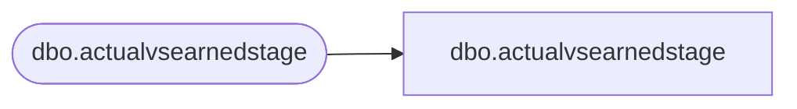

# dbo.actualvsearnedstage

**Database:** LH_Staging_CI  
**Server:** 4db76rlxaxcuvmuh5kw37wbnqq-ovsykae43znuhlmnflcdwm4ohu.datawarehouse.fabric.microsoft.com  

## Architecture Diagram



## Table Dependencies

| Referenced Table |
|---|
| dbo.actualvsearnedstage |

## View Code

```sql
; CREATE   VIEW [dbo].[actualvsearnedstage] AS SELECT [StartDate], [EndDate], [Year], [Week], [WeekID], [PeriodID], [StoreID], [ActualHours], [EarnedHours], [Variance], [PercentOfActual], [store_key], [date_key], [AdjustedSales], [AdjustedSalesRounded], [BaseHours] FROM [dbo].[actualvsearnedstage]
```

