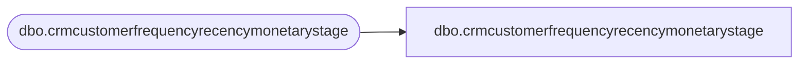

# dbo.crmcustomerfrequencyrecencymonetarystage

**Database:** LH_Staging_CI  
**Server:** 4db76rlxaxcuvmuh5kw37wbnqq-ovsykae43znuhlmnflcdwm4ohu.datawarehouse.fabric.microsoft.com  

## Architecture Diagram



## Table Dependencies

| Referenced Table |
|---|
| dbo.crmcustomerfrequencyrecencymonetarystage |

## View Code

```sql
; CREATE   VIEW [dbo].[crmcustomerfrequencyrecencymonetarystage] AS SELECT [CustomerNumber] COLLATE Latin1_General_CI_AS AS [CustomerNumber], [LifetimeTransactionCount], [LifetimeRecencyCount], [LifetimeSalesTotal], [FirstStoreConcept] COLLATE Latin1_General_CI_AS AS [FirstStoreConcept], [FirstTransactionDate], [Frequency3M], [Recency3M], [Sales3M], [minDaysBetween3M], [maxDaysBetween3M], [DaysBetween3M], [Frequency6M], [Recency6M], [Sales6M], [minDaysBetween6M], [maxDaysBetween6M], [DaysBetween6M], [Frequency12M], [Recency12M], [Sales12M], [minDaysBetween12M], [maxDaysBetween12M], [DaysBetween12M], [Frequency18M], [Recency18M], [Sales18M], [minDaysBetween18M], [maxDaysBetween18M], [DaysBetween18M], [Frequency24M], [Recency24M], [Sales24M], [minDaysBetween24M], [maxDaysBetween24M], [DaysBetween24M], [Frequency1M], [Recency1M], [Sales1M], [minDaysBetween1M], [maxDaysBetween1M], [DaysBetween1M], [LastTransactionDate], [LastTransactionStore] COLLATE Latin1_General_CI_AS AS [LastTransactionStore], [Frequency36M], [Recency36M], [Sales36M], [minDaysBetween36M], [maxDaysBetween36M], [DaysBetween36M] FROM [dbo].[crmcustomerfrequencyrecencymonetarystage]
```

