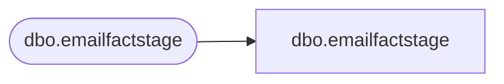

# dbo.emailfactstage

**Database:** LH_Staging_CI  
**Server:** 4db76rlxaxcuvmuh5kw37wbnqq-ovsykae43znuhlmnflcdwm4ohu.datawarehouse.fabric.microsoft.com  

## Architecture Diagram



## Table Dependencies

| Referenced Table |
|---|
| dbo.emailfactstage |

## View Code

```sql
; CREATE   VIEW [dbo].[emailfactstage] AS SELECT [ClientID], [SendID], [SendDate], [SubscriberKey] COLLATE Latin1_General_CI_AS AS [SubscriberKey], [EmailAddress] COLLATE Latin1_General_CI_AS AS [EmailAddress], [BounceDate], [ClickDate], [UnSubDate], [OpenDate], [FrequencyCount1m], [FrequencyCount3m], [FrequencyCount6m], [FrequencyCount12m], [FrequencyCount18m], [FrequencyCount24m], [FrequencyCountTtl], [RecencyCount1m], [RecencyCount3m], [RecencyCount6m], [RecencyCount12m], [RecencyCount24m], [RecencyCountTtl], [MonetarySum1m], [MonetarySum3m], [MonetarySum6m], [MonetarySum12m], [MonetarySum18m], [MonetarySum24m], [MonetarySumTtl], [AudienceSeg] COLLATE Latin1_General_CI_AS AS [AudienceSeg], [LastPurchaseDate], [LastPurchaseChan], [PreferredStory] COLLATE Latin1_General_CI_AS AS [PreferredStory], [SubscriberID], [clickCount], [StoreName] COLLATE Latin1_General_CI_AS AS [StoreName] FROM [dbo].[emailfactstage]
```

