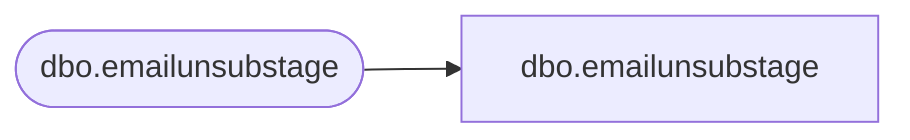

# dbo.emailunsubstage

**Database:** LH_Staging_CI  
**Server:** 4db76rlxaxcuvmuh5kw37wbnqq-ovsykae43znuhlmnflcdwm4ohu.datawarehouse.fabric.microsoft.com  

## Architecture Diagram



## Table Dependencies

| Referenced Table |
|---|
| dbo.emailunsubstage |

## View Code

```sql
; CREATE   VIEW [dbo].[emailunsubstage] AS SELECT [ClientID], [SendID], [SubscriberKey] COLLATE Latin1_General_CI_AS AS [SubscriberKey], [EmailAddress] COLLATE Latin1_General_CI_AS AS [EmailAddress], [UnSubDate] FROM [dbo].[emailunsubstage]
```

