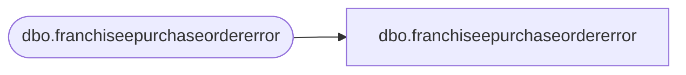

# dbo.franchiseepurchaseordererror

**Database:** LH_Staging_CI  
**Server:** 4db76rlxaxcuvmuh5kw37wbnqq-ovsykae43znuhlmnflcdwm4ohu.datawarehouse.fabric.microsoft.com  

## Architecture Diagram



## Table Dependencies

| Referenced Table |
|---|
| dbo.franchiseepurchaseordererror |

## View Code

```sql
; CREATE   VIEW [dbo].[franchiseepurchaseordererror] AS SELECT [PurchaseOrderID] COLLATE Latin1_General_CI_AS AS [PurchaseOrderID], [WarehouseID] COLLATE Latin1_General_CI_AS AS [WarehouseID], [Style] COLLATE Latin1_General_CI_AS AS [Style], [Units] COLLATE Latin1_General_CI_AS AS [Units], [LinePrice] COLLATE Latin1_General_CI_AS AS [LinePrice], [DueDate] COLLATE Latin1_General_CI_AS AS [DueDate], [InsertDate] COLLATE Latin1_General_CI_AS AS [InsertDate], [Franchisee] COLLATE Latin1_General_CI_AS AS [Franchisee], [ErrorDesc] COLLATE Latin1_General_CI_AS AS [ErrorDesc], [ErrorSource] COLLATE Latin1_General_CI_AS AS [ErrorSource] FROM [dbo].[franchiseepurchaseordererror]
```

