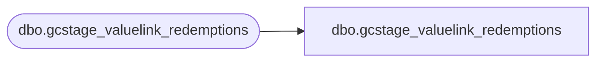

# dbo.gcstage_valuelink_redemptions

**Database:** LH_Staging_CI  
**Server:** 4db76rlxaxcuvmuh5kw37wbnqq-ovsykae43znuhlmnflcdwm4ohu.datawarehouse.fabric.microsoft.com  

## Architecture Diagram



## Table Dependencies

| Referenced Table |
|---|
| dbo.gcstage_valuelink_redemptions |

## View Code

```sql
; CREATE   VIEW [dbo].[gcstage_valuelink_redemptions] AS SELECT [activationDate], [date_key], [store_key], [terminal_id], [terminal_transaction_number], [account_number] COLLATE Latin1_General_CI_AS AS [account_number], [transaction_amount], [reversal_flag] COLLATE Latin1_General_CI_AS AS [reversal_flag], [LineID], [merchant_id] COLLATE Latin1_General_CI_AS AS [merchant_id], [postedPhase], [gaRecID] FROM [dbo].[gcstage_valuelink_redemptions]
```

