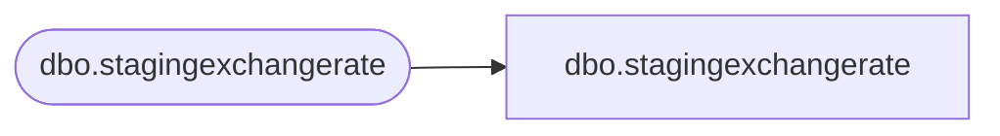

# dbo.stagingexchangerate

**Database:** LH_Staging_CI  
**Server:** 4db76rlxaxcuvmuh5kw37wbnqq-ovsykae43znuhlmnflcdwm4ohu.datawarehouse.fabric.microsoft.com  

## Architecture Diagram



## Table Dependencies

| Referenced Table |
|---|
| dbo.stagingexchangerate |

## View Code

```sql
; CREATE   VIEW [dbo].[stagingexchangerate] AS SELECT [ConversionFactor] COLLATE Latin1_General_CI_AS AS [ConversionFactor], [EndDate], [FromCurrency] COLLATE Latin1_General_CI_AS AS [FromCurrency], [Rate], [RateTypeDescription] COLLATE Latin1_General_CI_AS AS [RateTypeDescription], [RateTypeName] COLLATE Latin1_General_CI_AS AS [RateTypeName], [StartDate], [ToCurrency] COLLATE Latin1_General_CI_AS AS [ToCurrency] FROM [dbo].[stagingexchangerate]
```

