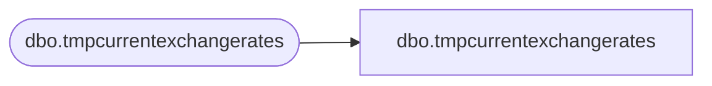

# dbo.tmpcurrentexchangerates

**Database:** LH_Staging_CI  
**Server:** 4db76rlxaxcuvmuh5kw37wbnqq-ovsykae43znuhlmnflcdwm4ohu.datawarehouse.fabric.microsoft.com  

## Architecture Diagram



## Table Dependencies

| Referenced Table |
|---|
| dbo.tmpcurrentexchangerates |

## View Code

```sql
; CREATE   VIEW [dbo].[tmpcurrentexchangerates] AS SELECT [exchange_rate_facts_key], [date_key], [from_currency_key], [to_currency_key], [actual_date], [from_currency_code] COLLATE Latin1_General_CI_AS AS [from_currency_code], [to_currency_code] COLLATE Latin1_General_CI_AS AS [to_currency_code], [bbw_rate], [actual_rate], [fiscal_month_ave_rate], [fiscal_month_end_rate], [calendar_month_ave_rate], [calendar_month_end_rate] FROM [dbo].[tmpcurrentexchangerates]
```

