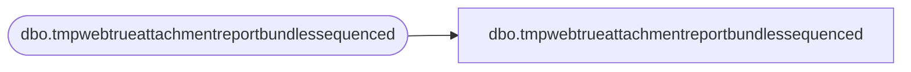

# dbo.tmpwebtrueattachmentreportbundlessequenced

**Database:** LH_Staging_CI  
**Server:** 4db76rlxaxcuvmuh5kw37wbnqq-ovsykae43znuhlmnflcdwm4ohu.datawarehouse.fabric.microsoft.com  

## Architecture Diagram



## Table Dependencies

| Referenced Table |
|---|
| dbo.tmpwebtrueattachmentreportbundlessequenced |

## View Code

```sql
; CREATE   VIEW [dbo].[tmpwebtrueattachmentreportbundlessequenced] AS SELECT [sku] COLLATE Latin1_General_CI_AS AS [sku], [QTY], [ItemDescription] COLLATE Latin1_General_CI_AS AS [ItemDescription], [Price], [ParentItem], [OrderNum] COLLATE Latin1_General_CI_AS AS [OrderNum], [OrderDate], [OrderItemID], [isParent], [linkID], [TransactionID], [Rn_num] FROM [dbo].[tmpwebtrueattachmentreportbundlessequenced]
```

