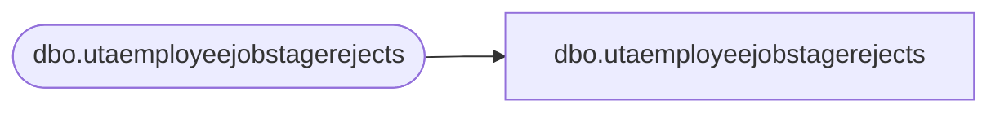

# dbo.utaemployeejobstagerejects

**Database:** LH_Staging_CI  
**Server:** 4db76rlxaxcuvmuh5kw37wbnqq-ovsykae43znuhlmnflcdwm4ohu.datawarehouse.fabric.microsoft.com  

## Architecture Diagram



## Table Dependencies

| Referenced Table |
|---|
| dbo.utaemployeejobstagerejects |

## View Code

```sql
; CREATE   VIEW [dbo].[utaemployeejobstagerejects] AS SELECT [Emp_ID] COLLATE Latin1_General_CI_AS AS [Emp_ID], [Empjob_Start_Date] COLLATE Latin1_General_CI_AS AS [Empjob_Start_Date], [Empjob_End_Date] COLLATE Latin1_General_CI_AS AS [Empjob_End_Date], [Job_ID] COLLATE Latin1_General_CI_AS AS [Job_ID], [ErrorCode], [ErrorColumn], [RejectDate] FROM [dbo].[utaemployeejobstagerejects]
```

