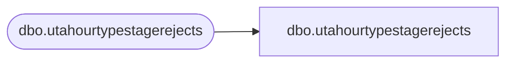

# dbo.utahourtypestagerejects

**Database:** LH_Staging_CI  
**Server:** 4db76rlxaxcuvmuh5kw37wbnqq-ovsykae43znuhlmnflcdwm4ohu.datawarehouse.fabric.microsoft.com  

## Architecture Diagram



## Table Dependencies

| Referenced Table |
|---|
| dbo.utahourtypestagerejects |

## View Code

```sql
; CREATE   VIEW [dbo].[utahourtypestagerejects] AS SELECT [Htype_ID] COLLATE Latin1_General_CI_AS AS [Htype_ID], [Htype_Name] COLLATE Latin1_General_CI_AS AS [Htype_Name], [ErrorCode], [ErrorColumn], [RejectDate] FROM [dbo].[utahourtypestagerejects]
```

