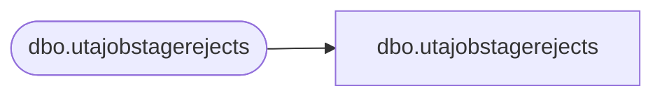

# dbo.utajobstagerejects

**Database:** LH_Staging_CI  
**Server:** 4db76rlxaxcuvmuh5kw37wbnqq-ovsykae43znuhlmnflcdwm4ohu.datawarehouse.fabric.microsoft.com  

## Architecture Diagram



## Table Dependencies

| Referenced Table |
|---|
| dbo.utajobstagerejects |

## View Code

```sql
; CREATE   VIEW [dbo].[utajobstagerejects] AS SELECT [JOB_ID] COLLATE Latin1_General_CI_AS AS [JOB_ID], [JOB_NAME] COLLATE Latin1_General_CI_AS AS [JOB_NAME], [JOB_DESC] COLLATE Latin1_General_CI_AS AS [JOB_DESC], [ErrorCode], [ErrorColumn], [RejectDate] FROM [dbo].[utajobstagerejects]
```

