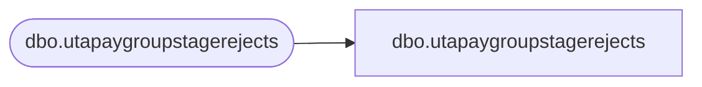

# dbo.utapaygroupstagerejects

**Database:** LH_Staging_CI  
**Server:** 4db76rlxaxcuvmuh5kw37wbnqq-ovsykae43znuhlmnflcdwm4ohu.datawarehouse.fabric.microsoft.com  

## Architecture Diagram



## Table Dependencies

| Referenced Table |
|---|
| dbo.utapaygroupstagerejects |

## View Code

```sql
; CREATE   VIEW [dbo].[utapaygroupstagerejects] AS SELECT [PayGrp_ID] COLLATE Latin1_General_CI_AS AS [PayGrp_ID], [PayGrp_Name] COLLATE Latin1_General_CI_AS AS [PayGrp_Name], [ErrorCode], [ErrorColumn], [RejectDate] FROM [dbo].[utapaygroupstagerejects]
```

