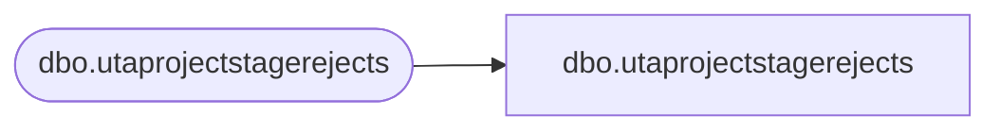

# dbo.utaprojectstagerejects

**Database:** LH_Staging_CI  
**Server:** 4db76rlxaxcuvmuh5kw37wbnqq-ovsykae43znuhlmnflcdwm4ohu.datawarehouse.fabric.microsoft.com  

## Architecture Diagram



## Table Dependencies

| Referenced Table |
|---|
| dbo.utaprojectstagerejects |

## View Code

```sql
; CREATE   VIEW [dbo].[utaprojectstagerejects] AS SELECT [Proj_ID], [Proj_Name] COLLATE Latin1_General_CI_AS AS [Proj_Name], [Proj_Desc] COLLATE Latin1_General_CI_AS AS [Proj_Desc], [ErrorCode], [ErrorColumn], [RejectDate] FROM [dbo].[utaprojectstagerejects]
```

