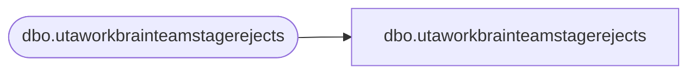

# dbo.utaworkbrainteamstagerejects

**Database:** LH_Staging_CI  
**Server:** 4db76rlxaxcuvmuh5kw37wbnqq-ovsykae43znuhlmnflcdwm4ohu.datawarehouse.fabric.microsoft.com  

## Architecture Diagram



## Table Dependencies

| Referenced Table |
|---|
| dbo.utaworkbrainteamstagerejects |

## View Code

```sql
; CREATE   VIEW [dbo].[utaworkbrainteamstagerejects] AS SELECT [wbt_id] COLLATE Latin1_General_CI_AS AS [wbt_id], [wbt_name] COLLATE Latin1_General_CI_AS AS [wbt_name], [wbt_parent_id] COLLATE Latin1_General_CI_AS AS [wbt_parent_id], [wbt_lft] COLLATE Latin1_General_CI_AS AS [wbt_lft], [wbt_rgt] COLLATE Latin1_General_CI_AS AS [wbt_rgt], [ErrorCode], [ErrorColumn], [RejectDate] FROM [dbo].[utaworkbrainteamstagerejects]
```

