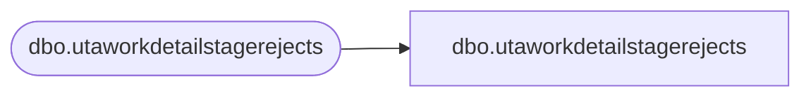

# dbo.utaworkdetailstagerejects

**Database:** LH_Staging_CI  
**Server:** 4db76rlxaxcuvmuh5kw37wbnqq-ovsykae43znuhlmnflcdwm4ohu.datawarehouse.fabric.microsoft.com  

## Architecture Diagram



## Table Dependencies

| Referenced Table |
|---|
| dbo.utaworkdetailstagerejects |

## View Code

```sql
; CREATE   VIEW [dbo].[utaworkdetailstagerejects] AS SELECT [wrks_id] COLLATE Latin1_General_CI_AS AS [wrks_id], [wrkd_id] COLLATE Latin1_General_CI_AS AS [wrkd_id], [wrkd_start_time] COLLATE Latin1_General_CI_AS AS [wrkd_start_time], [wrkd_end_time] COLLATE Latin1_General_CI_AS AS [wrkd_end_time], [wrkd_minutes] COLLATE Latin1_General_CI_AS AS [wrkd_minutes], [wbt_id] COLLATE Latin1_General_CI_AS AS [wbt_id], [tcode_id] COLLATE Latin1_General_CI_AS AS [tcode_id], [htype_id] COLLATE Latin1_General_CI_AS AS [htype_id], [wrkd_rate] COLLATE Latin1_General_CI_AS AS [wrkd_rate], [wrkd_work_date] COLLATE Latin1_General_CI_AS AS [wrkd_work_date], [Job_id] COLLATE Latin1_General_CI_AS AS [Job_id], [Dept_id] COLLATE Latin1_General_CI_AS AS [Dept_id], [ErrorCode], [ErrorColumn], [RejectDate], [proj_id] FROM [dbo].[utaworkdetailstagerejects]
```

