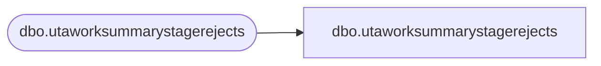

# dbo.utaworksummarystagerejects

**Database:** LH_Staging_CI  
**Server:** 4db76rlxaxcuvmuh5kw37wbnqq-ovsykae43znuhlmnflcdwm4ohu.datawarehouse.fabric.microsoft.com  

## Architecture Diagram



## Table Dependencies

| Referenced Table |
|---|
| dbo.utaworksummarystagerejects |

## View Code

```sql
; CREATE   VIEW [dbo].[utaworksummarystagerejects] AS SELECT [wrks_id] COLLATE Latin1_General_CI_AS AS [wrks_id], [emp_id] COLLATE Latin1_General_CI_AS AS [emp_id], [wrks_work_date] COLLATE Latin1_General_CI_AS AS [wrks_work_date], [paygrp_id] COLLATE Latin1_General_CI_AS AS [paygrp_id], [ErrorCode], [ErrorColumn], [RejectDate] FROM [dbo].[utaworksummarystagerejects]
```

