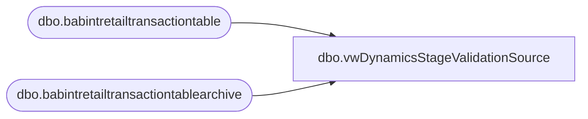

# dbo.vwDynamicsStageValidationSource

**Database:** Lakehouse_Validation  
**Server:** 4db76rlxaxcuvmuh5kw37wbnqq-ovsykae43znuhlmnflcdwm4ohu.datawarehouse.fabric.microsoft.com  

## Architecture Diagram



## Table Dependencies

| Referenced Table |
|---|
| dbo.babintretailtransactiontable |
| dbo.babintretailtransactiontablearchive |

## View Code

```sql
CREATE view [dbo].[vwDynamicsStageValidationSource]   as   with DataStage as  ( select   rt.inventlocationid as store  ,cast (rt.transdate as date) as TransDate ,rt.retailreceiptid as sequence_number  ,rt.retailtransactionid as RetailTransactionId , rt.babintretailprocessed , 'Staging' as SourceTable from [dbo].[babintretailtransactiontable] rt where 1=1 and rt.retailtransactionid is not NULL and rt.IsDelete is null  	union  select   rt.inventlocationid as store  ,cast (rt.transdate as date) as TransDate ,rt.retailreceiptid as sequence_number  ,rt.retailtransactionid as RetailTransactionId , rt.babintretailprocessed , 'StagingArchive' as SourceTable from [dbo].[babintretailtransactiontablearchive] rt where 1=1 and  datediff (dd, rt.transdate, getdate ()) <= 90  )  select * from DataStage ds where 1=1 --and ds.RetailTransactionId = '1110-20250701-0101110004129520250701_1' --and babintretailprocessed = 0  --and SourceTable = 'Staging'  --order by 2 desc
```

