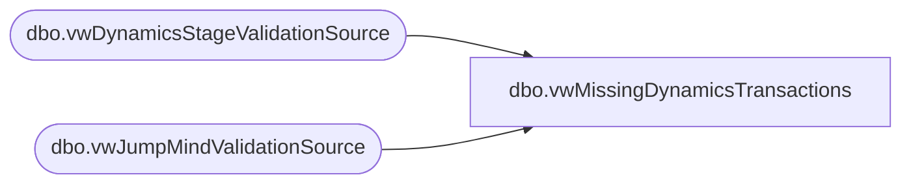

# dbo.vwMissingDynamicsTransactions

**Database:** Lakehouse_Validation  
**Server:** 4db76rlxaxcuvmuh5kw37wbnqq-ovsykae43znuhlmnflcdwm4ohu.datawarehouse.fabric.microsoft.com  

## Architecture Diagram



## Table Dependencies

| Referenced Table |
|---|
| dbo.vwDynamicsStageValidationSource |
| dbo.vwJumpMindValidationSource |

## View Code

```sql
CREATE   VIEW dbo.vwMissingDynamicsTransactions AS  SELECT     jmc.TransactionKey,     jmc.DeviceId,     jmc.BusinessDate,     jmc.SequenceNumber,     jmc.Barcode,     jmc.RetailTransactionId,     CONCAT(',''', jmc.RetailTransactionId, '''') AS RetailTransactionIdText,     jmc.CreateDate,     jmc.ES_Flag,     jmc.PIPO_Flag,     jmc.DiscountTotal,     jmc.SubTotal,     jmc.TaxTotal,     jmc.Total FROM dbo.vwJumpMindValidationSource jmc LEFT JOIN dbo.vwDynamicsStageValidationSource dyn     ON jmc.RetailTransactionId = dyn.RetailTransactionId WHERE dyn.RetailTransactionId IS NULL     AND CAST(jmc.CreateDate AS DATE) >= '2025-10-05'     AND jmc.DeviceId NOT IN (         '1584-002','1584-003',         '1584-102','1584-103',         '1585-002','1585-003',         '1585-102','1585-103',         '1586-002','1586-003',         '1586-102','1586-103',         '1587-002','1587-003',         '1587-102','1587-103',         '1588-002','1588-003',         '1588-102','1588-103',         '1590-002','1590-003',         '1590-102','1590-103',         '1591-002','1591-003'     );
```

