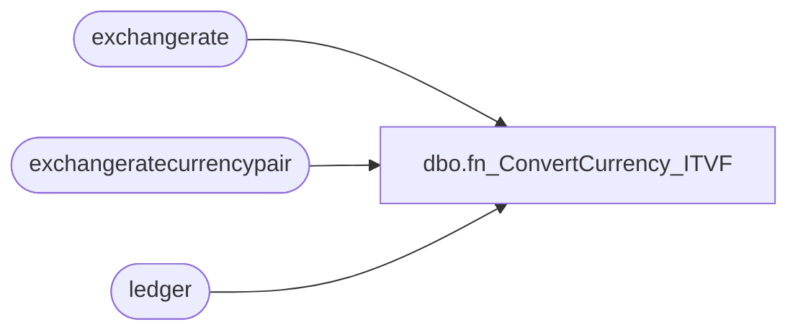

# dbo.fn_ConvertCurrency_ITVF

**Database:** LH_D365  
**Server:** 4db76rlxaxcuvmuh5kw37wbnqq-oxjjwecel5tehm2dtna3lt5qia.datawarehouse.fabric.microsoft.com  
**Function Type:** Inline Table-Valued Function  

## Architecture Diagram



## Parameters

| Parameter | Data Type | Max Length | Is Output |
|---|---|---|---|
| @FromCurrency | nvarchar | 20 | NO |
| @ToCurrency | nvarchar | 20 | NO |
| @Amount | decimal | 9 | NO |
| @LegalEntity | nvarchar | 20 | NO |

## Table Dependencies

| Referenced Table |
|---|
| exchangerate |
| exchangeratecurrencypair |
| ledger |

## Function Code

```sql
CREATE   FUNCTION [dbo].[fn_ConvertCurrency_ITVF]
(
    @FromCurrency NVARCHAR(10),
    @ToCurrency NVARCHAR(10),
    @Amount DECIMAL(18,4),
    @LegalEntity NVARCHAR(10)
)
RETURNS TABLE
AS
RETURN
(
    --  
    SELECT TOP 1
        ConvertedAmount = (@Amount * exchangerate.exchangerate) / NULLIF(exchangeratecurrencypair.exchangeratedisplayfactor, 0)
    FROM exchangerate
    JOIN exchangeratecurrencypair 
        ON exchangerate.exchangeratecurrencypair = exchangeratecurrencypair.recid
    JOIN ledger 
        ON ledger.defaultexchangeratetype = exchangeratecurrencypair.exchangeratetype
    WHERE exchangerate.validfrom <= CAST(GETDATE() AS DATE)
      AND exchangerate.validto   >= CAST(GETDATE() AS DATE)
      AND exchangeratecurrencypair.fromcurrencycode = @FromCurrency
      AND exchangeratecurrencypair.tocurrencycode   = @ToCurrency
      AND ledger.name = @LegalEntity

    UNION ALL

    --  
    SELECT TOP 1
        ConvertedAmount = (@Amount / exchangerate.exchangerate) * ISNULL(exchangeratecurrencypair.exchangeratedisplayfactor, 1)
    FROM exchangerate
    JOIN exchangeratecurrencypair 
        ON exchangerate.exchangeratecurrencypair = exchangeratecurrencypair.recid
    JOIN ledger 
        ON ledger.defaultexchangeratetype = exchangeratecurrencypair.exchangeratetype
    WHERE exchangerate.validfrom <= CAST(GETDATE() AS DATE)
      AND exchangerate.validto   >= CAST(GETDATE() AS DATE)
      AND exchangeratecurrencypair.fromcurrencycode = @ToCurrency
      AND exchangeratecurrencypair.tocurrencycode   = @FromCurrency
      AND ledger.name = @LegalEntity
      AND NOT EXISTS
      (
          SELECT 1
          FROM exchangerate
          JOIN exchangeratecurrencypair 
              ON exchangerate.exchangeratecurrencypair = exchangeratecurrencypair.recid
          JOIN ledger 
              ON ledger.defaultexchangeratetype = exchangeratecurrencypair.exchangeratetype
          WHERE exchangerate.validfrom <= CAST(GETDATE() AS DATE)
            AND exchangerate.validto   >= CAST(GETDATE() AS DATE)
            AND exchangeratecurrencypair.fromcurrencycode = @FromCurrency
            AND exchangeratecurrencypair.tocurrencycode   = @ToCurrency
            AND ledger.name = @LegalEntity
      )

    UNION ALL

    -- 
    SELECT @Amount AS ConvertedAmount
    WHERE NOT EXISTS
    (
        SELECT 1
        FROM exchangerate
        JOIN exchangeratecurrencypair 
            ON exchangerate.exchangeratecurrencypair = exchangeratecurrencypair.recid
        JOIN ledger 
            ON ledger.defaultexchangeratetype = exchangeratecurrencypair.exchangeratetype
        WHERE exchangerate.validfrom <= CAST(GETDATE() AS DATE)
          AND exchangerate.validto   >= CAST(GETDATE() AS DATE)
          AND ((exchangeratecurrencypair.fromcurrencycode = @FromCurrency AND exchangeratecurrencypair.tocurrencycode = @ToCurrency)
               OR (exchangeratecurrencypair.fromcurrencycode = @ToCurrency AND exchangeratecurrencypair.tocurrencycode = @FromCurrency))
          AND ledger.name = @LegalEntity
    )
);
```

