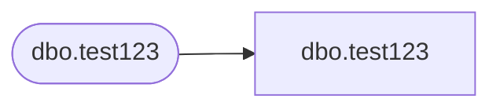

# dbo.test123

**Database:** BABTempWH  
**Server:** 4db76rlxaxcuvmuh5kw37wbnqq-oxjjwecel5tehm2dtna3lt5qia.datawarehouse.fabric.microsoft.com  

## Architecture Diagram



## Table Dependencies

| Referenced Table |
|---|
| dbo.test123 |

## Stored Procedure Code

```sql
create  procedure dbo.test123 (@param varchar(100) )
AS
SELECT @param as col2

exec dbo.test123 'lakehouse'
```

