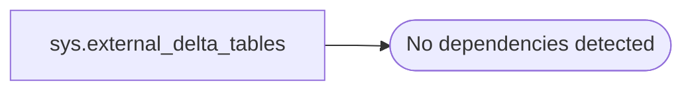

# sys.external_delta_tables

**Database:** BABTempWH  
**Server:** 4db76rlxaxcuvmuh5kw37wbnqq-oxjjwecel5tehm2dtna3lt5qia.datawarehouse.fabric.microsoft.com  

## Architecture Diagram



## Table Dependencies

_No table dependencies detected._

## View Code

```sql
CREATE   VIEW sys.external_delta_tables
AS
SELECT t.table_id, t.is_blocked, t.block_reason, t.local_path, t.relative_path, IIF(t.latest_manifest_version > -1, t.latest_manifest_version, NULL ) AS latest_manifest_version, IIF(t.latest_checkpoint_version > -1, t.latest_checkpoint_version, NULL ) AS latest_checkpoint_version, IIF(t.latest_checksum_version > -1, t.latest_checksum_version, NULL ) AS latest_checksum_version, t.latest_etag, t.latest_checkpoint_file_name, t.last_update_time, t.shortcut_type 
FROM sys.externaldeltatables t
JOIN sys.manageddeltatables f
ON t.table_id = f.table_id and f.drop_commit_time <= '1900-01-01T00:00:00'
```

