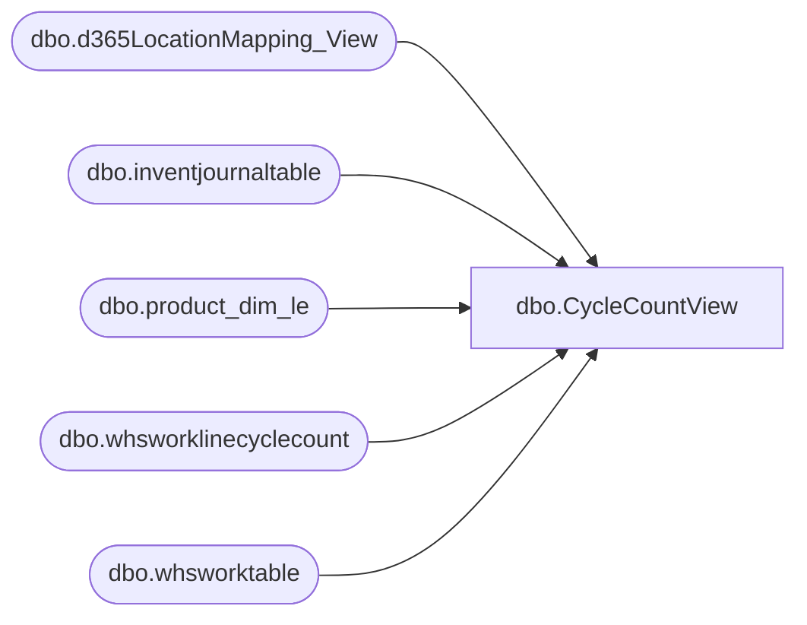

# dbo.CycleCountView

**Database:** LH_D365  
**Server:** 4db76rlxaxcuvmuh5kw37wbnqq-oxjjwecel5tehm2dtna3lt5qia.datawarehouse.fabric.microsoft.com  

## Architecture Diagram



## Table Dependencies

| Referenced Table |
|---|
| dbo.d365LocationMapping_View |
| dbo.inventjournaltable |
| dbo.product_dim_le |
| dbo.whsworklinecyclecount |
| dbo.whsworktable |

## View Code

```sql
CREATE VIEW dbo.CycleCountView AS
WITH DeduplicatedWorkTable AS (
    SELECT 
        *,
        ROW_NUMBER() OVER (
            PARTITION BY workid, dataareaid 
            ORDER BY recid DESC
        ) AS rn
    FROM dbo.whsworktable
    WHERE (IsDelete IS NULL OR IsDelete = 0)
),
DeduplicatedCycleCountLines AS (
    SELECT 
        *,
        ROW_NUMBER() OVER (
            PARTITION BY COALESCE(adjustmentworkid, workid), itemid, dataareaid 
            ORDER BY recid DESC
        ) AS rn
    FROM dbo.whsworklinecyclecount
    WHERE (IsDelete IS NULL OR IsDelete = 0)
      AND acceptreject IN (1, 2)
      AND qtycounted <> qtyexpected  -- Only include records with discrepancies
)
SELECT
    -- Primary Keys
    COALESCE(wl.adjustmentworkid, wl.workid)                        AS WorkId,
    wl.workid                                                       AS OriginalCycleCountWorkId,
    wl.linenum                                                      AS LineNum,

    -- Item (join to product_dim_le on product_key)
    wl.itemid                                                       AS ItemId,
    wl.inventdimid                                                  AS InventDimId,
    CONCAT(wl.itemid, wl.dataareaid, lm.JurisidictionCode)          AS ProductKey,
    CONCAT(wl.itemid, ' - ', COALESCE(pd.style_desc, 'Unknown'))   AS StyleWithDescription,

    -- Location (join to d365LocationMapping_View on LocationKey)
    wt.inventlocationid                                             AS InventLocationId,
    wt.inventsiteid                                                 AS InventSiteId,
    CONCAT(wt.inventlocationid, '-', wl.dataareaid)                 AS LocationKey,
    CONCAT(wt.inventlocationid, ' - ', COALESCE(lm.name, 'Unknown')) AS StoreWithDescription,
    
    -- Quantity Fields (signed — positive = add, negative = subtract)
    wl.qtyexpected                                                  AS ExpectedQty,
    wl.qtycounted                                                   AS CountedQty,
    (wl.qtycounted - wl.qtyexpected)                                AS AdjustmentQty,

    -- Cost Fields (signed)
    wl.babcostperunit                                               AS CostPerUnit,
    ((wl.qtycounted - wl.qtyexpected) * wl.babcostperunit)          AS CostAdjusted,

    -- Dates (operations-focused: work completed date primary)
    CAST(wt.workclosedutcdatetime AS DATE)                          AS CountCompletedDate,
    CAST(COALESCE(ij.posteddatetime, ij.createddatetime) AS DATE)   AS JournalPostedDate,
    COALESCE(
        CAST(wt.workclosedutcdatetime AS DATE),
        CAST(ij.posteddatetime AS DATE),
        CAST(ij.createddatetime AS DATE)
    )                                                              AS DateOfCount,
    CAST(wl.SinkModifiedOn AS DATE)                                AS ModifiedDate,

    -- Approval/Reject Date: Journal posted date for accepted, work closed for rejected
    CASE 
        WHEN wl.acceptreject = 1 THEN CAST(ij.posteddatetime AS DATE)
        WHEN wl.acceptreject = 2 THEN CAST(wt.workclosedutcdatetime AS DATE)
        ELSE NULL
    END                                                             AS ApprovalDate,

    -- Approval Outcome
    wl.acceptreject                                                 AS AcceptRejectCode,
    CASE wl.acceptreject
        WHEN 0 THEN 'None'
        WHEN 1 THEN 'Accept'
        WHEN 2 THEN 'Reject'
        ELSE 'Unknown'
    END                                                             AS AcceptReject,

    -- Work Status
    wt.workstatus                                                   AS WorkStatusCode,
    CASE wt.workstatus
        WHEN 0 THEN 'Open'
        WHEN 1 THEN 'InProcess'
        WHEN 2 THEN 'Closed'
        WHEN 3 THEN 'Cancelled'
        WHEN 4 THEN 'Completed'
        WHEN 5 THEN 'OnHold'
        ELSE 'Unknown'
    END
```

