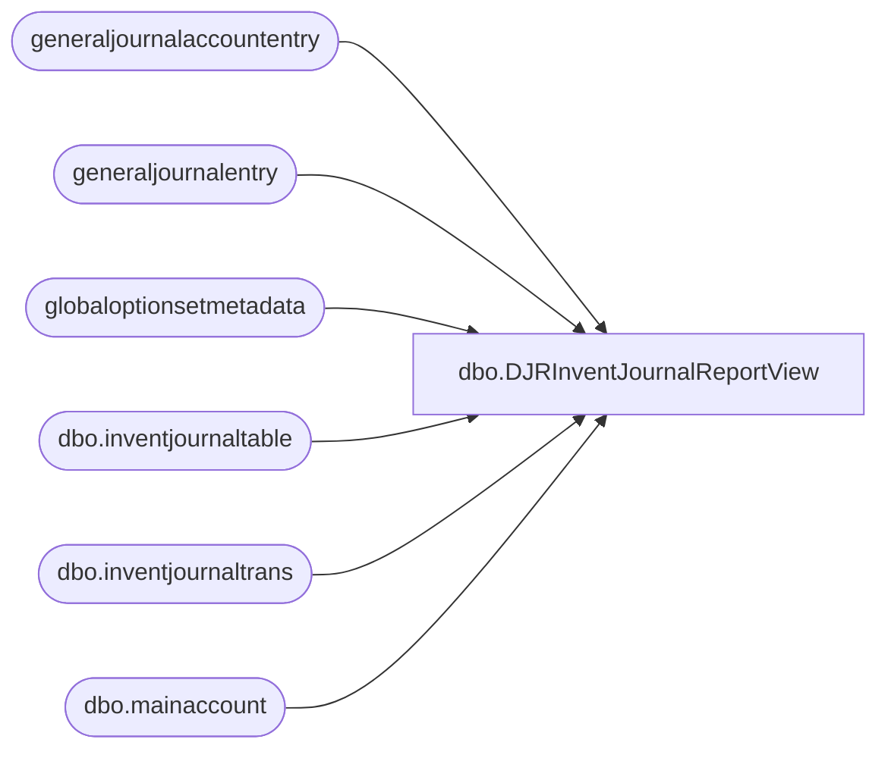

# dbo.DJRInventJournalReportView

**Database:** LH_D365  
**Server:** 4db76rlxaxcuvmuh5kw37wbnqq-oxjjwecel5tehm2dtna3lt5qia.datawarehouse.fabric.microsoft.com  

## Architecture Diagram



## Table Dependencies

| Referenced Table |
|---|
| generaljournalaccountentry |
| generaljournalentry |
| globaloptionsetmetadata |
| dbo.inventjournaltable |
| dbo.inventjournaltrans |
| dbo.mainaccount |

## View Code

```sql
CREATE   VIEW [dbo].[DJRInventJournalReportView]
AS
WITH GL AS
     (
         select
             gje.subledgervoucher                                 ,
             gje.subledgervoucherdataareaid                       ,
             --    GOSM_balanceSheetPosting.LocalizedLabel AS postingtype,
             ma.mainaccountid                   AS mainaccount    ,
             ma.name                            AS mainaccountname,
             gje.accountingdate                                   ,
             SUM(gjae.accountingcurrencyamount) AS accountingcurrencyamount
         from
             generaljournalentry gje
         join
             generaljournalaccountentry gjae
         on
             gjae.generaljournalentry = gje.recid
         left join
             globaloptionsetmetadata AS GOSM_balanceSheetPosting
         ON
             gjae.postingtype                       = GOSM_balanceSheetPosting.[Option]
         AND GOSM_balanceSheetPosting.EntityName    = 'generaljournalaccountentry'
         AND GOSM_balanceSheetPosting.OptionSetName = 'postingtype'
         inner join
             dbo.mainaccount AS ma
         ON
             ma.recid = gjae.mainaccount
         where
             gjae.IsDelete is null
         and gje.IsDelete is null
             --  and GOSM_balanceSheetPosting.LocalizedLabel IN ('Inventory issue','Inventory receipt')
         and gje.accountingdate >= DATEADD(MONTH, -24, GETDATE())
             --        and       gje.subledgervoucher   =  'ADJ000000882'
         GROUP BY
             gje.subledgervoucher          ,
             gje.subledgervoucherdataareaid,
             --        gjae.postingtype,
             --         GOSM_balanceSheetPosting.LocalizedLabel,
             ma.mainaccountid,
             ma.name         ,
             gje.accountingdate )
SELECT DISTINCT
    ijt.dataareaid                     AS 'Legal Entity'              ,
    ijtrans.voucher                    AS 'Voucher'                   ,
    ijt.journalid                      AS 'Journal ID'                ,
    gosm_ijtjournaltype.LocalizedLabel AS 'Journal Type'              ,
    ijt.description                    AS 'Journal Description'       ,
    --    GL.postingtype AS 'GL Posting Type',
    GL.mainaccount                     AS 'Main Account'              ,
    GL.mainaccountname                 AS 'Main Account Name'         ,
    GL.accountingcurrencyamount        AS 'Accounting Currency Amount',
    GL.accountingdate                  AS 'Accounting Date'
FROM
    dbo.inventjournaltable AS ijt
LEFT JOIN
    globaloptionsetmetadata AS gosm_ijtjournaltype
ON
    ijt.journaltype                   = gosm_ijtjournaltype.[Option]
AND gosm_ijtjournaltype.EntityName    = 'inventjournaltable'
AND gosm_ijtjournaltype.OptionSetName = 'journaltype'
INNER JOIN
    dbo.inventjournaltrans AS ijtrans
ON
    ijtrans.journalid  = ijt.journalid
AND ijtrans.dataareaid = ijt.dataareaid
INNER JOIN
    GL
ON
    GL.subledgervoucherdataareaid = ijt.dataareaid
AND GL.subledgervoucher           = ijtrans.voucher
WHERE
    ijt.IsDelete IS NULL
AND ijtrans.IsDelete IS NULL
    --    AND ijtrans.voucher = 'ADJ000000882'
```

